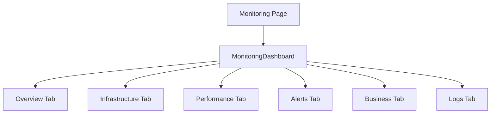

# Technical Specification: System Monitoring

## Module Information
- **Module**: System Administration
- **Sub-Module**: System Monitoring
- **Route**: `/system-administration/monitoring`
- **Version**: 1.0.0
- **Last Updated**: 2026-01-17

---

## Architecture



---

## Technology Stack

| Layer | Technology |
|-------|------------|
| Framework | Next.js 14 |
| UI | shadcn/ui |
| Charts | Recharts |
| Styling | Tailwind CSS |

---

## File Structure

```
app/(main)/system-administration/monitoring/
└── page.tsx    # MonitoringDashboard (719 lines)
```

---

## Tab Content

| Tab | Components |
|-----|------------|
| Overview | Health checks, active alerts |
| Infrastructure | Resource progress bars, line charts |
| Performance | Core Web Vitals, bar charts |
| Alerts | Statistics, pie chart, rules list |
| Business | User metrics, workflow analytics |
| Logs | Log entry viewer |

---

## UI Components

- Card, Tabs, Badge, Button, Progress, Alert (shadcn/ui)
- LineChart, BarChart, PieChart (Recharts)
- Lucide icons for status indicators

---

**Document End**
