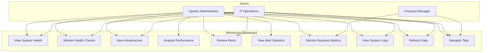

# Use Cases: System Monitoring

## Module Information
- **Module**: System Administration
- **Sub-Module**: System Monitoring
- **Route**: `/system-administration/monitoring`
- **Version**: 1.0.0
- **Last Updated**: 2026-01-17
- **Owner**: IT Operations Team
- **Status**: Active

## Document History

| Version | Date | Author | Changes |
|---------|------|--------|---------|
| 1.0.0 | 2026-01-17 | Documentation Team | Initial version |

---

## Overview

This document defines the use cases for the System Monitoring module, describing user interactions with the monitoring dashboard.

**Related Documents**:
- [Business Requirements](./BR-monitoring.md)
- [Data Dictionary](./DD-monitoring.md)
- [Technical Specification](./TS-monitoring.md)
- [Flow Diagrams](./FD-monitoring.md)
- [Validation Rules](./VAL-monitoring.md)

---

## Use Case Summary

| ID | Name | Actor | Priority |
|----|------|-------|----------|
| UC-MON-001 | View System Health Overview | System Administrator | High |
| UC-MON-002 | Monitor Health Checks | IT Operations | High |
| UC-MON-003 | View Infrastructure Metrics | IT Operations | High |
| UC-MON-004 | Analyze Performance Metrics | System Administrator | Medium |
| UC-MON-005 | Review Active Alerts | IT Operations | High |
| UC-MON-006 | View Alert Statistics | System Administrator | Medium |
| UC-MON-007 | Monitor Business Metrics | Financial Manager | Medium |
| UC-MON-008 | View System Logs | IT Operations | Low |
| UC-MON-009 | Refresh Monitoring Data | IT Operations | Medium |
| UC-MON-010 | Navigate Between Tabs | All Users | High |

---

## UC-MON-001: View System Health Overview

### Description
User views the overall system health status displayed in summary cards at the top of the dashboard.

### Actors
- System Administrator
- IT Operations

### Preconditions
- User is authenticated
- User has monitoring access permissions

### Main Flow
1. User navigates to `/system-administration/monitoring`
2. System displays four summary cards:
   - System Health (Healthy/Degraded/Unhealthy)
   - Uptime percentage
   - Active Alerts count
   - Performance Score
3. User reviews overall system status at a glance

### Postconditions
- User understands current system health status

### UI Elements
- System Health card with status text
- Uptime card with percentage value
- Active Alerts card with count
- Performance Score card with numeric value

---

## UC-MON-002: Monitor Health Checks

### Description
User monitors individual service health status on the Overview tab.

### Actors
- IT Operations
- System Administrator

### Preconditions
- User is on the monitoring page
- Overview tab is active

### Main Flow
1. User views the Health Checks card
2. System displays list of services:
   - Database
   - Authentication (Keycloak)
   - Cache
   - External APIs
3. For each service, user sees:
   - Status icon (checkmark, warning, or error)
   - Service name
   - Status message
   - Latency badge (in ms)
   - Status indicator dot
4. User identifies any degraded or unhealthy services

### Postconditions
- User knows which services need attention

### UI Elements
- Health Checks card
- Service list with status indicators
- Latency badges
- Color-coded status dots

---

## UC-MON-003: View Infrastructure Metrics

### Description
User monitors server resource utilization on the Infrastructure tab.

### Actors
- IT Operations
- System Administrator

### Preconditions
- User is on the monitoring page

### Main Flow
1. User clicks "Infrastructure" tab
2. System displays System Resources card with:
   - CPU Usage progress bar and percentage
   - Memory Usage progress bar and percentage
   - Disk Usage progress bar and percentage
3. System displays Database Metrics card with:
   - Connection Pool status
   - Query Performance average
   - Transactions per second
4. System displays Resource Usage Trends chart
5. User analyzes resource utilization patterns

### Postconditions
- User understands current infrastructure load

### UI Elements
- System Resources card with progress bars
- Database Metrics card
- Line chart for usage trends over time

---

## UC-MON-004: Analyze Performance Metrics

### Description
User reviews Core Web Vitals and application performance data.

### Actors
- System Administrator

### Preconditions
- User is on the monitoring page

### Main Flow
1. User clicks "Performance" tab
2. System displays Core Web Vitals card with:
   - Load Time (value vs threshold)
   - First Contentful Paint
   - Largest Contentful Paint
   - First Input Delay
   - Cumulative Layout Shift
3. Each metric shows:
   - Current value with unit
   - Target threshold
   - Progress bar for comparison
4. System displays Performance Metrics bar chart
5. User evaluates overall application performance

### Postconditions
- User understands application performance status

### UI Elements
- Core Web Vitals card with 5 metrics
- Progress bars for threshold comparison
- Bar chart visualization

---

## UC-MON-005: Review Active Alerts

### Description
User reviews currently firing alerts that require attention.

### Actors
- IT Operations
- System Administrator

### Preconditions
- User is on the monitoring page
- Active alerts exist in the system

### Main Flow
1. User views Active Alerts section on Overview tab
2. For each alert, user sees:
   - Alert name
   - Severity badge (critical/warning/info)
   - Escalation level
   - Current value vs threshold
   - Time since alert started
   - Acknowledgement status (if applicable)
3. User identifies which alerts need immediate action

### Alternative Flow
3a. No active alerts exist:
   - Active Alerts section is not displayed
   - User sees only Health Checks

### Postconditions
- User is aware of all active system alerts

### UI Elements
- Alert cards with border styling
- Severity badges
- Escalation level badges
- Alert details (values, timing)

---

## UC-MON-006: View Alert Statistics

### Description
User reviews alert statistics and alert rule configuration on the Alerts tab.

### Actors
- System Administrator

### Preconditions
- User is on the monitoring page

### Main Flow
1. User clicks "Alerts" tab
2. System displays Alert Statistics card showing:
   - Total alerts (24h)
   - Critical count
   - Warning count
   - Info count
   - Average resolution time
3. System displays Alert Sources pie chart
4. System displays Alert Rules list showing:
   - Rule name
   - Threshold condition
   - Severity level
   - Enabled/Disabled status
5. User analyzes alert patterns and rules

### Postconditions
- User understands alert trends and configuration

### UI Elements
- Alert Statistics summary
- Pie chart for alert sources
- Alert Rules list with badges

---

## UC-MON-007: Monitor Business Metrics

### Description
User reviews business-level metrics and workflow performance.

### Actors
- Financial Manager
- System Administrator

### Preconditions
- User is on the monitoring page

### Main Flow
1. User clicks "Business" tab
2. System displays summary cards:
   - Total Users with growth trend
   - Active Users (currently online)
   - Workflow Completion Rate
   - Error Rate
3. System displays Workflow Performance card with:
   - Total, completed, and abandoned workflows
   - Average workflow duration
   - Top bottlenecks with failure rates
4. User identifies workflow inefficiencies

### Postconditions
- User understands business impact of system performance

### UI Elements
- Business metric summary cards
- Workflow Performance card
- Bottleneck progress bars

---

## UC-MON-008: View System Logs

### Description
User reviews recent system log events for troubleshooting.

### Actors
- IT Operations
- System Administrator

### Preconditions
- User is on the monitoring page

### Main Flow
1. User clicks "Logs" tab
2. System displays Recent Log Events card with:
   - Scrollable log list
   - Each entry showing: timestamp, level, source, message
3. Log levels are color-coded:
   - INFO: outline badge
   - WARN: secondary badge
   - ERROR: destructive badge
   - DEBUG: outline badge
4. User scrolls through log history
5. User identifies relevant log entries for investigation

### Postconditions
- User can trace system events for troubleshooting

### UI Elements
- Log viewer with monospace font
- Level badges with color coding
- Scrollable container

---

## UC-MON-009: Refresh Monitoring Data

### Description
User manually triggers a refresh of all monitoring data.

### Actors
- IT Operations
- System Administrator

### Preconditions
- User is on the monitoring page

### Main Flow
1. User clicks "Refresh" button in header
2. Button shows loading state (spinning icon)
3. Button is disabled during refresh
4. System simulates API call (1 second delay)
5. System updates last updated timestamp
6. Button returns to normal state

### Postconditions
- All displayed data is refreshed
- Last updated timestamp is current

### UI Elements
- Refresh button with icon
- Loading spinner animation
- Last updated timestamp display

---

## UC-MON-010: Navigate Between Tabs

### Description
User switches between different monitoring views using the tab navigation.

### Actors
- All users with monitoring access

### Preconditions
- User is on the monitoring page

### Main Flow
1. User sees tab bar with 6 tabs:
   - Overview (default)
   - Infrastructure
   - Performance
   - Alerts
   - Business
   - Logs
2. User clicks on desired tab
3. System displays corresponding content
4. Tab becomes highlighted as active

### Postconditions
- User views the selected monitoring section

### UI Elements
- TabsList with 6 TabsTrigger components
- TabsContent for each section

---

## Use Case Diagram

---

**Document End**
