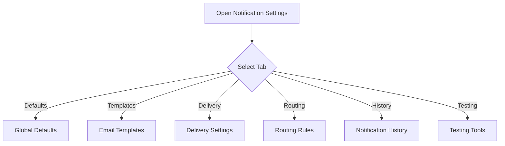
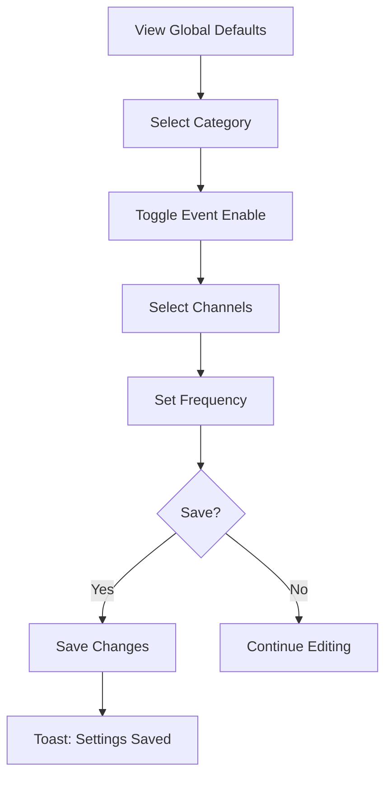
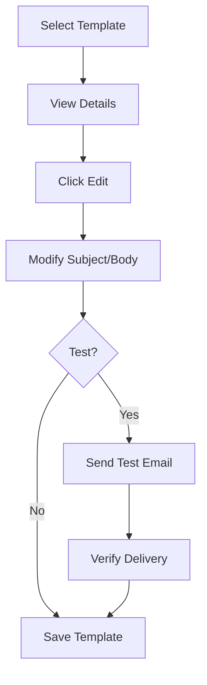
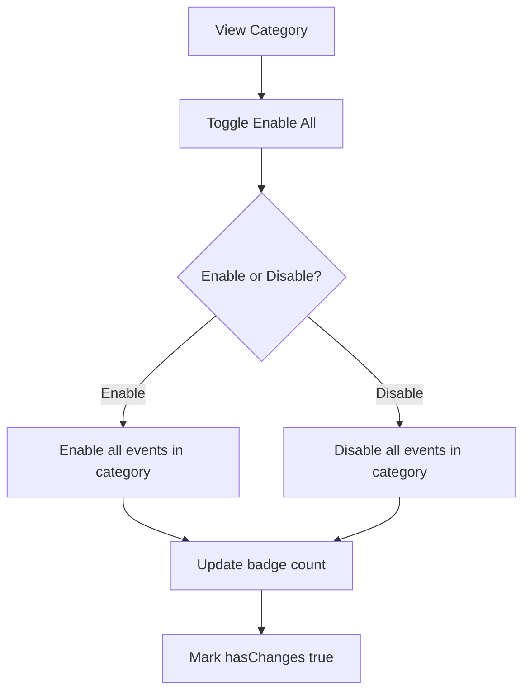
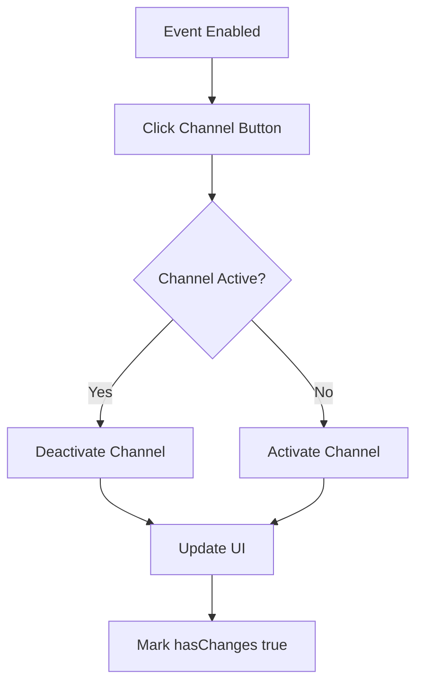

# Flow Diagrams: Notification Preferences

## Module Information
- **Module**: System Administration
- **Sub-Module**: Notification Preferences
- **Route**: `/system-administration/settings/notifications`
- **Version**: 1.0.0
- **Last Updated**: 2026-01-17

---

## Page Navigation

---

## Configure Defaults Flow

---

## Edit Template Flow

---

## Bulk Enable Flow

---

## Channel Toggle Flow

---

**Document End**
