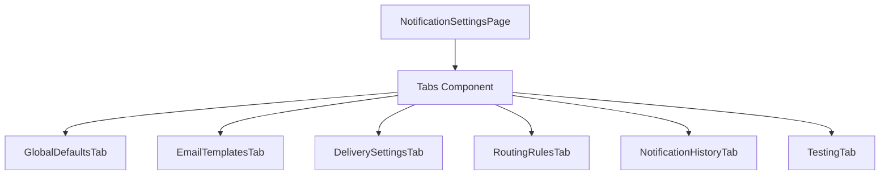

# Technical Specification: Notification Preferences

## Module Information
- **Module**: System Administration
- **Sub-Module**: Notification Preferences
- **Route**: `/system-administration/settings/notifications`
- **Version**: 1.0.0
- **Last Updated**: 2026-01-17

---

## Architecture



---

## File Structure

```
app/(main)/system-administration/settings/notifications/
├── page.tsx                          # Main page
└── components/
    ├── global-defaults-tab.tsx       # Defaults configuration
    ├── email-templates-tab.tsx       # Template management
    ├── delivery-settings-tab.tsx     # Delivery config
    ├── routing-rules-tab.tsx         # Routing rules
    ├── notification-history-tab.tsx  # History viewer
    └── testing-tab.tsx               # Testing tools
```

---

## Tab Components

| Tab | Component | Features |
|-----|-----------|----------|
| Defaults | GlobalDefaultsTab | Event toggles, channels, frequency |
| Templates | EmailTemplatesTab | Template list, preview, edit |
| Delivery | DeliverySettingsTab | Server configuration |
| Routing | RoutingRulesTab | Rule management |
| History | NotificationHistoryTab | Log viewer |
| Testing | TestingTab | Test notifications |

---

## Dependencies

| Dependency | Source |
|------------|--------|
| NotificationPreference | lib/types/settings.ts |
| EmailTemplate | lib/types/settings.ts |
| mockNotificationPreferences | lib/mock-data/settings.ts |
| mockEmailTemplates | lib/mock-data/settings.ts |

---

## UI Components

- Tabs (shadcn/ui)
- Card (shadcn/ui)
- Switch (shadcn/ui)
- Select (shadcn/ui)
- Button (shadcn/ui)
- Badge (shadcn/ui)
- Textarea (shadcn/ui)
- Toast notifications

---

**Document End**
