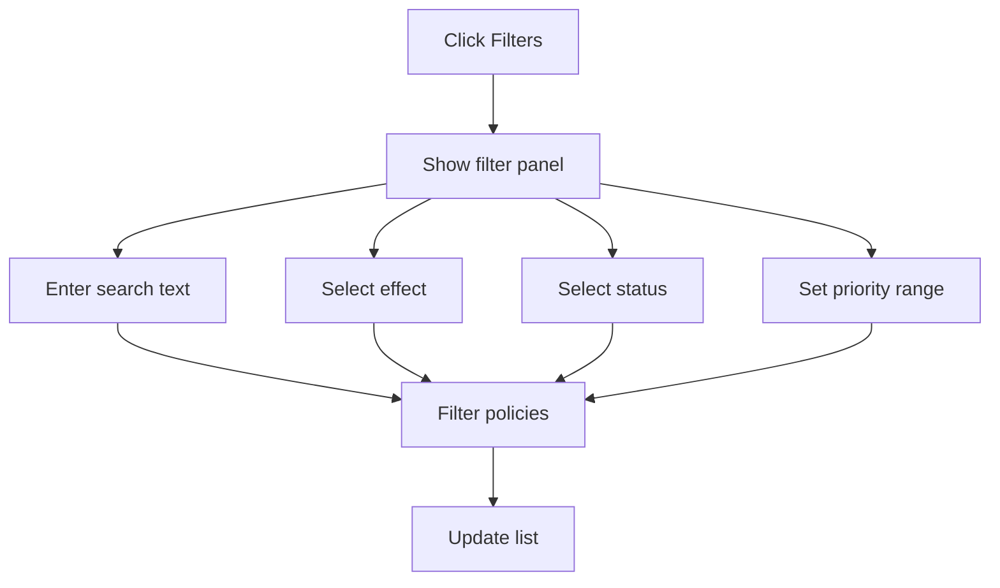
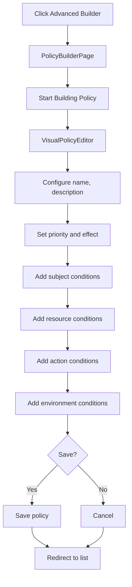
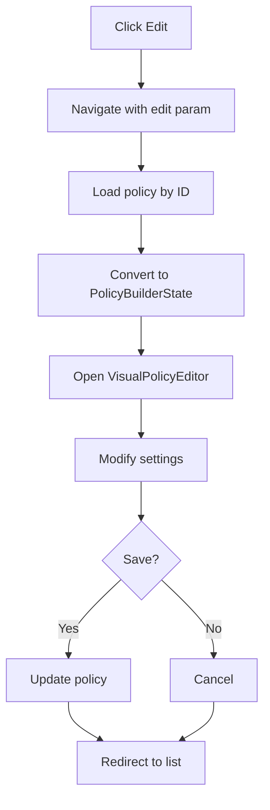
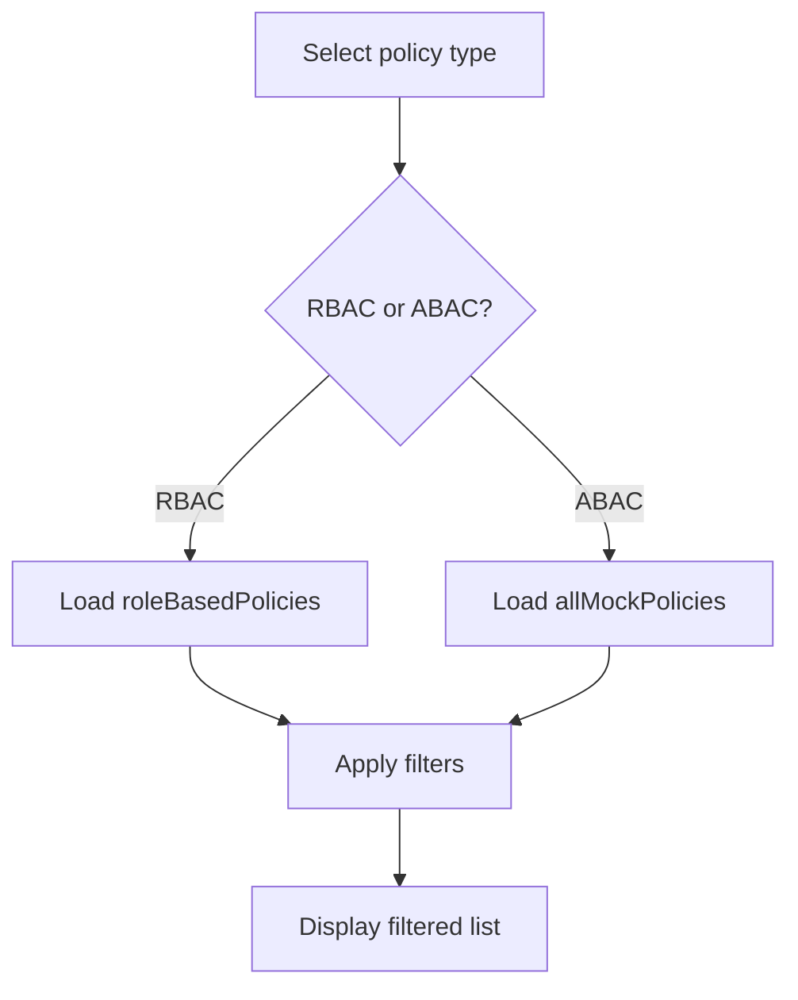
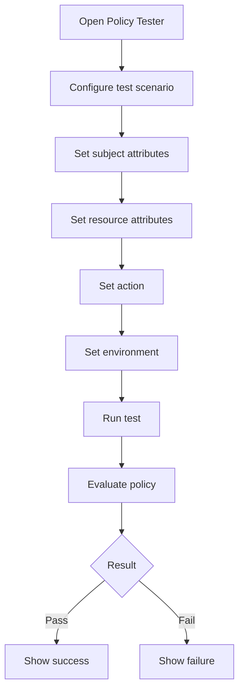

# Flow Diagrams: Policy Management

## Module Information
- **Module**: System Administration > Permission Management
- **Sub-Module**: Policy Management
- **Route**: `/system-administration/permission-management/policies`
- **Version**: 1.0.0
- **Last Updated**: 2026-01-17

---

## Page Navigation

```mermaid
graph TD
    A[Policy List] --> B{Action}
    B -->|Simple Creator| C[/policies/simple]
    B -->|Advanced Builder| D[/policies/builder]
    B -->|View| E[/policies/id]
    B -->|Edit| F[/policies/builder?edit=id]
    B -->|Clone| G[/policies/builder?clone=id]
```

---

## Filter Flow



---

## Create Policy Flow



---

## Edit Policy Flow



---

## Policy Type Toggle



---

## Test Policy Flow



---

**Document End**
