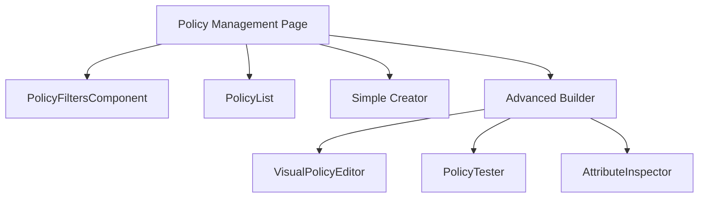

# Technical Specification: Policy Management

## Module Information
- **Module**: System Administration > Permission Management
- **Sub-Module**: Policy Management
- **Route**: `/system-administration/permission-management/policies`
- **Version**: 1.0.0
- **Last Updated**: 2026-01-17

---

## Architecture

---

## Page Structure

| Route | Component | Description |
|-------|-----------|-------------|
| /policies | PolicyManagementPage | Main list page |
| /policies/simple | SimplifiedPolicyCreator | Template-based creator |
| /policies/builder | PolicyBuilderPage | ABAC policy builder |
| /policies/[id] | PolicyDetailPage | View policy details |
| /policies/[id]/edit | PolicyEditPage | Edit existing policy |

---

## Components

### PolicyManagementPage
- **Location**: `app/.../policies/page.tsx`
- **Type**: Client Component
- **State**: policyType, filters, showFilters

### PolicyFiltersComponent
- **Source**: `@/components/permissions/policy-manager/policy-filters`
- **Features**: Search, effect filter, status filter, priority range, saved presets

### PolicyList
- **Source**: `@/components/permissions/policy-manager/policy-list`
- **Features**: RBAC/ABAC tabs, policy cards, actions menu

### PolicyBuilderPage
- **Location**: `app/.../policies/builder/page.tsx`
- **Tabs**: Policy Builder, Policy Tester, Attribute Explorer

### VisualPolicyEditor
- **Source**: `@/components/permissions/policy-builder`
- **Features**: Drag-and-drop conditions, visual rule builder

---

## Navigation Actions

| Action | Route |
|--------|-------|
| Create (Simple) | `/policies/simple` |
| Create (Advanced) | `/policies/builder` |
| Edit | `/policies/builder?edit={id}` |
| Clone | `/policies/builder?clone={id}` |
| View | `/policies/{id}` |

---

## Dependencies

| Dependency | Source |
|------------|--------|
| Policy | lib/types/permissions.ts |
| EffectType | lib/types/permissions.ts |
| ResourceType | lib/types/permission-resources.ts |
| allMockPolicies | lib/mock-data/permission-index.ts |
| roleBasedPolicies | lib/mock-data/permission-index.ts |

---

**Document End**
