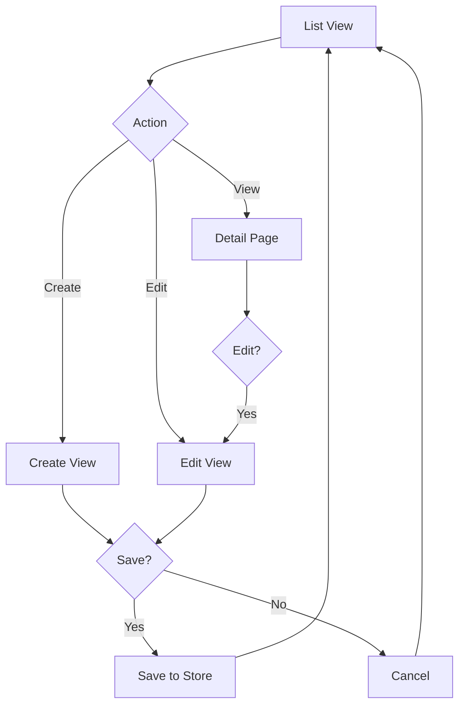
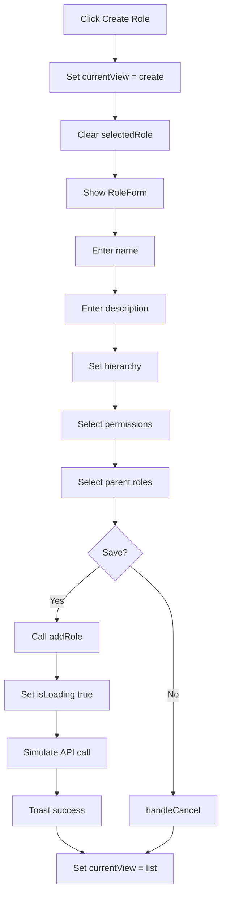
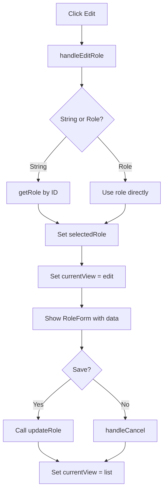
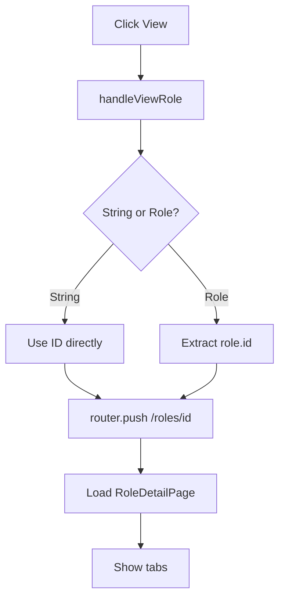
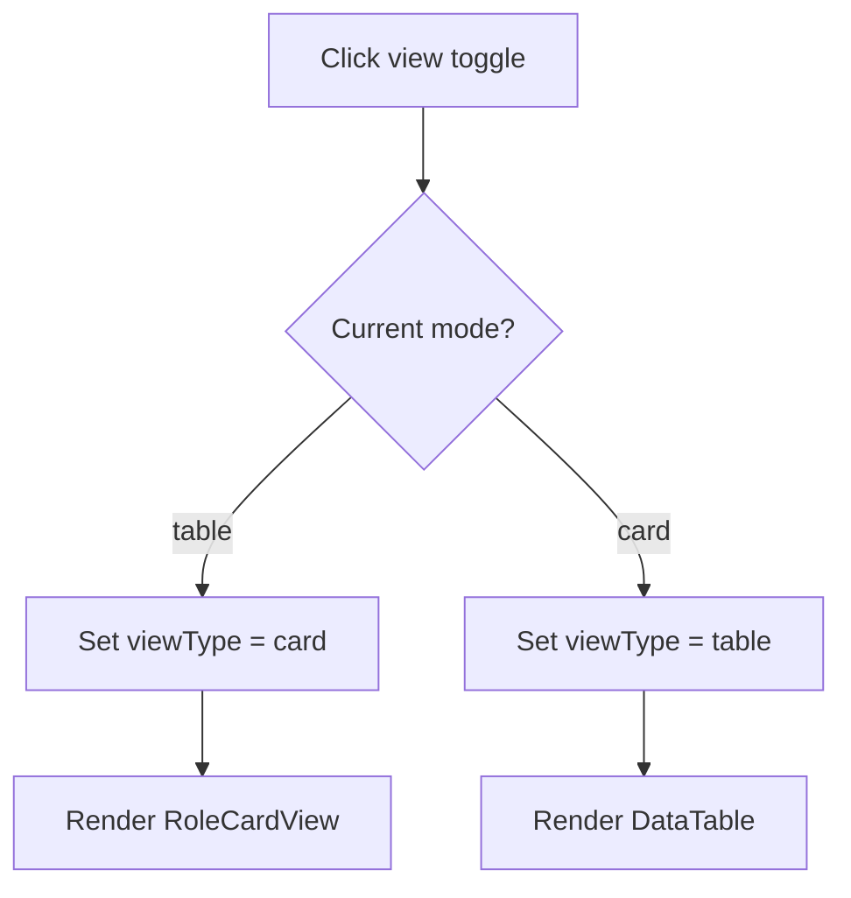
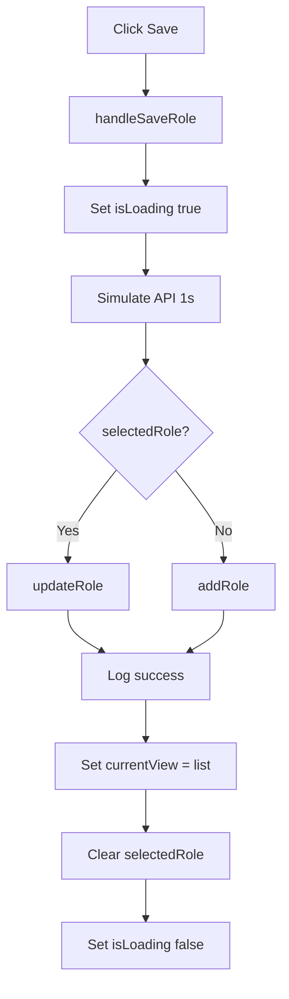

# Flow Diagrams: Role Management

## Module Information
- **Module**: System Administration > Permission Management
- **Sub-Module**: Role Management
- **Route**: `/system-administration/permission-management/roles`
- **Version**: 1.0.0
- **Last Updated**: 2026-01-17

---

## View Mode Navigation

---

## Create Role Flow

---

## Edit Role Flow

---

## View Role Detail Flow

---

## Toggle View Mode

---

## Role Save Flow

---

**Document End**
