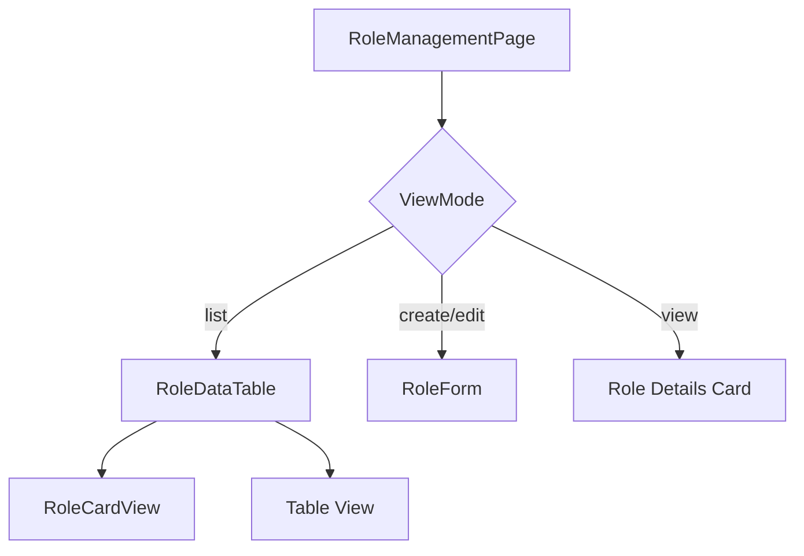

# Technical Specification: Role Management

## Module Information
- **Module**: System Administration > Permission Management
- **Sub-Module**: Role Management
- **Route**: `/system-administration/permission-management/roles`
- **Version**: 1.0.0
- **Last Updated**: 2026-01-17

---

## Architecture



---

## Page Structure

| Route | Component | Description |
|-------|-----------|-------------|
| /roles | RoleManagementPage | Main list/form page |
| /roles/[id] | RoleDetailPage | Detail view with tabs |
| /roles/[id]/edit | RoleEditPage | Edit page wrapper |
| /roles/new | NewRolePage | Create page wrapper |

---

## File Structure

```
app/.../permission-management/roles/
├── page.tsx                    # Main page
├── [id]/page.tsx               # Detail page
├── edit/[id]/page.tsx          # Edit page
├── new/page.tsx                # Create page
└── components/
    ├── role-data-table.tsx     # DataTable wrapper
    ├── role-card-view.tsx      # Card grid view
    ├── role-columns.tsx        # Column definitions
    ├── role-header.tsx         # Page header
    ├── role-quick-filters.tsx  # Filter controls
    ├── role-filter-builder.tsx # Advanced filters
    ├── enhanced-role-card.tsx  # Role card component
    ├── permission-details-tab.tsx
    ├── user-assignment-tab.tsx
    └── policy-assignment-tab.tsx
```

---

## Components

### RoleManagementPage
- **Type**: Client Component
- **State Management**: Local state + useRoleStore
- **Views**: list, create, edit, view

### RoleDataTable
- **Source**: `./components/role-data-table.tsx`
- **Features**: Table/card toggle, sorting, pagination

### RoleForm
- **Source**: `@/components/permissions/role-manager/role-form`
- **Features**: Full role configuration form

### RoleCardView
- **Source**: `./components/role-card-view.tsx`
- **Features**: Visual cards with role hierarchy

---

## State Management

### Zustand Store
- **Store**: `useRoleStore`
- **Source**: `lib/stores/role-store.ts`
- **Methods**: roles, addRole, updateRole, getRole

---

## Navigation

| Trigger | Navigation |
|---------|------------|
| Create Role | Set currentView = 'create' |
| Edit Role | Set currentView = 'edit', load role |
| View Role | router.push('/roles/{id}') |
| Cancel | Set currentView = 'list' |
| Save | addRole/updateRole, set 'list' |

---

## Role Detail Tabs

| Tab | Component | Description |
|-----|-----------|-------------|
| Permissions | PermissionDetailsTab | List of permissions |
| Users | UserAssignmentTab | Assigned users |
| Policies | PolicyAssignmentTab | Linked policies |

---

**Document End**
