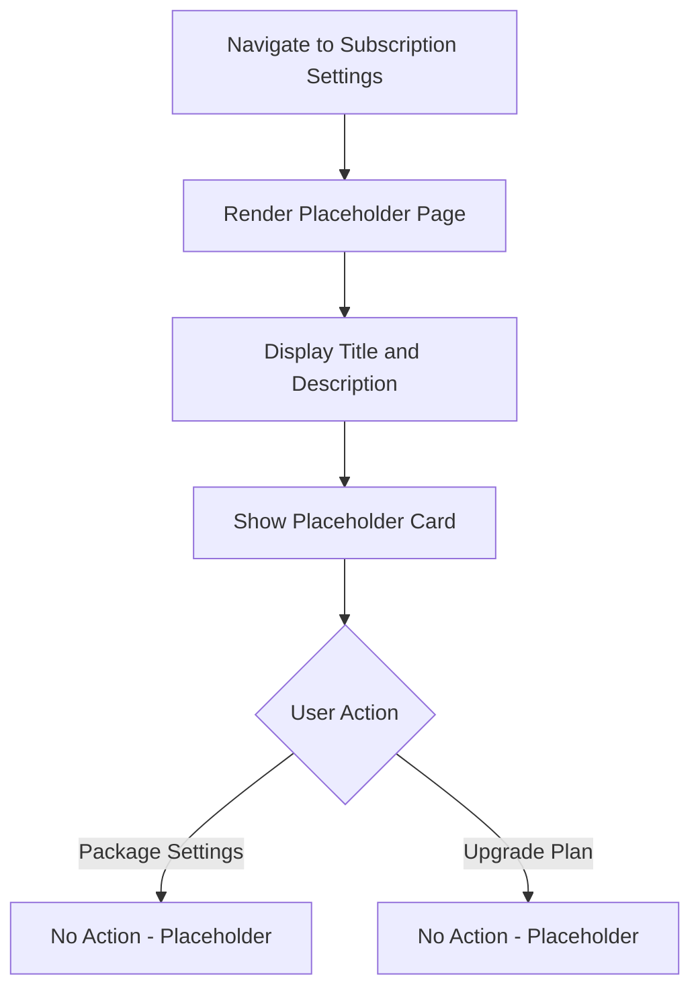
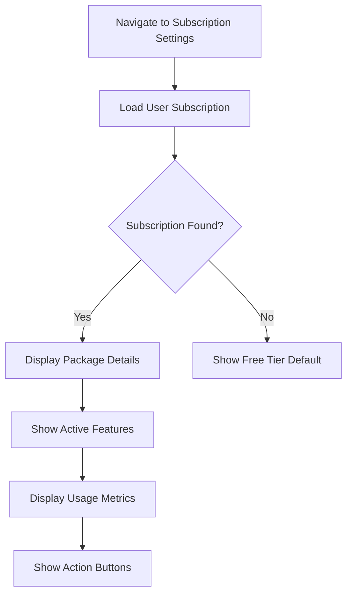
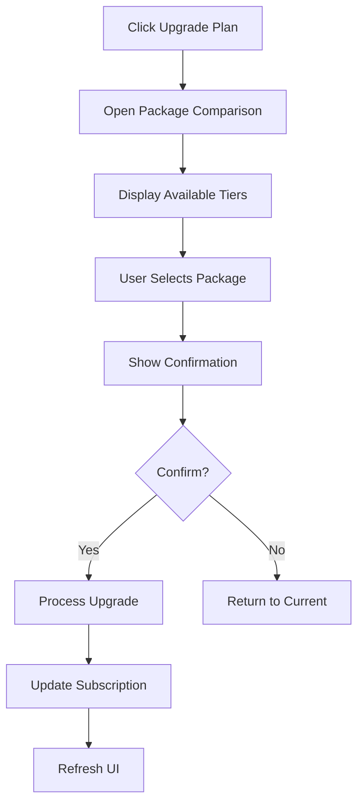
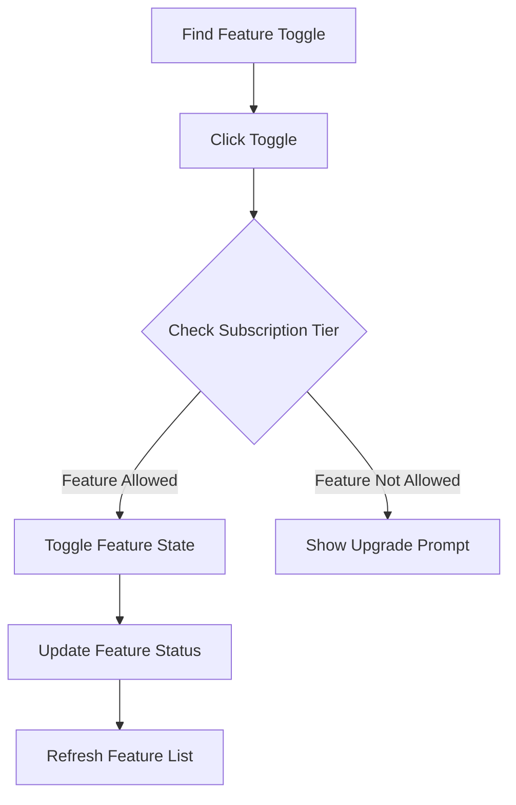

# Flow Diagrams: Subscription Settings

## Module Information
- **Module**: System Administration > Permission Management
- **Sub-Module**: Subscription Settings
- **Route**: `/system-administration/permission-management/subscription`
- **Version**: 1.0.0
- **Last Updated**: 2026-01-17
- **Status**: Placeholder

---

## Current Page Flow

---

## Planned Flow: View Subscription (Future)

---

## Planned Flow: Upgrade Package (Future)

---

## Planned Flow: Feature Toggle (Future)

---

**Document End**
