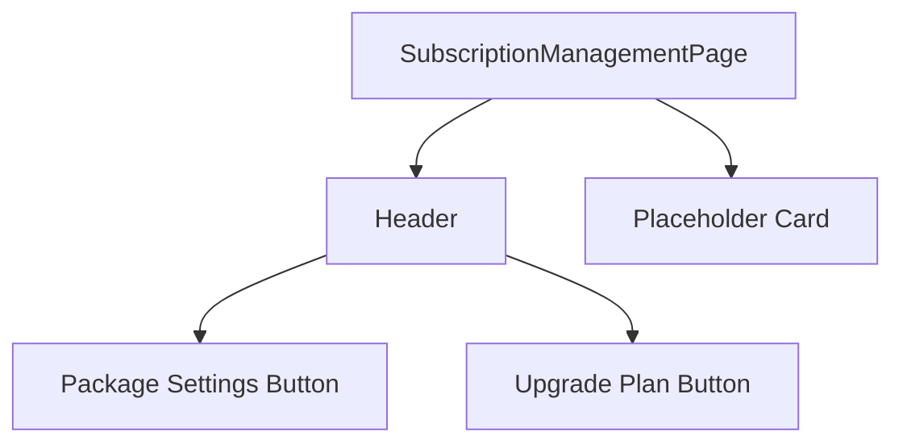

# Technical Specification: Subscription Settings

## Module Information
- **Module**: System Administration > Permission Management
- **Sub-Module**: Subscription Settings
- **Route**: `/system-administration/permission-management/subscription`
- **Version**: 1.0.0
- **Last Updated**: 2026-01-17
- **Status**: Placeholder

---

## Current Architecture



---

## File Structure

```
app/.../permission-management/subscription/
└── page.tsx    # Placeholder page
```

---

## Page Component

### SubscriptionManagementPage
- **Type**: Client Component
- **State**: None
- **UI**: Header + Placeholder card

---

## UI Components

| Component | Source | Usage |
|-----------|--------|-------|
| Button | shadcn/ui | Package Settings, Upgrade Plan |
| Card | - | Placeholder content (inline) |

---

## Icons

| Icon | Usage |
|------|-------|
| Settings | Package Settings button |
| CreditCard | Upgrade Plan button |

---

## Dependencies

| Import | Source |
|--------|--------|
| mockSubscriptionPackages | lib/mock-data/permission-index |
| mockUserSubscriptions | lib/mock-data/permission-index |
| getUserSubscription | lib/mock-data/permission-index |

Note: These imports exist but are not currently used in the component.

---

## Planned Components

| Component | Description |
|-----------|-------------|
| PackageComparison | Compare subscription tiers |
| FeatureActivation | Toggle features |
| UsageMonitor | Resource usage display |
| BillingManagement | Billing interface |

---

**Document End**
