# Flow Diagrams: POS Integration

## Module Information
- **Module**: System Administration > System Integrations
- **Sub-Module**: POS Integration
- **Route**: `/system-administration/system-integration/pos`
- **Version**: 2.0.0
- **Last Updated**: 2026-01-27

---

## Module Layout (Setup / Operate / Audit)

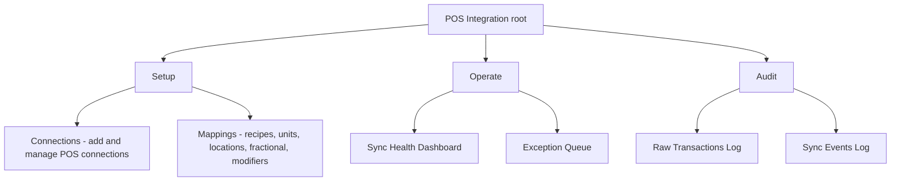

---

## Connection Wizard Flow (Setup → Connections)

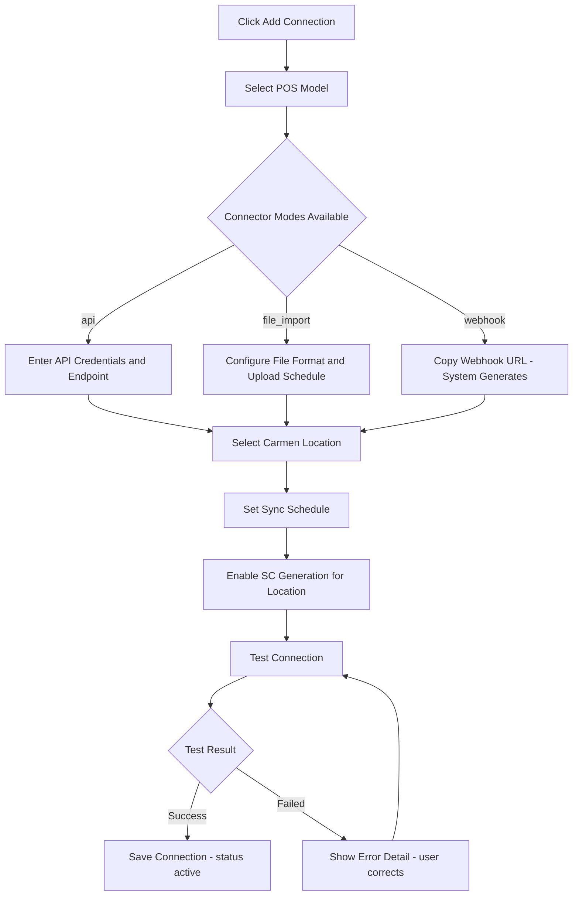

---

## Exception Queue Flow (Operate → Exceptions)

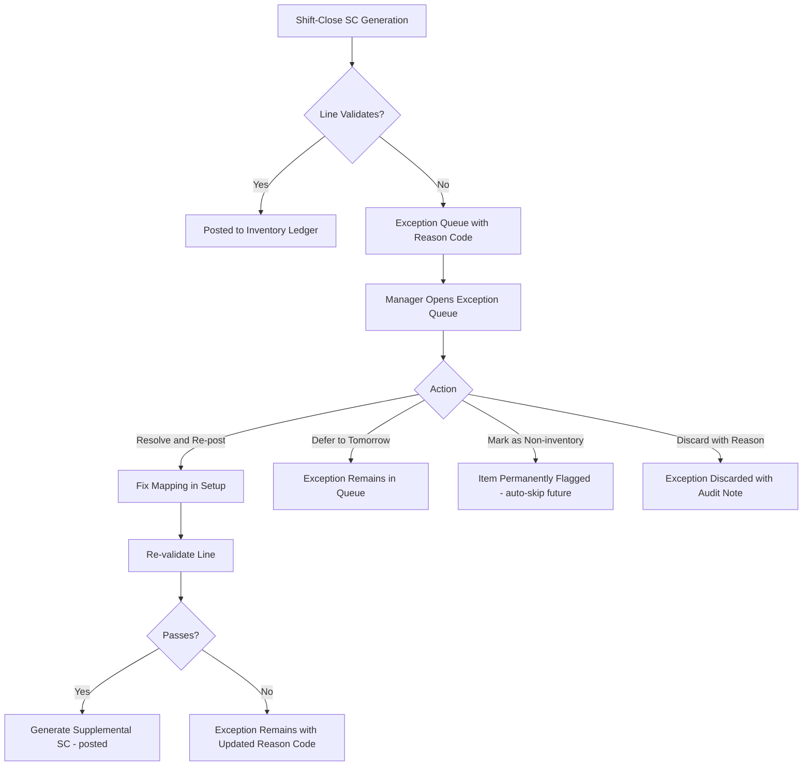

## Transaction Processing Flow (Legacy — replaced by SC pipeline)

The old per-transaction approval flow (pending_approval → approved → processing → success) has been replaced by the shift-close batch SC generation model. See [Sales Consumption module](../../../store-operations/sales-consumption/FD-sales-consumption.md) for the current pipeline flow.

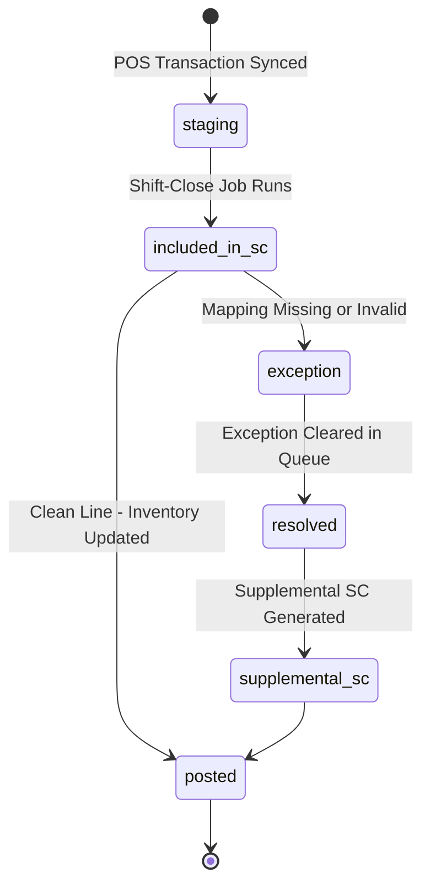

---

## Recipe Mapping Flow

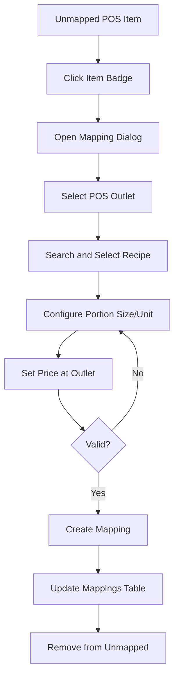

---

## Location Mapping Flow

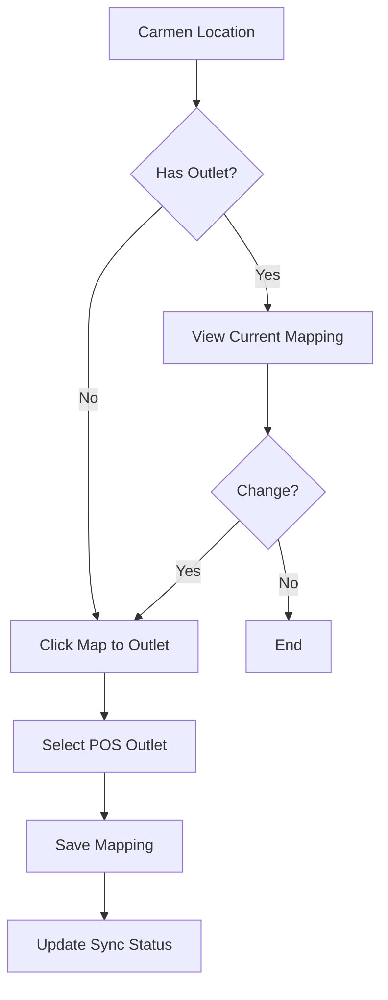

---

## Transaction Approval Flow

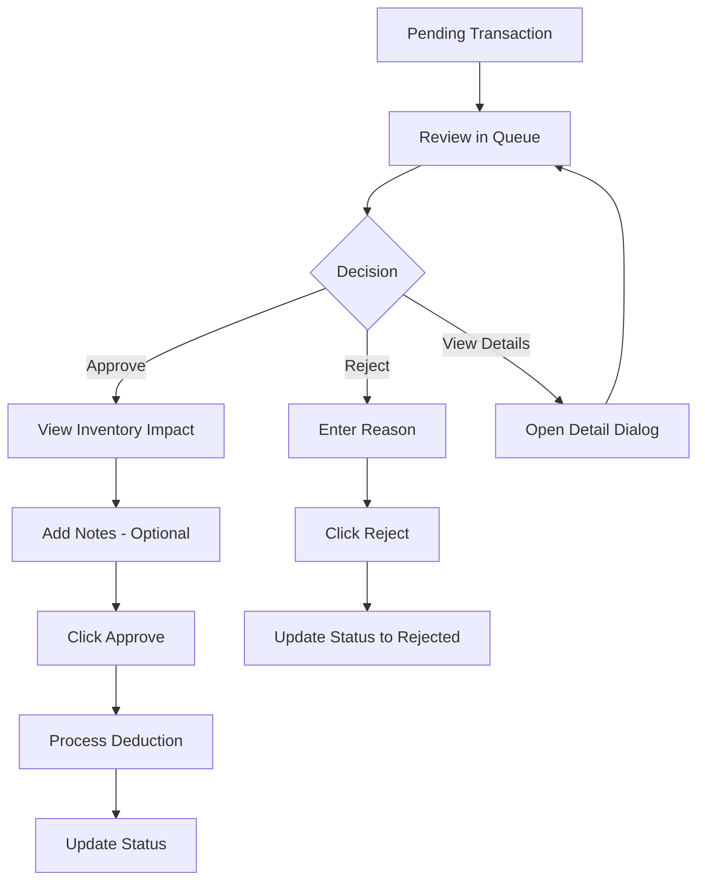

---

## Bulk Approval Flow

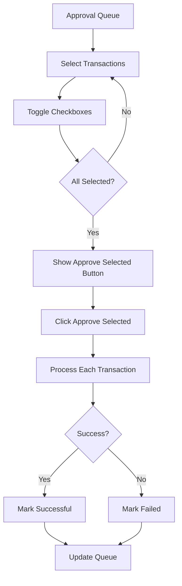

---

## Fractional Variant Flow

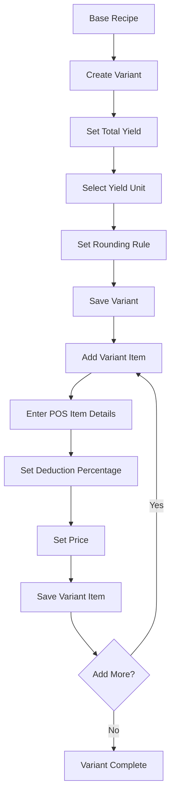

---

## Configuration Save Flow

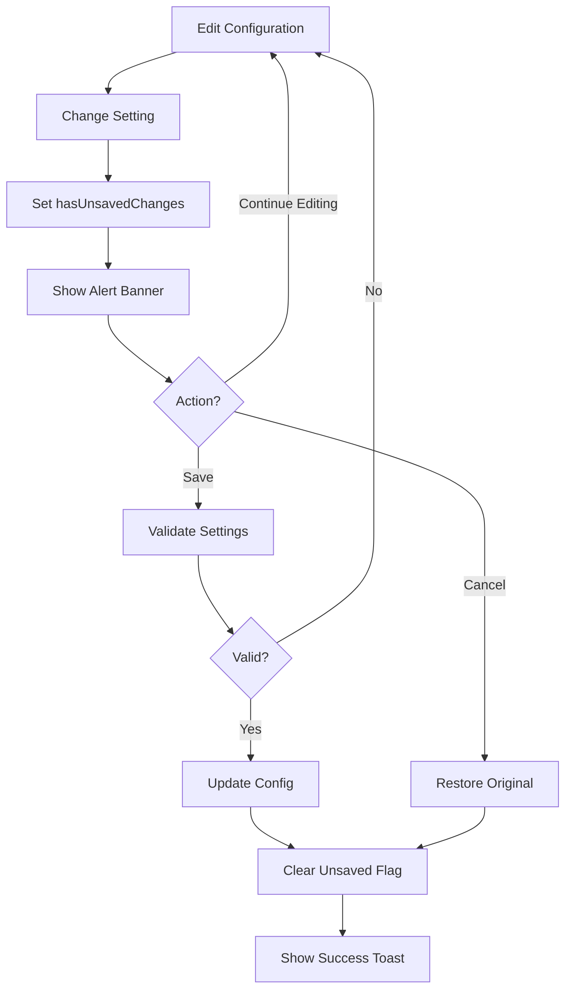

---

## Connection Test Flow

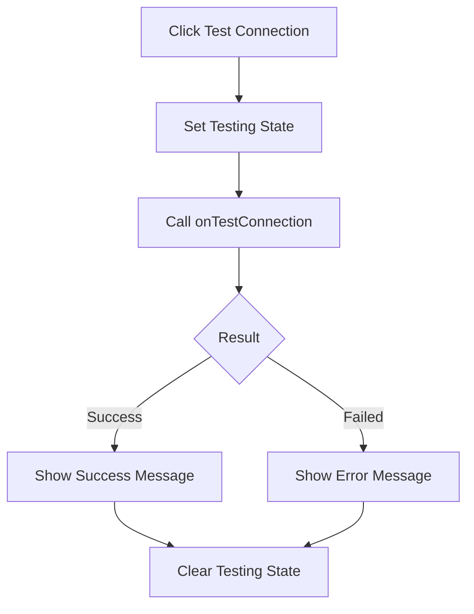

---

## Sync Workflow (Updated)

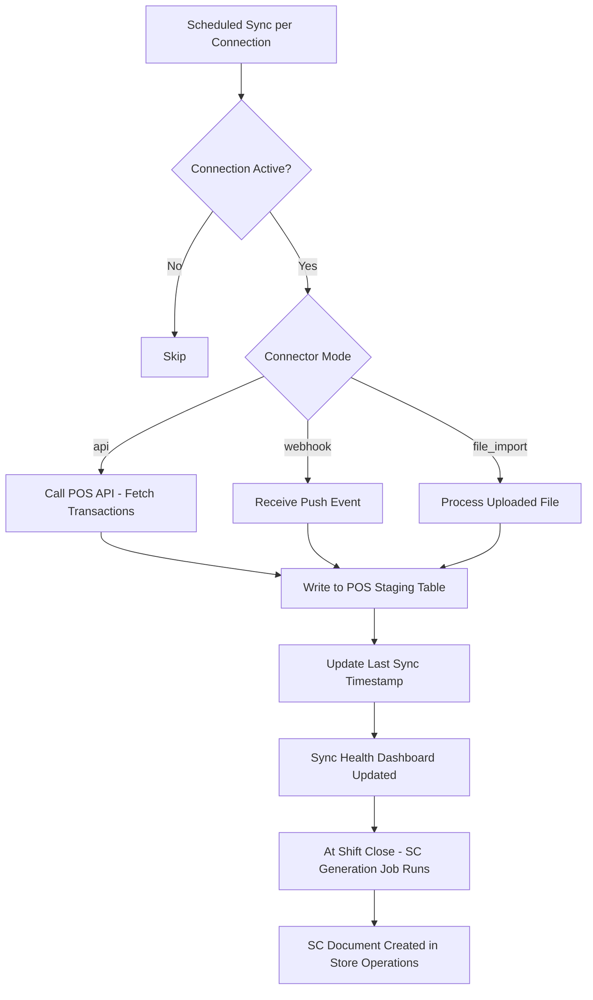

---

**Document End**
