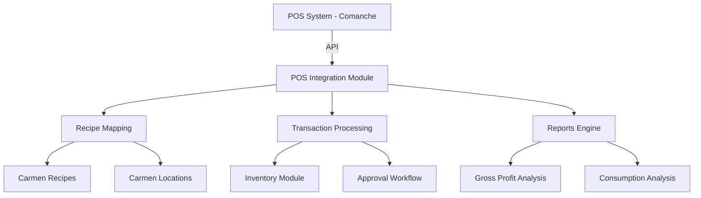
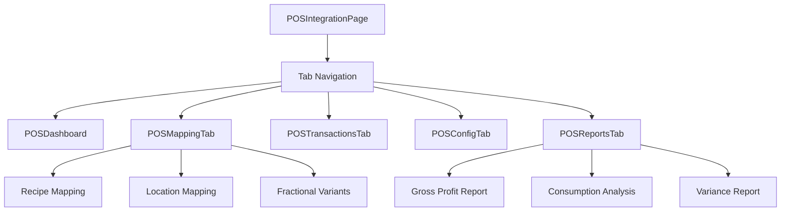

# Technical Specification: POS Integration

## Module Information
- **Module**: System Administration > System Integrations
- **Sub-Module**: POS Integration
- **Route**: `/system-administration/system-integration/pos`
- **Version**: 1.0.0
- **Last Updated**: 2026-01-18

---

## System Architecture



---

## Page Architecture



---

## File Structure

```
app/(main)/system-administration/system-integration/pos/
├── page.tsx                           # Main page with tabs
└── components/
    ├── index.ts                       # Component exports
    ├── pos-dashboard.tsx              # Dashboard tab
    ├── pos-mapping-tab.tsx            # Mapping tab
    ├── pos-transactions-tab.tsx       # Transactions tab
    ├── pos-config-tab.tsx             # Configuration tab
    └── pos-reports-tab.tsx            # Reports tab

lib/types/
└── pos-integration.ts                 # Type definitions

lib/mock-data/
└── pos-integration.ts                 # Mock data
```

---

## Components

### POSIntegrationPage
- **Type**: Client Component (Suspense wrapped)
- **Responsibilities**: Tab navigation, state management, handler functions
- **State**: activeTab, mappings, config
- **URL Params**: ?tab=dashboard|mapping|transactions|config|reports

### POSDashboard
- **Props**: metrics, statistics, onNavigateToTab, onSync
- **Features**:
  - System status banner with connection indicator
  - Alert cards (clickable navigation)
  - Transaction statistics with period display
  - Recent activity feed
  - Sync schedule display

### POSMappingTab
- **Props**: mappings, unmappedItems, locationMappings, fractionalVariants, recipeSearchResults, handlers
- **Sub-tabs**: Recipe Mapping, Location Mapping, Fractional Variants
- **Features**:
  - Stats cards (mapped, unmapped, locations, variants)
  - Unmapped items alert with quick-map badges
  - Recipe mapping table with outlet/category filters
  - Location mapping table with sync status
  - Fractional variant cards with variant items

### POSTransactionsTab
- **Props**: transactions, pendingTransactions, lineItems, errors, inventoryImpact, handlers
- **Features**:
  - Status filter cards (total, pending, success, failed, processing)
  - Approval queue with bulk selection
  - Transaction history table with expandable rows
  - Search by transaction ID
  - Location and date range filters
  - Approval/rejection dialogs with notes

### POSConfigTab
- **Props**: config, onUpdateConfig, onTestConnection, onResetConfig
- **Features**:
  - Connection settings (POS system, API endpoint)
  - Connection test with result feedback
  - Sync settings (enabled, frequency)
  - Processing settings (mode, threshold, approval)
  - Notification settings (email, recipients)
  - Data retention settings
  - Danger zone (reset configuration)
  - Unsaved changes alert

### POSReportsTab
- **Props**: grossProfitReport, consumptionAnalysis, period, onExportReport
- **Sub-tabs**: Gross Profit Analysis, Consumption Analysis, Variance Report
- **Features**:
  - Period selector (7d, 30d, 90d, YTD)
  - Summary cards per report type
  - Data tables with export
  - Variance distribution cards
  - Recommendations section

---

## Handler Functions

| Handler | Purpose |
|---------|---------|
| handleSync | Trigger manual POS sync |
| handleTabChange | Switch tabs with URL update |
| handleCreateMapping | Create new recipe mapping |
| handleUpdateMapping | Update existing mapping |
| handleDeleteMapping | Delete mapping |
| handleSyncPOSItems | Fetch latest POS items |
| handleApproveTransaction | Approve with notes |
| handleRejectTransaction | Reject with reason |
| handleRetryTransaction | Retry failed transaction |
| handleBulkApprove | Approve multiple transactions |
| handleUpdateConfig | Save configuration changes |
| handleTestConnection | Test POS connection |
| handleResetConfig | Reset to defaults |
| handleExportReport | Export report data |

---

## State Management

Page-level state managed via useState:
- mappings: POSMapping[] - Current mappings array
- config: POSIntegrationConfig - Integration settings

Tab state managed locally within each tab component.

---

## Navigation

| Tab | URL | Description |
|-----|-----|-------------|
| Dashboard | ?tab=dashboard | Overview and metrics |
| Mapping | ?tab=mapping | Recipe/location/variant mapping |
| Transactions | ?tab=transactions | Transaction processing |
| Configuration | ?tab=config | Integration settings |
| Reports | ?tab=reports | Analytics and reports |

Tab changes update URL without page reload using router.push with scroll: false.

---

## External Integrations

### Comanche POS API
- Transaction data synchronization
- Menu item retrieval
- Connection testing

### Carmen Internal
- Recipe module for mapping
- Location module for outlet mapping
- Inventory module for deductions

---

## Dependencies

| Import | Source | Usage |
|--------|--------|-------|
| POSMapping, POSIntegrationConfig | lib/types/pos-integration | Type definitions |
| mockPOSMappings, mockPOSConfig, etc. | lib/mock-data/pos-integration | Mock data |
| Tabs, Table, Dialog, Select | shadcn/ui | UI components |
| formatNumber, formatCurrency | lib/utils/formatters | Number formatting |
| formatDistanceToNow, format | date-fns | Date formatting |

---

## UI Components Used

| Component | Source | Usage |
|-----------|--------|-------|
| Tabs, TabsList, TabsTrigger, TabsContent | shadcn/ui | Tab navigation |
| Card, CardHeader, CardContent | shadcn/ui | Content containers |
| Table, TableHeader, TableBody, TableRow | shadcn/ui | Data tables |
| Dialog, DialogContent, DialogHeader | shadcn/ui | Modal dialogs |
| Select, SelectTrigger, SelectContent | shadcn/ui | Dropdowns |
| Button | shadcn/ui | Actions |
| Badge | shadcn/ui | Status indicators |
| Input, Textarea | shadcn/ui | Form inputs |
| Switch | shadcn/ui | Toggle settings |
| Checkbox | shadcn/ui | Selection |
| DropdownMenu | shadcn/ui | Action menus |

---

## Icons

| Icon | Usage |
|------|-------|
| Activity, Settings, FileText, Map, BarChart | Tab icons |
| CheckCircle2, XCircle, Clock, AlertTriangle | Status indicators |
| RefreshCw | Sync actions |
| Link2, Link2Off | Mapping status |
| Slice | Fractional variants |
| Download, Upload | Import/export |
| Eye, Edit, Trash2 | Row actions |
| TrendingUp, TrendingDown | Trend indicators |
| DollarSign, PieChart, BarChart3 | Report icons |

---

**Document End**
