# Pricelist Templates - Flow Diagrams (FD)

## Document Information
- **Document Type**: Flow Diagrams Document
- **Module**: Vendor Management > Pricelist Templates
- **Version**: 3.0.0
- **Last Updated**: 2026-01-15
- **Document Status**: Active
- **Mermaid Compatibility**: 8.8.2+

## Document History

| Version | Date | Author | Changes |
|---------|------|--------|---------|
| 3.0.0 | 2026-01-15 | Documentation Team | Synced with current code; Updated route paths from /pricelist-templates to /templates; Added 3-step wizard flow; Added notification settings workflow; Updated product selection to hierarchical model |
| 1.1.0 | 2025-12-10 | Documentation Team | Standardized reference number format (XXX-YYMM-NNNN) |
| 2.0.0 | 2025-11-25 | Documentation Team | Simplified to align with BR-pricelist-templates.md; Removed distribution, approval, notification, and submission tracking workflows; Streamlined to core template functionality |
| 1.1 | 2025-11-25 | Documentation Team | Updated Mermaid diagrams for 8.8.2 compatibility |
| 1.0 | 2024-01-15 | System | Initial creation |

---

## 1. Introduction

This document provides visual representations of workflows and processes in the Pricelist Templates module using Mermaid diagrams. The module enables organizations to create standardized pricing request templates that define products, units of measure, and specifications for vendor price submissions.

---

## 2. System Architecture Diagram

### 2.1 High-Level Architecture

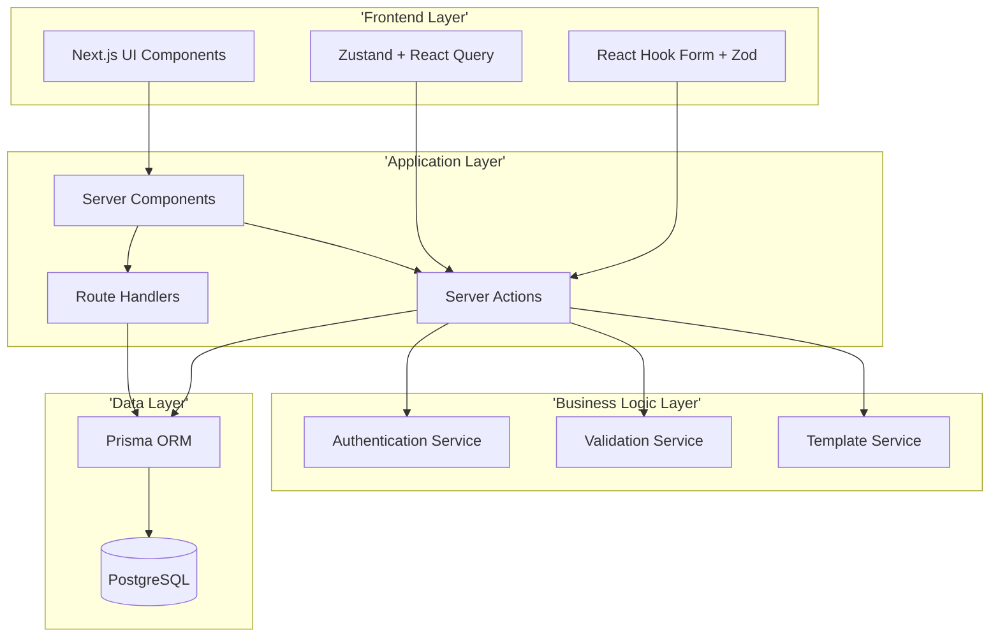

---

## 3. Entity Relationship Diagram

### 3.1 Core Entities

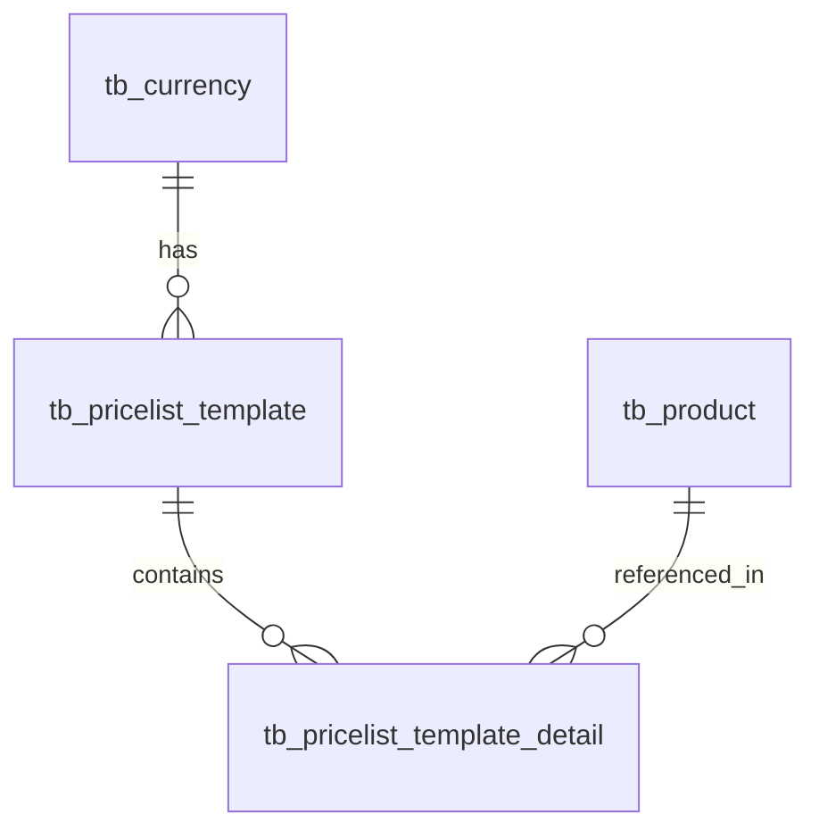

#### tb_pricelist_template

| Field | Type | Key | Description |
|-------|------|-----|-------------|
| id | uuid | PK | Primary key |
| name | string | UK | Template name (unique) |
| description | text | | Template description |
| currency_id | uuid | FK | Reference to tb_currency |
| currency_name | string | | Currency display name |
| vendor_instructions | text | | Instructions for vendors |
| effective_from | date | | Start date |
| effective_to | date | | End date |
| status | enum | | Template status |
| info | json | | Extended information |
| doc_version | decimal | | Document version |
| created_at | timestamp | | Creation timestamp |
| created_by_id | uuid | | Creator reference |
| updated_at | timestamp | | Last update timestamp |
| updated_by_id | uuid | | Updater reference |

#### tb_pricelist_template_detail

| Field | Type | Key | Description |
|-------|------|-----|-------------|
| id | uuid | PK | Primary key |
| pricelist_template_id | uuid | FK | Reference to template |
| sequence_no | integer | | Item sequence |
| product_id | uuid | FK | Reference to tb_product |
| product_name | string | | Product display name |
| unit_of_measure | string | | Unit of measure |
| minimum_order_quantity | decimal | | Minimum order qty |
| lead_time_days | integer | | Lead time in days |
| info | json | | Extended information |
| doc_version | decimal | | Document version |

---

## 4. Template Lifecycle State Diagram

### 4.1 Template Status Workflow

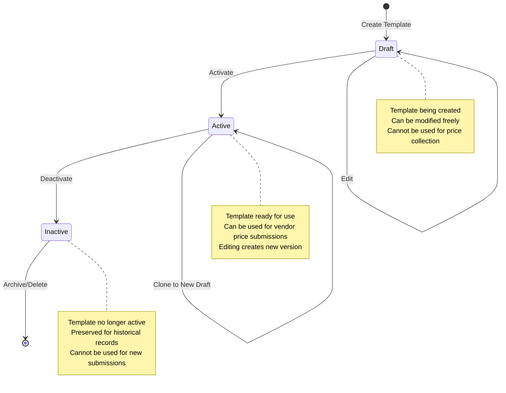

---

## 5. Core Workflows

### 5.1 Template Creation Workflow (3-Step Wizard)

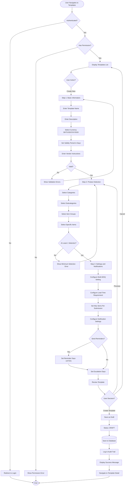

### 5.2 Product Assignment Workflow (Hierarchical Selection)

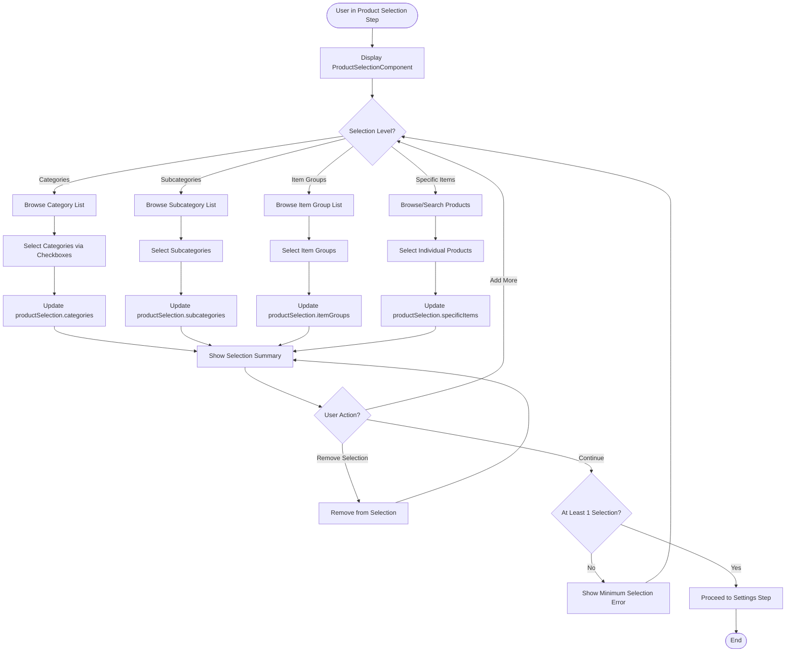

**Selection Interface Features**:
- Checkbox-based multi-selection at each level
- Collapsible/expandable category tree
- Search/filter within each level
- Selection count badges
- Clear all selections option

### 5.3 Template Cloning Workflow

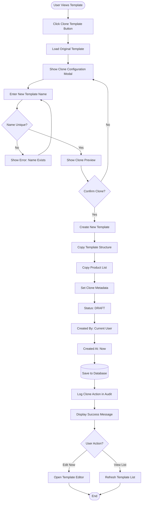

### 5.4 Template Status Change Workflow

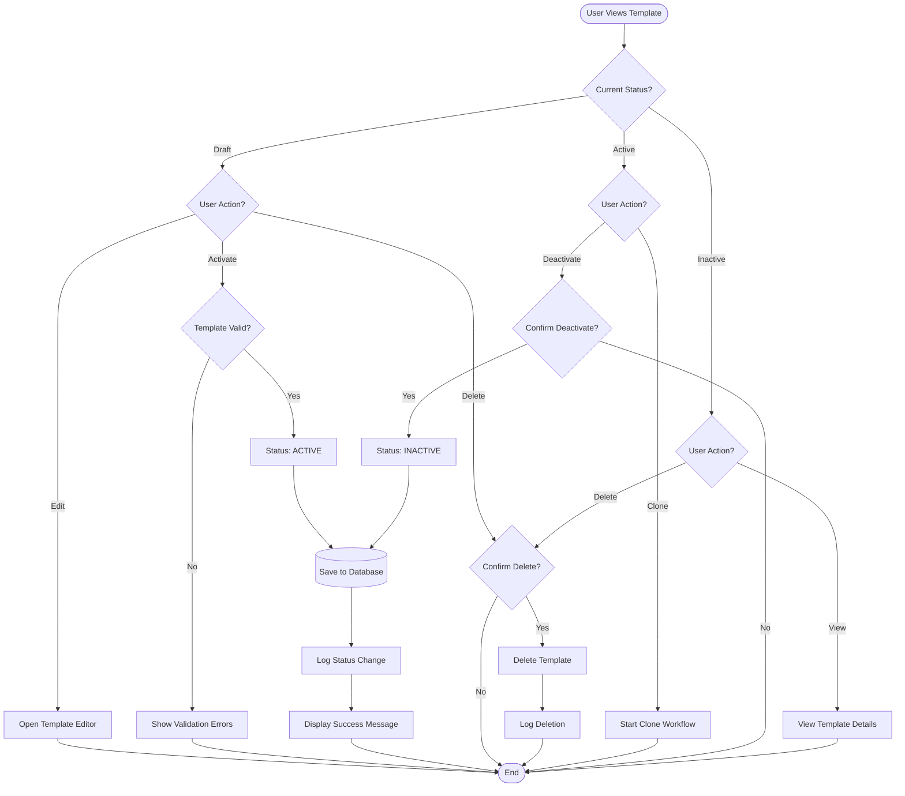

---

## 6. Search and Filter Workflow

### 6.1 Template Search Workflow

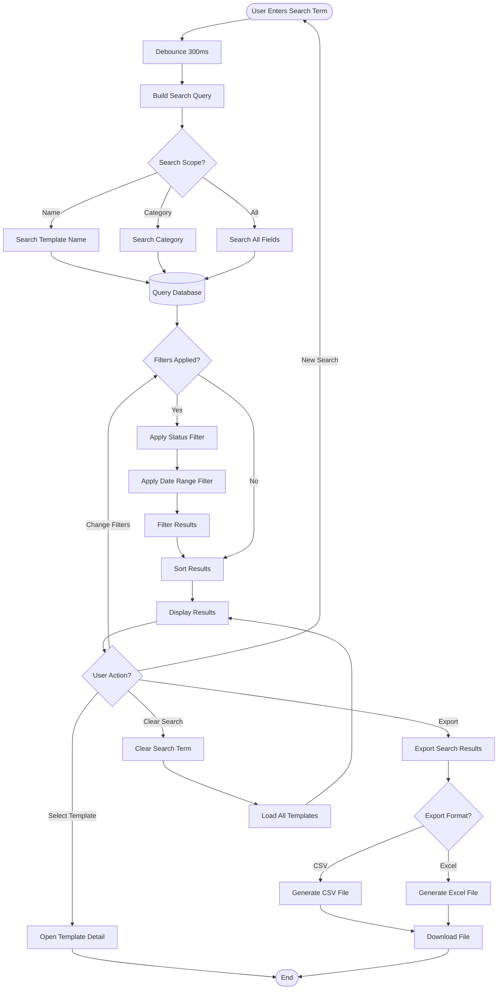

---

## 7. Integration Flow Diagrams

### 7.1 Price List Module Integration

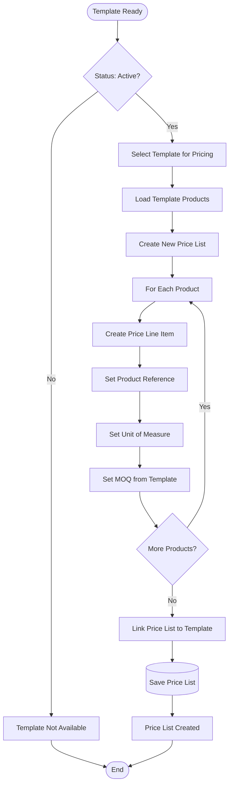

### 7.2 Product Management Integration

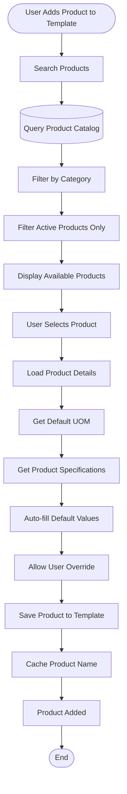

---

## 8. Data Flow Diagrams

### 8.1 Template Creation Data Flow

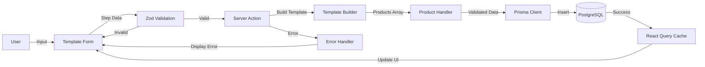

### 8.2 Template Read Data Flow

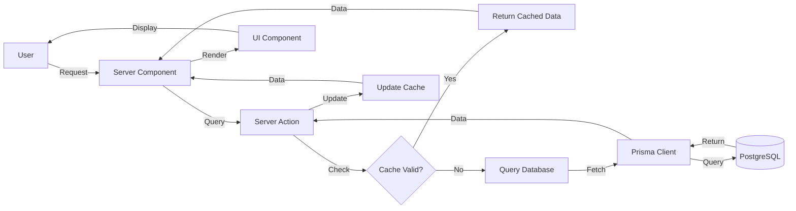

---

## Related Documents
- BR-pricelist-templates.md - Business Requirements
- DD-pricelist-templates.md - Data Definition
- UC-pricelist-templates.md - Use Cases
- TS-pricelist-templates.md - Technical Specification
- VAL-pricelist-templates.md - Validations

---

**End of Flow Diagrams Document**
