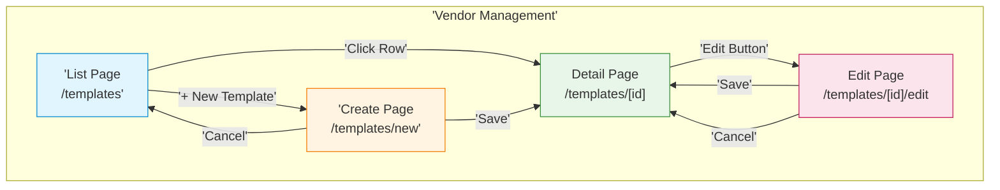

# Pricelist Templates - Technical Specification (TS)

## Document Information
- **Document Type**: Technical Specification (Sitemap)
- **Module**: Vendor Management > Pricelist Templates
- **Version**: 3.0.0
- **Last Updated**: 2025-01-15
- **Document Status**: Active
- **Mermaid Compatibility**: 8.8.2+

## Document History

| Version | Date | Author | Changes |
|---------|------|--------|---------|
| 3.0.0 | 2025-01-15 | Documentation Team | Synced with current code implementation; Updated file structure to match actual components; Added wizard-based creation flow; Added notification settings; Updated route paths; Added Multi-MOQ, lead time, currency options |
| 1.1.0 | 2025-12-10 | Documentation Team | Standardized reference number format (XXX-YYMM-NNNN) |
| 2.1.0 | 2025-11-25 | Documentation Team | Restructured to sitemap-focused format; Removed implementation code |
| 2.0.0 | 2025-11-25 | Documentation Team | Simplified to align with BR-pricelist-templates.md |
| 1.0 | 2024-01-15 | System | Initial technical specification |

---

## 1. Module Overview

### 1.1 Purpose
The Pricelist Templates module provides a centralized system for creating, managing, and distributing standardized pricing templates to vendors.

### 1.2 Base Route
```
/vendor-management/templates
```

### 1.3 File Structure
```
app/
└── (main)/
    └── vendor-management/
        └── templates/
            ├── page.tsx                           # List Page (Table/Card views)
            ├── new/
            │   └── page.tsx                       # Create Page (3-step wizard)
            ├── [id]/
            │   ├── page.tsx                       # Detail Page (tabs: Product Selection, RfP/Campaigns)
            │   └── edit/
            │       └── page.tsx                   # Edit Page
            ├── components/
            │   ├── CustomFieldsComponent.tsx      # Custom field configuration
            │   ├── ExcelTemplateCustomizer.tsx    # Excel export customization
            │   ├── MOQPricingComponent.tsx        # Multi-MOQ pricing configuration
            │   ├── ProductSelectionComponent.tsx  # Product selection by category/item
            │   └── TemplatePreview.tsx            # Template preview modal
            ├── lib/
            │   ├── excel-download-service.ts      # Excel file download service
            │   └── excel-generator.ts             # Excel template generation
            └── types/
                └── index.ts                       # Module-specific types
```

---

## 2. Sitemap Overview

### 2.1 Navigation Structure



### 2.2 Page Summary

| Page | Route | Purpose |
|------|-------|---------|
| List Page | `/templates` | Browse and manage templates (Table/Card view) |
| Create Page | `/templates/new` | Create new template (3-step wizard) |
| Detail Page | `/templates/[id]` | View template details and campaigns |
| Edit Page | `/templates/[id]/edit` | Modify existing template |

---

## 3. Page Specifications

### 3.1 List Page

**Route**: `/vendor-management/templates`

**Purpose**: Display paginated list of all pricelist templates with filtering, search, and view mode toggle.

#### Layout Structure

```
┌─────────────────────────────────────────────────────────────┐
│ HEADER                                                      │
│ ┌─────────────────────────────────────────────────────────┐ │
│ │ Breadcrumbs: Vendor Management > Pricelist Templates    │ │
│ │ Title: Pricelist Templates                              │ │
│ │ [+ New Template]                                        │ │
│ └─────────────────────────────────────────────────────────┘ │
├─────────────────────────────────────────────────────────────┤
│ TOOLBAR                                                     │
│ ┌─────────────────────────────────────────────────────────┐ │
│ │ [Search...          ] [Status Filter ▼] [Table|Card]    │ │
│ └─────────────────────────────────────────────────────────┘ │
├─────────────────────────────────────────────────────────────┤
│ DATA VIEW (Table or Card)                                   │
│ ┌─────────────────────────────────────────────────────────┐ │
│ │ TABLE VIEW:                                              │ │
│ │ Name | Currency | Products | Status | Updated | Actions │ │
│ ├─────────────────────────────────────────────────────────┤ │
│ │ CARD VIEW:                                               │ │
│ │ [Card] [Card] [Card] [Card]                              │ │
│ └─────────────────────────────────────────────────────────┘ │
├─────────────────────────────────────────────────────────────┤
│ PAGINATION                                                  │
│ ┌─────────────────────────────────────────────────────────┐ │
│ │ Showing 1-10 of 50    [Prev] [1] [2] [3] ... [Next]     │ │
│ └─────────────────────────────────────────────────────────┘ │
└─────────────────────────────────────────────────────────────┘
```

#### View Modes

| Mode | Description |
|------|-------------|
| Table | Traditional data table with sortable columns |
| Card | Visual card grid layout for templates |

#### Status Filter Options

| Status | Badge Color | Description |
|--------|-------------|-------------|
| All | - | All templates regardless of status |
| Draft | Yellow (`bg-yellow-100 text-yellow-800`) | Templates being created/edited |
| Active | Green (`bg-green-100 text-green-800`) | Templates ready for use |
| Inactive | Gray (`bg-gray-100 text-gray-800`) | Deactivated templates |

#### Table Columns

| Column | Type | Sortable | Description |
|--------|------|----------|-------------|
| Name | Text | Yes | Template name (clickable link) |
| Currency | Text | Yes | Default currency code |
| Products | Number | Yes | Count of assigned products |
| Status | Badge | Yes | Draft / Active / Inactive |
| Updated | Date | Yes | Last modification date |
| Actions | Menu | No | Row action menu |

#### Row Actions

| Action | Icon | Condition | Description |
|--------|------|-----------|-------------|
| View | Eye | Always | Navigate to detail page |
| Edit | Pencil | Always | Navigate to edit page |
| Duplicate | Copy | Always | Creates copy of template |
| Generate Excel | FileSpreadsheet | Always | Download Excel template |
| Create RfP | Send | Status = Active | Create Request for Pricing campaign |
| Delete | Trash | Always | Opens delete confirmation |

#### Dialogues

| Dialog | Trigger | Purpose |
|--------|---------|---------|
| Duplicate Template | Row action: Duplicate | Create copy with new name |
| Delete Confirm | Row action: Delete | Confirm deletion with warning |
| Template Preview | Row action: View (quick) | Preview template structure |

---

### 3.2 Detail Page

**Route**: `/vendor-management/templates/[id]`

**Purpose**: Display comprehensive view of a single template including assigned products and associated campaigns.

#### Layout Structure

```
┌─────────────────────────────────────────────────────────────┐
│ HEADER                                                      │
│ ┌─────────────────────────────────────────────────────────┐ │
│ │ [Back] Template Name                    [Status Badge]  │ │
│ │ Description text                                        │ │
│ │ [Preview] [Duplicate] [Generate Excel] [Create RfP]     │ │
│ │ [Edit] [Delete]                                         │ │
│ └─────────────────────────────────────────────────────────┘ │
├─────────────────────────────────────────────────────────────┤
│ TEMPLATE INFO CARD                                          │
│ ┌─────────────────────────────────────────────────────────┐ │
│ │ Template #: TPL-XXXX-XXX                                │ │
│ │ Currency | Validity Period | Multi-MOQ | Lead Time     │ │
│ │ Vendor Instructions text area                           │ │
│ │ Notification Settings (Reminders, Escalation)           │ │
│ └─────────────────────────────────────────────────────────┘ │
├─────────────────────────────────────────────────────────────┤
│ TABS                                                        │
│ ┌─────────────────────────────────────────────────────────┐ │
│ │ [Product Selection] [RfP/Campaigns]                     │ │
│ └─────────────────────────────────────────────────────────┘ │
├─────────────────────────────────────────────────────────────┤
│ TAB CONTENT                                                 │
│ ┌─────────────────────────────────────────────────────────┐ │
│ │ (Content varies by selected tab)                        │ │
│ └─────────────────────────────────────────────────────────┘ │
└─────────────────────────────────────────────────────────────┘
```

#### Template Info Card Fields

| Field | Type | Description |
|-------|------|-------------|
| Template # | Text | Template reference number (e.g., TPL-2410-001) |
| Default Currency | Select | Currency for pricing (BHT, USD, CNY, SGD) |
| Validity Period | Number | Days prices remain valid |
| Allow Multi-MOQ | Switch | Enable multi-level MOQ pricing |
| Require Lead Time | Switch | Require lead time from vendors |
| Max Items Per Submission | Number | Maximum items vendors can submit |
| Vendor Instructions | Textarea | Instructions for vendors |
| Notification Settings | Section | Reminder days and escalation settings |

#### Tabs

##### Tab: Product Selection

| Section | Content |
|---------|---------|
| Categories | Selected product categories |
| Subcategories | Selected subcategories |
| Item Groups | Selected item groups |
| Specific Items | Individual products selected |

##### Tab: RfP/Campaigns

| Column | Type | Description |
|--------|------|-------------|
| Campaign Name | Text | Request for Pricing name |
| Vendors | Number | Count of invited vendors |
| Status | Badge | Campaign status |
| Response Rate | Percent | Vendor response rate |
| Created | Date | Campaign creation date |

#### Header Actions

| Action | Icon | Condition | Description |
|--------|------|-----------|-------------|
| Edit | Pencil | Always | Navigate to edit page |
| Preview | Eye | Always | Opens template preview modal |
| Duplicate | Copy | Always | Creates copy of template |
| Generate Excel | FileSpreadsheet | Always | Download Excel template |
| Create RfP | Send | Status = Active | Create new campaign |
| Delete | Trash | Always | Opens delete confirmation |

#### Status Change Actions

| Current Status | Available Action | New Status |
|----------------|------------------|------------|
| Draft | Activate | Active |
| Active | Deactivate | Inactive |
| Inactive | (view only) | - |

#### Dialogues

| Dialog | Trigger | Purpose |
|--------|---------|---------|
| Template Preview | Preview button | Preview template structure |
| Delete Confirm | Delete button | Confirm deletion |
| Status Change | Status toggle | Confirm activation/deactivation |

---

### 3.3 Create Page

**Route**: `/vendor-management/templates/new`

**Purpose**: Create a new pricelist template using a 3-step wizard.

#### Wizard Steps

| Step | Name | Description |
|------|------|-------------|
| 1 | Basic Information | Template name, description, currency, validity |
| 2 | Product Selection | Select categories, subcategories, items |
| 3 | Settings & Notifications | MOQ, lead time, notification settings |

#### Layout Structure

```
┌─────────────────────────────────────────────────────────────┐
│ HEADER                                                      │
│ ┌─────────────────────────────────────────────────────────┐ │
│ │ [Back] Create Pricelist Template                        │ │
│ └─────────────────────────────────────────────────────────┘ │
├─────────────────────────────────────────────────────────────┤
│ WIZARD PROGRESS                                             │
│ ┌─────────────────────────────────────────────────────────┐ │
│ │ (1) Basic Info ──── (2) Products ──── (3) Settings      │ │
│ └─────────────────────────────────────────────────────────┘ │
├─────────────────────────────────────────────────────────────┤
│ STEP CONTENT (varies by step)                               │
│ ┌─────────────────────────────────────────────────────────┐ │
│ │ Step 1: Name, Description, Currency, Validity, etc.    │ │
│ │ Step 2: ProductSelectionComponent                       │ │
│ │ Step 3: MOQ, Lead Time, Notifications                   │ │
│ └─────────────────────────────────────────────────────────┘ │
├─────────────────────────────────────────────────────────────┤
│ FOOTER                                                      │
│ ┌─────────────────────────────────────────────────────────┐ │
│ │ [Cancel]                    [Previous] [Next/Create]    │ │
│ └─────────────────────────────────────────────────────────┘ │
└─────────────────────────────────────────────────────────────┘
```

#### Step 1: Basic Information

| Field | Type | Required | Default | Validation |
|-------|------|----------|---------|------------|
| Template Name | Text | Yes | - | 3-200 characters, unique |
| Description | Textarea | No | - | Max 2000 characters |
| Currency | Select | Yes | BHT | Valid currency (BHT, USD, CNY, SGD) |
| Supported Currencies | Multi-select | No | [BHT] | Valid currencies |
| Validity Period | Number | Yes | 90 | 1-365 days |
| Vendor Instructions | Textarea | No | - | Max 5000 characters |

#### Currency Options

| Code | Label |
|------|-------|
| BHT | Thai Baht (BHT) |
| USD | US Dollar (USD) |
| CNY | Chinese Yuan (CNY) |
| SGD | Singapore Dollar (SGD) |

#### Step 2: Product Selection

| Selection Type | Description |
|----------------|-------------|
| Categories | Select entire product categories |
| Subcategories | Select specific subcategories |
| Item Groups | Select item groups within subcategories |
| Specific Items | Select individual products |

#### Step 3: Settings & Notifications

| Field | Type | Required | Default | Validation |
|-------|------|----------|---------|------------|
| Allow Multi-MOQ | Switch | No | true | Boolean |
| Require Lead Time | Switch | No | true | Boolean |
| Max Items Per Submission | Number | No | 1000 | 1-10000 |
| Send Reminders | Switch | No | true | Boolean |
| Reminder Days | Checkbox group | No | [7, 3, 1] | Values: 14, 7, 3, 1 |
| Escalation Days | Number | No | 14 | 1-90 |

#### Initial Form State

```typescript
{
  name: '',
  description: '',
  productSelection: { categories: [], subcategories: [], itemGroups: [], specificItems: [] },
  customFields: [],
  instructions: '',
  validityPeriod: 90,
  status: 'draft',
  allowMultiMOQ: true,
  requireLeadTime: true,
  defaultCurrency: 'BHT',
  supportedCurrencies: ['BHT'],
  maxItemsPerSubmission: 1000,
  notificationSettings: {
    sendReminders: true,
    reminderDays: [7, 3, 1],
    escalationDays: 14
  }
}
```

#### Dialogues

| Dialog | Trigger | Purpose |
|--------|---------|---------|
| Cancel Confirm | Cancel button (if unsaved changes) | Confirm discarding changes |

---

### 3.4 Edit Page

**Route**: `/vendor-management/templates/[id]/edit`

**Purpose**: Modify an existing pricelist template.

#### Layout Structure

```
┌─────────────────────────────────────────────────────────────┐
│ HEADER                                                      │
│ ┌─────────────────────────────────────────────────────────┐ │
│ │ [Back] [Template Name Input]  [Status Badge]            │ │
│ │ [Description Input]                                     │ │
│ │ [Save Changes]                                          │ │
│ └─────────────────────────────────────────────────────────┘ │
├─────────────────────────────────────────────────────────────┤
│ TEMPLATE CONFIGURATION CARD                                 │
│ ┌─────────────────────────────────────────────────────────┐ │
│ │ Template #: [ID]                                        │ │
│ │ Vendor Instructions (textarea)                          │ │
│ │ Currency | Validity Period | Status Toggle | History    │ │
│ └─────────────────────────────────────────────────────────┘ │
├─────────────────────────────────────────────────────────────┤
│ PRODUCT SELECTION CARD                                      │
│ ┌─────────────────────────────────────────────────────────┐ │
│ │ ProductSelectionComponent                               │ │
│ └─────────────────────────────────────────────────────────┘ │
├─────────────────────────────────────────────────────────────┤
│ NOTIFICATION SETTINGS CARD                                  │
│ ┌─────────────────────────────────────────────────────────┐ │
│ │ Send Reminders (switch)                                 │ │
│ │ Reminder Days (14, 7, 3, 1 checkboxes)                  │ │
│ │ Escalation After (days input)                           │ │
│ └─────────────────────────────────────────────────────────┘ │
└─────────────────────────────────────────────────────────────┘
```

#### Editable Fields

| Section | Field | Type | Description |
|---------|-------|------|-------------|
| Header | Template Name | Text Input | Inline editable name |
| Header | Description | Textarea | Inline editable description |
| Config | Vendor Instructions | Textarea | Instructions for vendors |
| Config | Default Currency | Select | BHT, USD, CNY, SGD |
| Config | Validity Period | Number | Days (1-365) |
| Config | Status | Switch | Active/Inactive toggle |
| Products | Product Selection | Component | Category/subcategory/item selection |
| Notifications | Send Reminders | Switch | Enable/disable reminders |
| Notifications | Reminder Days | Checkboxes | 14, 7, 3, 1 days before deadline |
| Notifications | Escalation Days | Number | Days before escalation |

#### Status Toggle Logic

| Current Status | Can Toggle To | Validation Required |
|----------------|---------------|---------------------|
| Draft | Active | Name and product selection required |
| Active | Inactive | Confirmation only |
| Inactive | Active | Name and product selection required |

#### Header Actions

| Action | Icon | Description |
|--------|------|-------------|
| Back | ChevronLeft | Return to previous page |
| Save Changes | Save | Save all changes and redirect to detail page |

#### Dialogues

| Dialog | Trigger | Purpose |
|--------|---------|---------|
| Discard Changes | Back button (if unsaved changes) | Confirm discarding changes |
| Validation Error | Save with invalid data | Show missing required fields |

---

## 4. Navigation Flow

### 4.1 Primary User Flows

```mermaid
flowchart TD
    subgraph CreateFlow['Create Template Flow']
        L1[List Page] -->|"Click + New Template"| C1[Create Page]
        C1 -->|'Fill Form'| C2[Add Products]
        C2 -->|'Save'| D1[Detail Page]
        C1 -->|'Cancel'| L1
    end

    subgraph EditFlow['Edit Template Flow']
        L2[List Page] -->|"Click Row"| D2[Detail Page]
        D2 -->|'Click Edit'| E1[Edit Page]
        E1 -->|'Save'| D2
        E1 -->|'Cancel'| D2
    end

    subgraph StatusFlow['Status Change Flow']
        D3[Detail Page] -->|"Click Activate"| S1{Status Dialog}
        S1 -->|'Confirm'| D4[Detail Page - Active]
        D4 -->|'Click Deactivate'| S2{Status Dialog}
        S2 -->|'Confirm'| D5[Detail Page - Inactive]
    end

    subgraph CloneFlow['Clone Template Flow']
        D6[Detail Page] -->|"Click Clone"| CL1{Clone Dialog}
        CL1 -->|'Enter Name + Confirm'| D7[New Template Detail]
    end
```



### 4.2 Quick Actions

| From | Action | To |
|------|--------|-----|
| List Page | Click row | Detail Page |
| List Page | + New Template | Create Page |
| List Page | Row action: Edit | Edit Page |
| List Page | Row action: Clone | Clone Dialog → Detail Page |
| Detail Page | Edit button | Edit Page |
| Detail Page | Clone button | Clone Dialog → Detail Page |
| Create Page | Save | Detail Page |
| Create Page | Cancel | List Page |
| Edit Page | Save | Detail Page |
| Edit Page | Cancel | Detail Page |

---

## 5. Component Specifications

### 5.1 ProductSelectionComponent

**File**: `components/ProductSelectionComponent.tsx`

**Purpose**: Hierarchical product selection with category, subcategory, item group, and specific item support.

**Props**:
| Prop | Type | Description |
|------|------|-------------|
| productSelection | ProductSelection | Current selection state |
| onChange | (selection: ProductSelection) => void | Selection change handler |

**ProductSelection Interface**:
```typescript
interface ProductSelection {
  categories: string[]
  subcategories: string[]
  itemGroups: string[]
  specificItems: string[]
}
```

### 5.2 TemplatePreview

**File**: `components/TemplatePreview.tsx`

**Purpose**: Modal preview of template structure and configuration.

**Props**:
| Prop | Type | Description |
|------|------|-------------|
| template | PricelistTemplate | Template data to preview |
| onClose | () => void | Close modal handler |

### 5.3 MOQPricingComponent

**File**: `components/MOQPricingComponent.tsx`

**Purpose**: Multi-level MOQ pricing configuration interface.

**Features**:
- Add multiple MOQ tiers
- Configure unit price per tier
- Set conversion factors
- Define lead time per MOQ level

### 5.4 CustomFieldsComponent

**File**: `components/CustomFieldsComponent.tsx`

**Purpose**: Configure custom fields for vendor submissions.

**Supported Field Types**:
| Type | Description |
|------|-------------|
| text | Single-line text input |
| number | Numeric input |
| date | Date picker |
| select | Dropdown selection |
| textarea | Multi-line text |

### 5.5 ExcelTemplateCustomizer

**File**: `components/ExcelTemplateCustomizer.tsx`

**Purpose**: Customize Excel template export format and fields.

### 5.6 Excel Services

**File**: `lib/excel-download-service.ts`
- Download service for Excel file generation
- Handles file download triggers

**File**: `lib/excel-generator.ts`
- Excel template generation logic
- Product list formatting
- Custom field integration

---

## 6. State Management

### 6.1 Server State (React Query)

| Query Key | Data | Cache Time |
|-----------|------|------------|
| `['templates']` | Template list | 5 minutes |
| `['templates', id]` | Single template | 5 minutes |
| `['products', search, category]` | Product search results | 1 minute |
| `['currencies']` | Currency list | 10 minutes |

### 6.2 Form State (React Hook Form)

| Form | Fields | Validation |
|------|--------|------------|
| Template Form | name, description, currencyId, effectiveFrom, effectiveTo, vendorInstructions, products | Zod schema |

---

## 7. Access Control

### 7.1 Page Access by Role

| Role | List | Detail | Create | Edit | Delete |
|------|------|--------|--------|------|--------|
| Procurement Manager | ✅ | ✅ | ✅ | ✅ | ✅ |
| Procurement Staff | ✅ | ✅ | ✅ (draft) | ✅ (own) | ❌ |
| Finance Manager | ✅ | ✅ | ❌ | ❌ | ❌ |
| Department Manager | ✅ (dept) | ✅ (dept) | ❌ | ❌ | ❌ |
| Executive | ✅ | ✅ | ❌ | ❌ | ❌ |

### 7.2 Action Permissions

| Action | Permission Required |
|--------|---------------------|
| View templates | `view_templates` |
| Create template | `create_templates` |
| Edit template | `edit_templates` or owner of draft |
| Activate template | `activate_templates` |
| Delete template | `delete_templates` |
| Clone template | `create_templates` |

---

## Related Documents
- BR-pricelist-templates.md - Business Requirements
- DD-pricelist-templates.md - Data Definition
- FD-pricelist-templates.md - Flow Diagrams
- VAL-pricelist-templates.md - Validations
- UC-pricelist-templates.md - Use Cases

---

**End of Technical Specification Document**
