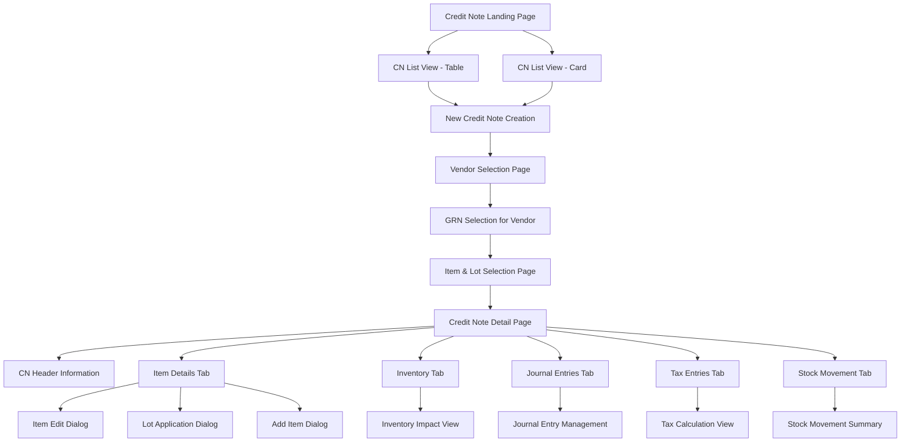
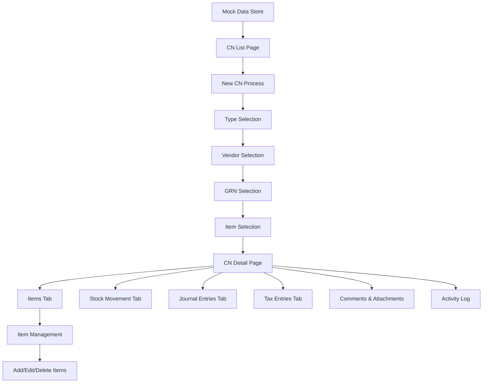
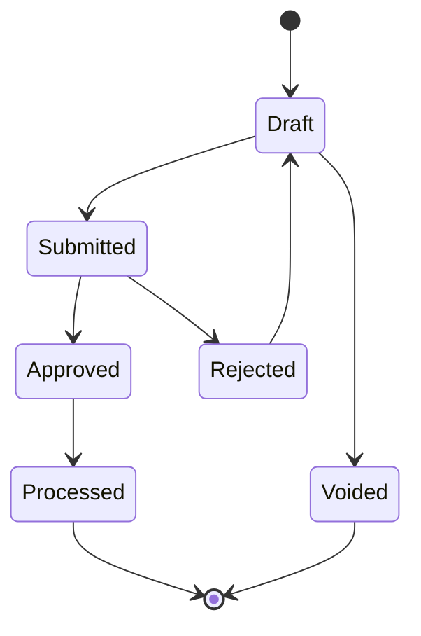

# Credit Note Module Documentation

Welcome to the comprehensive documentation for the Carmen ERP Credit Note module. This documentation provides complete technical specifications, user guides, and implementation details.

## 📚 Documentation Structure

### 1. [Complete Technical Specification](./credit-note-complete-specification.md)
**Comprehensive overview of the entire Credit Note module**
- Module overview and key features
- Complete site map with Mermaid diagrams
- Page and component documentation
- Data flow and user interactions
- Technical architecture details
- API endpoints and database schema

### 2. [Detailed Component Documentation](./components-detailed-documentation.md)
**In-depth analysis of all components and their interactions**
- Page components (List, Detail, Create)
- Form components and validation
- Dialog components and workflows
- Tab components and functionality
- Utility and data components
- Component interaction patterns

### 3. [User Interaction Guide](./user-interaction-guide.md)
**Complete guide for user workflows and interactions**
- Navigation and entry points
- Primary user workflows
- Dialog and form interactions
- Data management features
- Advanced functionality

### 4. [API Specification](./api-specification.md)
**Technical API documentation for developers**
- Authentication and authorization
- Core endpoints and operations
- Data models and schemas
- Error handling and responses
- Rate limiting and webhooks

## 🖼️ Screenshots & Visual Documentation

All screenshots are stored in the [`screenshots/`](./screenshots/) directory:

- **cn-list-page.png** - Main Credit Note listing interface (Card View)
- **cn-list-page-table-view.png** - Main Credit Note listing interface (Table View)
- **cn-new-type-selection-dialog.png** - Credit Note type selection dialog
- **cn-detail-page-items-tab.png** - Credit Note detail page showing Items tab
- **cn-detail-page-stock-movement-tab.png** - Credit Note detail page showing Stock Movement tab

## 🗺️ Module Site Map



## 🚀 Key Features

### Credit Note Management
- Complete CN lifecycle management (Draft → Submitted → Approved → Processed)
- Multi-type support (Quantity Return, Amount Discount)
- Integration with Goods Received Notes for seamless procurement flow
- Comprehensive item management with lot tracking and inventory integration

### User Interface
- Responsive design with table and card views
- Advanced filtering and search capabilities
- Multi-step creation workflow
- Export and print functionality
- Real-time status updates

### Document Management
- Attachment handling for CN documents
- Integration with GRNs, invoices, and vendor correspondence
- Activity logging and complete audit trail
- Email notifications and vendor communication
- Comments and collaboration features

### Technical Architecture
- Next.js 14 with App Router
- TypeScript with strict mode
- Tailwind CSS + Shadcn/ui components
- React Hook Form + Zod validation
- Multi-currency support with exchange rates

## 📁 File Structure

```
docs/documents/cn/
├── README.md                                   # This file
├── credit-note-complete-specification.md      # Complete technical spec
├── components-detailed-documentation.md       # Component documentation
├── user-interaction-guide.md                  # User workflows
├── api-specification.md                       # API documentation
└── screenshots/                               # Visual documentation
    ├── cn-list-page.png
    ├── cn-list-page-table-view.png
    ├── cn-new-type-selection-dialog.png
    ├── cn-detail-page-items-tab.png
    └── cn-detail-page-stock-movement-tab.png
```

## 🔗 Source Code Structure

```
app/(main)/procurement/credit-note/
├── page.tsx                                   # Main listing page
├── [id]/page.tsx                             # Detail page route
├── new/page.tsx                              # New credit note route
└── components/                               # Component library
    ├── credit-note-management.tsx           # Main list management
    ├── credit-note-detail.tsx               # Detail component
    ├── credit-note-items.tsx                # Items management
    ├── transaction-summary.tsx              # Financial summary
    └── tabs/                                # Tab components
        ├── inventory-tab.tsx                # Inventory tracking
        ├── journal-entries-tab.tsx          # Journal entries
        ├── tax-entries-tab.tsx              # Tax calculations
        └── stock-movement-tab.tsx           # Stock movements
```

## 🎯 Primary User Workflows

### 1. Create Credit Note from GRN
1. Navigate to CN List → Click "New Credit Note" → Select credit note type
2. Select vendor from searchable list
3. Choose one or multiple Goods Received Notes
4. Select items and quantities to credit
5. Review and confirm credit note details
6. Save as draft or submit for approval

### 2. Create Credit Note Manually
1. Click "New Credit Note" → Select "Manual Creation"
2. Fill vendor and header information manually
3. Add items with pricing and quantities
4. Configure reason codes and lot numbers
5. Review financial summary
6. Save as draft or submit for approval

### 3. Process Credit Note Items
1. Open CN Detail → Items tab
2. Review credited vs available quantities
3. Process inventory adjustments (automatic)
4. Handle lot tracking and expiry dates
5. Complete item processing

## 🛠️ Technical Implementation

### Component Architecture
- **CreditNoteDetail**: Main detail interface with multi-mode support
- **CreditNoteItems**: Comprehensive item management
- **TransactionSummary**: Real-time financial calculations
- **Multi-step workflow**: Type selection → Vendor → GRN → Items → Confirmation

### State Management
- React useState for local state management
- URL parameters for routing context
- LocalStorage for temporary workflow data
- Mock data integration with future API readiness

### Data Flow


## 📊 Database Schema Overview

### Main Tables
- **credit_notes** - Core CN information
- **credit_note_items** - Line items and quantities
- **cn_stock_movements** - Inventory movements
- **cn_journal_entries** - Financial journal entries
- **cn_activity_log** - Complete audit trail

### Key Relationships
- CN → Items (One-to-Many)
- CN → Stock Movements (One-to-Many)
- CN → Journal Entries (One-to-Many)
- CN → Activity Log (One-to-Many)
- Items → GRN Items (Many-to-One, optional)

## 🔄 Status Workflow



## 📧 Support & Contributions

For questions, issues, or contributions to this documentation:

1. **Technical Issues**: Review the component documentation and API specification
2. **User Workflow Questions**: Consult the user interaction guide
3. **Feature Requests**: Reference the complete technical specification
4. **Bug Reports**: Include relevant screenshots and component details

## Document History

| Version | Date | Author | Changes |
|---------|------|--------|---------|
| 1.0.0 | 2025-11-19 | Documentation Team | Initial version |
---

*Documentation generated on: 2025-09-23*
*Module Version: 1.0*
*Carmen ERP - Hospitality Supply Chain Management*