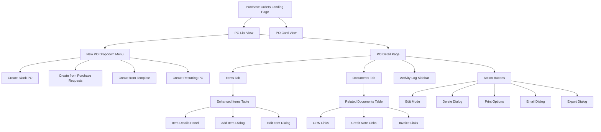
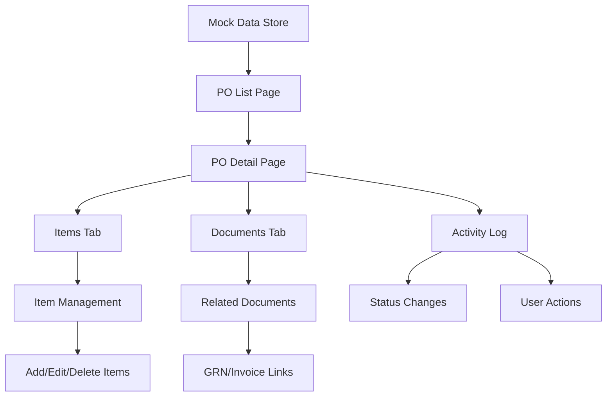
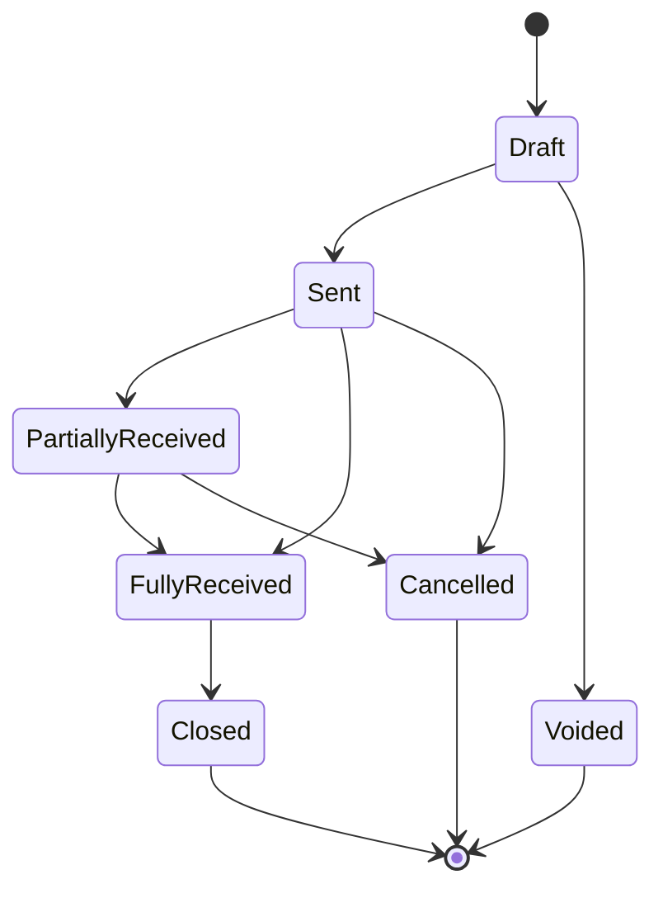

# Purchase Order Module Documentation

Welcome to the comprehensive documentation for the Carmen ERP Purchase Order module. This documentation provides complete technical specifications, user guides, and implementation details.

## 📚 Documentation Structure

### 1. [Complete Technical Specification](./purchase-order-complete-specification.md)
**Comprehensive overview of the entire Purchase Order module**
- Module overview and key features
- Complete site map with Mermaid diagrams
- Page and component documentation
- Data flow and user interactions
- Technical architecture details
- API endpoints and database schema

### 2. [Detailed Component Documentation](./components-detailed-documentation.md)
**In-depth analysis of all components and their interactions**
- Page components (List, Detail, Create)
- Form components and validation
- Dialog components and workflows
- Tab components and functionality
- Utility and data components
- Component interaction patterns

### 3. [User Interaction Guide](./user-interaction-guide.md)
**Complete guide for user workflows and interactions**
- Navigation and entry points
- Primary user workflows
- Dialog and form interactions
- Data management features
- Advanced functionality

### 4. [API Specification](./api-specification.md)
**Technical API documentation for developers**
- Authentication and authorization
- Core endpoints and operations
- Data models and schemas
- Error handling and responses
- Rate limiting and webhooks

## 🖼️ Screenshots & Visual Documentation

All screenshots are stored in the [`screenshots/`](./screenshots/) directory:

- **purchase-orders-list-page.png** - Main PO listing interface
- **purchase-order-detail-page.png** - Detailed PO view with Items tab
- **purchase-order-documents-tab.png** - Documents tab showing related GRNs
- **purchase-order-new-po-menu.png** - New PO creation dropdown menu

## 🗺️ Module Site Map



## 🚀 Key Features

### Purchase Order Management
- Complete PO lifecycle management (Draft → Sent → Received → Closed)
- Multi-currency support with real-time exchange rates
- Integration with Purchase Requests for seamless procurement flow
- Comprehensive item management with inventory tracking

### User Interface
- Responsive design with table and card views
- Advanced filtering and search capabilities
- Bulk operations and template support
- Export and print functionality

### Document Management
- Attachment handling for PO documents
- Integration with GRNs, invoices, and credit notes
- Activity logging and complete audit trail
- Email notifications and vendor communication

### Technical Architecture
- Next.js 14 with App Router
- TypeScript with strict mode
- Tailwind CSS + Shadcn/ui components
- React Hook Form + Zod validation

## 📁 File Structure

```
docs/documents/po/
├── README.md                                   # This file
├── purchase-order-complete-specification.md   # Complete technical spec
├── components-detailed-documentation.md       # Component documentation
├── user-interaction-guide.md                  # User workflows
├── api-specification.md                       # API documentation
└── screenshots/                               # Visual documentation
    ├── purchase-orders-list-page.png
    ├── purchase-order-detail-page.png
    ├── purchase-order-documents-tab.png
    └── purchase-order-new-po-menu.png
```

## 🔗 Source Code Structure

```
app/(main)/procurement/purchase-orders/
├── page.tsx                                   # Main listing page
├── [id]/page.tsx                             # Detail page route
├── [id]/edit/page.tsx                        # Edit page route
├── create/page.tsx                           # Create page route
├── create/from-pr/page.tsx                   # Create from PR route
├── create/bulk/page.tsx                      # Bulk create route
└── components/                               # Component library
    ├── PODetailPage.tsx                      # Main detail component
    ├── PurchaseOrdersDataTable.tsx          # Data table component
    ├── createpofrompr.tsx                    # PR selection dialog
    ├── TransactionSummary.tsx               # Financial summary
    ├── purchase-orders-columns.tsx          # Table columns
    ├── purchase-orders-card-view.tsx        # Card view component
    └── tabs/                                # Tab components
        ├── EnhancedItemsTab.tsx             # Items management
        ├── RelatedDocumentsTab.tsx          # Related documents
        ├── ActivityLogTab.tsx               # Activity log
        └── item-details.tsx                 # Item detail forms
```

## 🎯 Primary User Workflows

### 1. Create Purchase Order from Scratch
1. Navigate to PO List → Click "New PO" → "Create Blank PO"
2. Fill vendor and header information
3. Add items with pricing and quantities
4. Review financial summary
5. Save as Draft or Send to vendor

### 2. Create from Purchase Requests
1. Click "New PO" → "Create from Purchase Requests"
2. Select approved PRs from dialog
3. System groups by vendor and currency
4. Review and modify items
5. Generate PO(s) with traceability

### 3. Process Purchase Order Items
1. Open PO Detail → Items tab
2. Review ordered vs received quantities
3. Process goods receipt (links to GRN)
4. Handle partial deliveries
5. Close completed items

## 🛠️ Technical Implementation

### Component Architecture
- **PODetailPage**: Main detail interface with edit capabilities
- **EnhancedItemsTab**: Comprehensive item management
- **RelatedDocumentsTab**: Document integration and tracking
- **TransactionSummary**: Real-time financial calculations

### State Management
- React useState for local state
- URL parameters for routing context
- LocalStorage for temporary data (PR → PO conversion)
- Mock data integration with future API readiness

### Data Flow


## 📊 Database Schema Overview

### Main Tables
- **purchase_orders** - Core PO information
- **purchase_order_items** - Line items and quantities
- **po_activity_log** - Complete audit trail

### Key Relationships
- PO → Items (One-to-Many)
- PO → Activity Log (One-to-Many)
- Items → Purchase Requests (Many-to-One, optional)

## 🔄 Status Workflow



## 📧 Support & Contributions

For questions, issues, or contributions to this documentation:

1. **Technical Issues**: Review the component documentation and API specification
2. **User Workflow Questions**: Consult the user interaction guide
3. **Feature Requests**: Reference the complete technical specification
4. **Bug Reports**: Include relevant screenshots and component details

## Document History

| Version | Date | Author | Changes |
|---------|------|--------|---------|
| 1.0.0 | 2025-11-19 | Documentation Team | Initial version |
---

*Documentation generated on: $(date)*
*Module Version: 1.0*
*Carmen ERP - Hospitality Supply Chain Management*