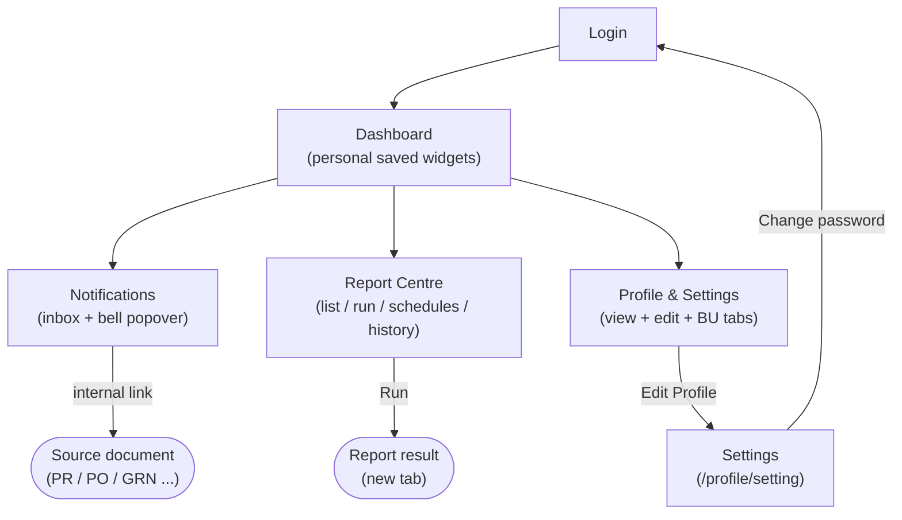

# General & Reporting — Everyday User Experience

The **Any Authenticated User** persona covers the cross-cutting surfaces every signed-in
user touches regardless of their role or permissions: the personal **Dashboard**, the
**Notifications** inbox, the **Report** centre, and their **Profile & Settings**. These
screens are not tied to a single workflow (procurement, inventory, etc.) — they are the
common shell that frames day-to-day usage.

A few traits set these journeys apart from the module workflows:

- **No role gate.** Every authenticated user can reach all four areas; there are no
  approver/purchaser/admin distinctions here. The only guard is authentication itself —
  an unauthenticated visitor is redirected to `/login`.
- **Personal, not shared.** The Dashboard is a *personal saved-widgets board* (each user
  pins their own metrics), Notifications is the signed-in user's own inbox, and Profile
  shows that user's own record. None of these are business-unit-wide dashboards.
- **Reporting is read-and-run.** The Report centre lets users browse report templates,
  fill parameters, and **run** them; "export" simply means the **Run** action opens the
  generated result in a new browser tab. Schedules and History round out the area.

---

## Workflow Overview

---

## Document Index

| Step | Document | Screen | Route | URL |
|------|----------|--------|-------|-----|
| 1 | [dashboard.md](dashboard.md) | Dashboard — personal saved widgets | `routes/dashboard` | `/dashboard` |
| 2 | [notifications.md](notifications.md) | Notifications inbox + bell popover | `routes/notifications` | `/notifications` |
| 3 | [report.md](report.md) | Report centre (landing / list / run / schedules / history) | `routes/report` | `/report` |
| 4 | [profile.md](profile.md) | Profile & Settings | `routes/profile` | `/profile`, `/profile/setting` |

---

## Access Path

All four areas are reachable from the app shell once signed in:

- **Dashboard** — the default landing route after login, or via the sidebar / brand link.
- **Notifications** — the bell icon in the navbar (popover) or the full page at `/notifications`.
- **Report** — the Report entry in the sidebar → `/report` landing → sub-pages.
- **Profile & Settings** — the avatar / user menu in the navbar → Profile, then **Edit Profile** for Settings.

---

## Related Test-Case Catalogs

| Area | Catalog | Prefix | Total |
|------|---------|--------|-------|
| Dashboard | `docs/test-cases/1200-dashboard.md` | `DASH` | 16 |
| Profile & Settings | `docs/test-cases/1201-profile.md` | `PROF` | 18 |
| Report | `docs/test-cases/1202-report.md` | `RPT` | 16 |
| Notifications | `docs/test-cases/1203-notifications.md` | `NTFY` | 14 |
