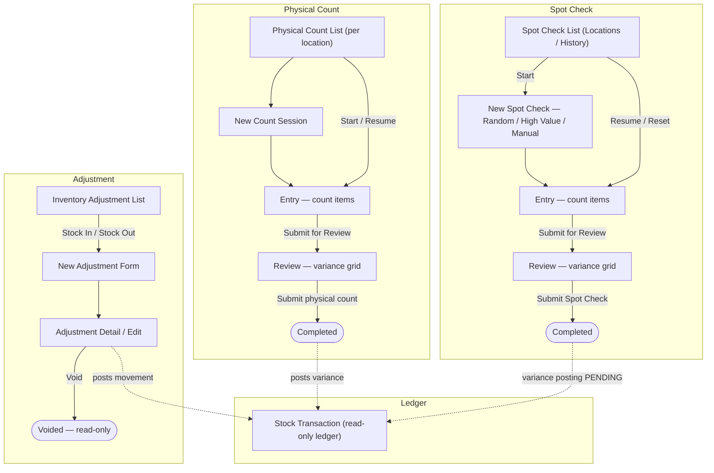

# Inventory Management — Stock Controller Workflows

The **Inventory Controller** persona covers staff who keep recorded stock aligned with physical stock. In Carmen this maps to roles such as Inventory Controller, Store Manager, and Storekeeper. The persona is responsible for:

- **Manual adjustments** — recording stock-in / stock-out corrections (damage, found stock, write-off, opening balances) against an inventory or consignment location.
- **Monitoring movement** — reviewing the read-only stock transaction ledger to see how quantity on hand changed and which source document drove each movement.
- **Periodic counts** — running full **Physical Count** sessions per location, and targeted **Spot Checks** (Random / High Value / Manual) to verify recorded stock against reality and surface variances.

All four modules are scoped to the active **Business Unit**; the e2e standard for this suite is **BU = BLAVG** (the data fetch hooks read `buCode` and do not fetch until it is set). The Physical Count and Spot Check personas in this suite default to **Store Manager**; Inventory Adjustment and the Transaction ledger default to **Inventory Controller**.

---

## Workflow Overview

---

## Document Index

| Journey | Document | URL | Default Role | Prefix |
|---------|----------|-----|--------------|--------|
| Manual stock-in / stock-out adjustments | [inventory-adjustment.md](inventory-adjustment.md) | `/inventory-management/inventory-adjustment` | Inventory Controller | `IADJ` |
| Read-only stock movement ledger | [stock-transaction.md](stock-transaction.md) | `/inventory-management/transaction` | Inventory Controller | `STKT` |
| Full per-location physical count | [physical-count.md](physical-count.md) | `/inventory-management/physical-count` | Store Manager | `PCNT` |
| Targeted spot checks (3 methods) | [spot-check.md](spot-check.md) | `/inventory-management/spot-check` | Store Manager | `SPC` |

---

## Access Path

**Dashboard → Inventory Management (sidebar) → Inventory Adjustment / Transaction / Physical Count / Spot Check**

---

## Related Flow Documents

These journey docs describe **what the user does** in the UI. The transaction-process angle — **what the system does** underneath each stock-in/out adjustment, physical stocktake, and spot check (inventory update, lot management, cost recalculation, period control) — is documented separately under [`docs/persona-doc/System Process/`](../System%20Process/INDEX.md):

| This journey | System-process counterpart |
|--------------|----------------------------|
| Inventory Adjustment — **Stock In** | [tx-06-stock-in-adj.md](../System%20Process/tx-06-stock-in-adj.md) |
| Inventory Adjustment — **Stock Out** | [tx-07-stock-out-adj.md](../System%20Process/tx-07-stock-out-adj.md) |
| Physical Count | [tx-08-physical-stocktake.md](../System%20Process/tx-08-physical-stocktake.md) |
| Spot Check | [tx-10-spot-check.md](../System%20Process/tx-10-spot-check.md) |

> Note from the System Process docs: Spot Check variance posting to inventory is currently **PENDING** (not yet implemented) — Spot Checks reach `completed` status but do not yet post QOH / lot / cost changes. Physical Count posts variance as its own transaction type and must reach **Finalized** (GL posted) to satisfy End Period Close Stage 3.
