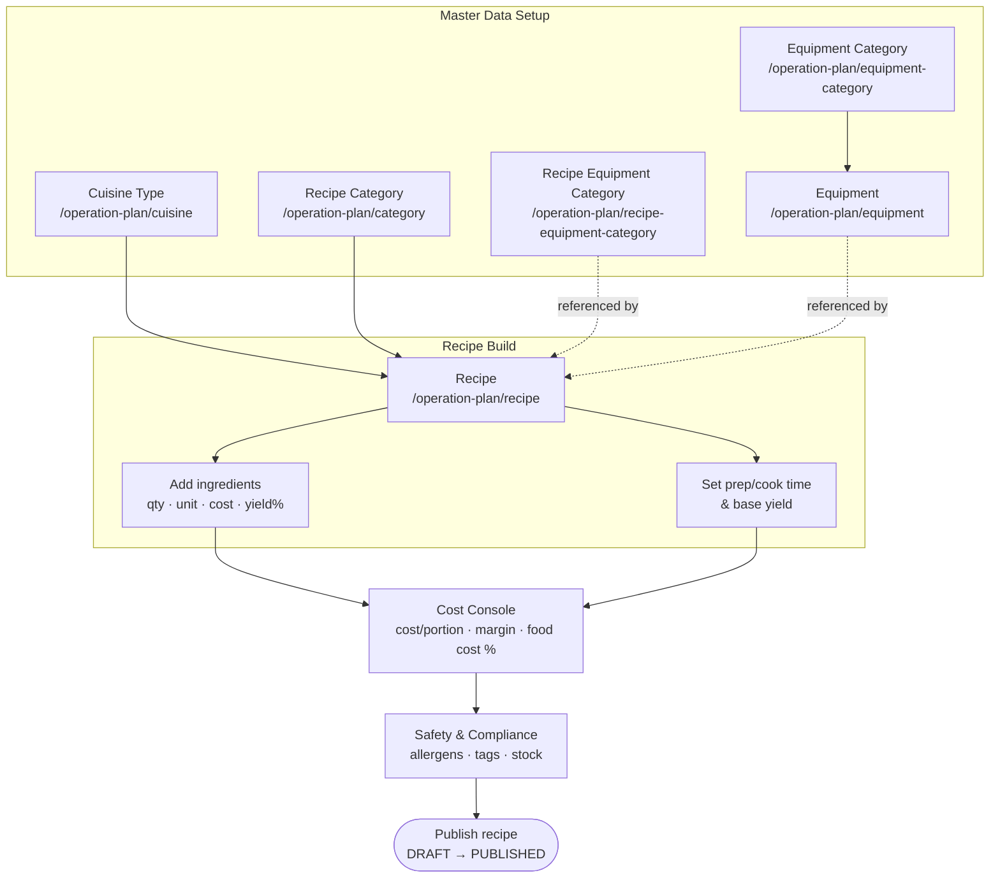

# Operation Plan — Culinary & Equipment Setup

The **Operation Planner** persona covers the culinary/operations staff who set up and maintain the master data behind menu engineering: the cuisines and categories recipes are classified by, the recipes themselves (with ingredients, yield, costing and compliance), and the kitchen equipment plus its categories. In Carmen this work happens under the **Operation Plan** module, scoped to the active business unit (default `admin@blueledgers.com`, BU = `BLAVG`).

The planner's central artifact is the **Recipe** — a rich, multi-section document that pulls together classification (cuisine + category), composition (ingredients), timing & yield, a live costing console, and safety/compliance data. Everything else in the module exists to feed or support the recipe: cuisines and recipe categories classify it; recipe-equipment categories and equipment describe what the kitchen needs to produce it.

---

## Workflow Overview

The master-data entities (cuisine, recipe category, equipment category, recipe-equipment category) are typically created first so the recipe lookups are populated. The planner then builds each recipe: classify it, compose ingredients, set yield/time, let the cost console compute pricing, fill in compliance, and finally publish.

---

## Document Index

| # | Document | Scope | Route(s) |
|---|----------|-------|----------|
| 1 | [recipe.md](recipe.md) | Full recipe authoring journey — list, detail/view, create, ingredients, yield/time, cost console, compliance, image gallery, status lifecycle | `/operation-plan/recipe`, `/operation-plan/recipe/new`, `/operation-plan/recipe/:id` |
| 2 | [master-data.md](master-data.md) | Consolidated CRUD journey for the supporting master data: Recipe Category, Cuisine Type, Equipment, Equipment Category, Recipe Equipment Category | `/operation-plan/category`, `/operation-plan/cuisine`, `/operation-plan/equipment`, `/operation-plan/equipment-category`, `/operation-plan/recipe-equipment-category` |

---

## Access Path

**Dashboard → Operation Plan (sidebar) → Recipe / Cuisine / Category / Equipment / Equipment Category / Recipe Equipment Category**

Or direct: e.g. `/operation-plan/recipe`

---

## Modules & Test-Case Coverage

| Module | URL | Prefix | Test cases | Catalog |
|--------|-----|--------|-----------:|---------|
| Recipe | `/operation-plan/recipe` | `RCP` | 28 | `docs/test-cases/120-recipe.md` |
| Recipe Category | `/operation-plan/category` | `OPCAT` | 16 | `docs/test-cases/110-op-category.md` |
| Cuisine Type | `/operation-plan/cuisine` | `CUIS` | 15 | `docs/test-cases/111-cuisine.md` |
| Equipment | `/operation-plan/equipment` | `EQP` | 18 | `docs/test-cases/130-equipment.md` |
| Equipment Category | `/operation-plan/equipment-category` | `EQPC` | 14 | `docs/test-cases/131-equipment-category.md` |
| Recipe Equipment Category | `/operation-plan/recipe-equipment-category` | `RECC` | 13 | `docs/test-cases/121-recipe-equipment-category.md` |

---

## Conventions in this module

- **List vs. dialog vs. page editing.** The larger entities (Recipe, Equipment) and Recipe Category open a dedicated detail page (`/:id`) with a view → Edit flow. The lightweight master-data entities (Equipment Category, Recipe Equipment Category) edit through an in-list **Dialog**.
- **List affordances.** Most list pages share the same toolbar: a Search box (Enter to apply), a Status (Active/Inactive) filter, optional multi-select filters (Parent / Cuisine / Category / Difficulty), and a List/Grid view toggle. No matches render an `EmptyComponent`.
- **Optimistic concurrency.** Update calls send `doc_version`; the category dialogs note this explicitly.
- **Active BU.** All flows assume the active business unit is set; the catalogs use `BLAVG`.
