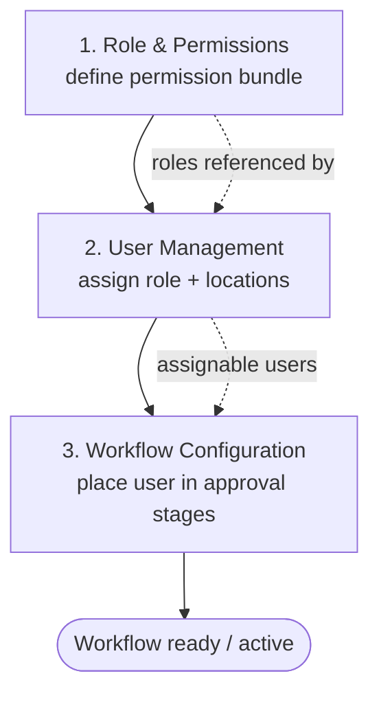

# Platform Administration — Identity & Access

The **Platform Administrator** is the system-owner persona for Carmen Inventory. They operate inside the **System Admin** area (`/system-admin/*`) and are responsible for *who can do what, where*. Three modules make up their Identity & Access toolkit:

- **Role & Permissions** — define reusable permission bundles (a role is a name plus a set of granted `resource.action` permissions across categories like Configuration, Procurement, Inventory).
- **User Management** — assign those roles to existing people, review their department membership, and grant the locations they can operate at. (There is no "create user" screen — users already exist; the admin *assigns* access.)
- **Workflow Configuration** — design the approval chains (stages, assigned users / HOD routing, actions, SLAs) that documents such as Purchase Requests and Purchase Orders flow through.

These three are sequential by intent: an administrator first **defines a role**, then **assigns it to a user** (alongside departments/locations), and finally **wires that user into the workflow stages** where their authority applies.

Access requires System Admin rights. Unauthenticated visitors are redirected to `/login`; authenticated users without the right permissions are blocked from every module.

---

## Workflow Overview

The dotted edges show the data dependencies: roles defined in module 1 are the cards a user can be granted in module 2, and the users assigned in module 2 are the people that can be placed on a workflow stage in module 3.

---

## Document Index

| Step | Document | Module | Route | URL |
|------|----------|--------|-------|-----|
| 1 | [role.md](role.md) | Role & Permissions | `routes/system-admin/role` | `/system-admin/role` |
| 2 | [user.md](user.md) | User Management | `routes/system-admin/user` | `/system-admin/user` |
| 3 | [workflow.md](workflow.md) | Workflow Configuration | `routes/system-admin/workflow` | `/system-admin/workflow` |

---

## Access Path

**Dashboard → System Admin (sidebar) → Role / User / Workflow**

Or direct:
- `/system-admin/role`
- `/system-admin/user`
- `/system-admin/workflow`

---

## Linked Test-Case Catalogs

| Module | Catalog | Prefix | Total TCs |
|--------|---------|--------|-----------|
| Role & Permissions | `docs/test-cases/1101-role.md` | `ROLE` | 27 |
| User Management | `docs/test-cases/1102-user.md` | `USR` | 26 |
| Workflow Configuration | `docs/test-cases/1103-workflow.md` | `WF` | 30 |
