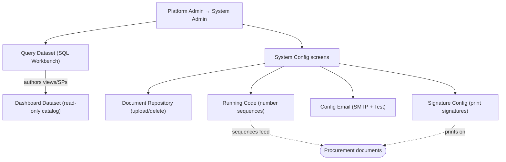

# Platform Data & Config — Documents, Datasets & System Config

The **Platform Administrator** persona covers the tenant-level operator who keeps the Carmen Inventory platform running: maintaining shared files, authoring reporting datasets, defining document numbering, configuring outbound email, and shaping the signature blocks that appear on printed documents. These screens all live under **System Admin** (`/system-admin/*`) and are not part of any day-to-day procurement flow — they are the infrastructure the procurement modules depend on.

This folder groups six modules in the **Data & Config** area:

- **Document Repository** — a plain file store (upload / list / filter / delete). No create or edit form; "creating" is uploading.
- **Query Dataset (SQL Workbench)** — the richest screen here: a database object tree, a Monaco SQL editor with Run / Format, a results panel with CSV export, and Save / Drop for views, procedures and functions — fronted by a SQL-safety validator.
- **Running Code** — number-sequence records keyed by `type`, each carrying a JSON `config` and a `note`, with Add / Init / Export / Print.
- **Config Email (SMTP)** — a single SMTP settings form with a Test Email action.
- **Dashboard Dataset** — a read-only catalog of the dashboard datasets the system ships.
- **Signature Config** — a reusable component embedded in document-config screens that defines the print signature block (orientation + up to five signatories).

> **Access requires Platform Admin.** Every screen is behind the auth guard; an unauthenticated request to any `/system-admin/*` URL is redirected to `/login`.

---

## Workflow Overview

---

## Document Index

| Doc | Screen(s) | Route | URL |
|-----|-----------|-------|-----|
| [query-dataset.md](query-dataset.md) | SQL Workbench | `routes/system-admin/query-dataset` | `/system-admin/query-dataset` |
| [system-config.md](system-config.md) | Document Repository · Running Code · Config Email · Dashboard Dataset · Signature Config | `routes/system-admin/{document,running-code,config-email,dashboard-dataset}`, `routes/system-admin/_components/signature-config.tsx` | `/system-admin/document`, `/system-admin/running-code`, `/system-admin/config-email`, `/system-admin/dashboard-dataset`, `/system-admin` |

---

## Access Path

**Dashboard → System Admin (sidebar) → [module]**

Or direct, e.g.: `https://carmen-inventory.vercel.app/system-admin/query-dataset`

---

## Module Map

| Module | Prefix | Shape | Mutations | Catalog |
|--------|--------|-------|-----------|---------|
| Document Repository | `DOC` | File list | Upload, Delete | `docs/test-cases/1107-document.md` |
| Query Dataset | `QDS` | SQL Workbench | Save (view/SP/function), Drop | `docs/test-cases/1108-query-dataset.md` |
| Running Code | `RUNC` | Keyed records | Add, Edit, Delete, Init, Export | `docs/test-cases/1110-running-code.md` |
| Config Email | `CEML` | Single form | Save (upsert), Test Email | `docs/test-cases/1111-config-email.md` |
| Dashboard Dataset | `DDS` | Read-only catalog | _none_ | `docs/test-cases/1112-dashboard-dataset.md` |
| Signature Config | `SIGN` | Embedded form | Save (upsert print + signatures) | `docs/test-cases/1113-signature-config.md` |
