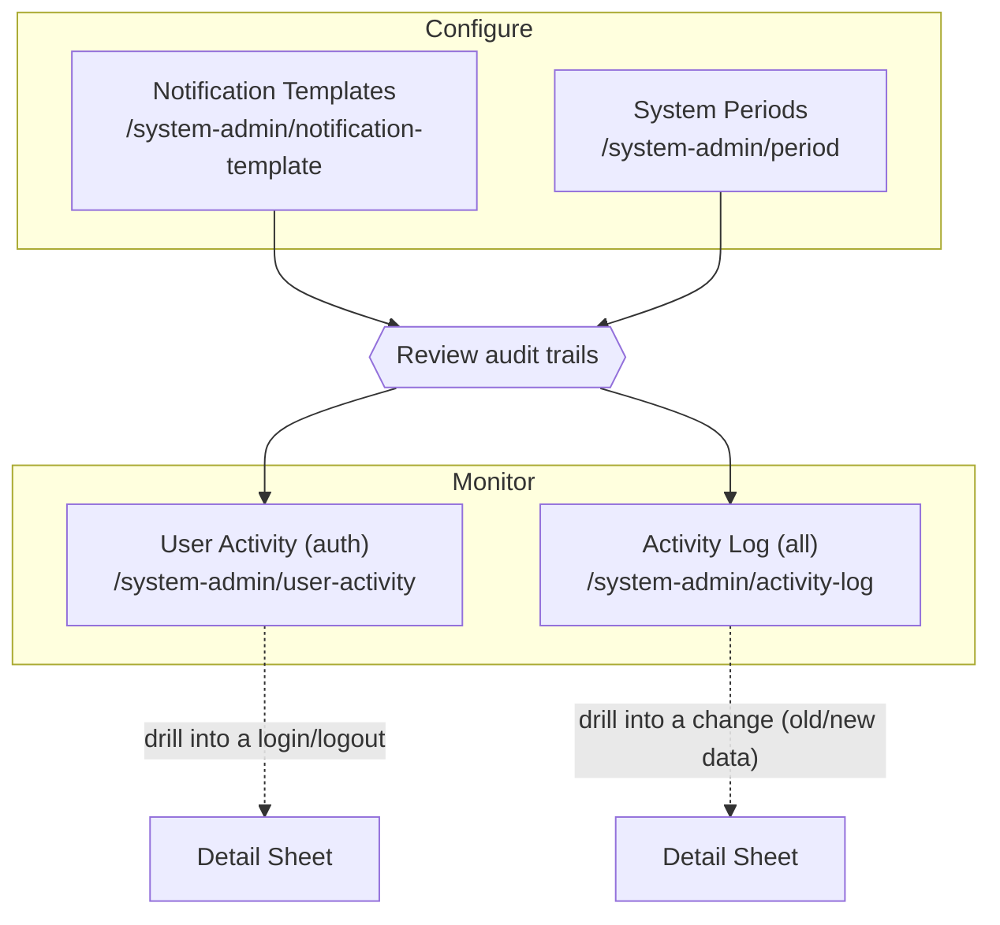

# Platform Operations — Notifications, Periods & Audit

The **Platform Administrator** persona covers the back-office operator who keeps the Carmen Inventory platform configured and observable. Within the **System Admin** area this persona owns three responsibilities:

1. **Configure notification templates** — author the messages the platform sends across App, Email, LINE and SMS channels.
2. **Manage accounting periods** — open, close and lock the fiscal periods that transactions post into, and generate periods ahead of time.
3. **Monitor audit trails** — review the read-only User Activity (login/logout) and Activity Log (all system changes) views to answer "who did what, when".

All screens in this folder live under `/system-admin/*` and require System Admin access. Notification Template and System Period are read/write configuration surfaces; User Activity and Activity Log are strictly read-only audit views.

---

## Workflow Overview

The two configuration modules generate the records and login events that the two audit modules later surface. A typical operating loop is: configure (templates / periods) → operate → review the audit logs to confirm changes and access.

---

## Document Index

| Document | Screens | Route | Read/Write |
|----------|---------|-------|------------|
| [notification-template.md](notification-template.md) | List · Detail (view/edit) · New form · Delete dialog | `/system-admin/notification-template` | Read/Write |
| [system-period.md](system-period.md) | List · Add/Edit dialog · Generate Next · Export/Print | `/system-admin/period` | Read/Write |
| [audit-logs.md](audit-logs.md) | User Activity list + detail sheet · Activity Log list + detail sheet | `/system-admin/user-activity`, `/system-admin/activity-log` | Read-only |

---

## Access Path

**Dashboard → System Admin (sidebar) → Notification Template / Period / User Activity / Activity Log**

Or direct, e.g. `/system-admin/notification-template`.

---

## Related Test-Case Catalogs

| Module | User stories | Test-case catalog | Prefix |
|--------|--------------|-------------------|--------|
| Notification Template | `docs/user-stories/1104-notification-template.md` | `docs/test-cases/1104-notification-template.md` | `NTPL` |
| System Period | `docs/user-stories/1105-system-period.md` | `docs/test-cases/1105-system-period.md` | `SPER` |
| User Activity | `docs/user-stories/1106-user-activity.md` | `docs/test-cases/1106-user-activity.md` | `UACT` |
| Activity Log | `docs/user-stories/1109-activity-log.md` | `docs/test-cases/1109-activity-log.md` | `ALOG` |
