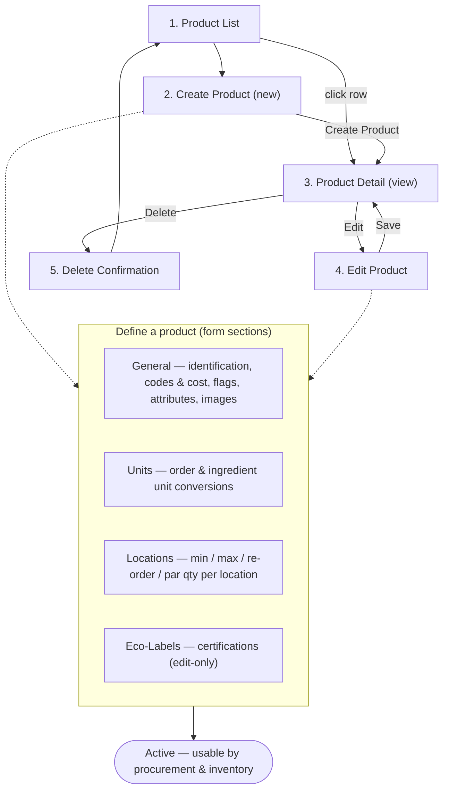

# Product Management — Product Master Maintenance

The **Product Manager** persona owns the product master — the catalog of items that every other module (procurement, inventory, recipes) draws from. In Carmen this role maps to staff responsible for defining what a product is, how it is measured, where it is stocked, and what it costs. A well-maintained product master is the precondition for purchasing, receiving, counting, and costing, so the accuracy of this catalog is upstream of nearly everything else in the system.

This persona works almost entirely inside **Product Management → Product**: browsing/searching the catalog, registering new products with their identification, units, locations, pricing and attributes, then keeping them current (edits, status changes, eco-label certifications) or retiring them.

---

## Workflow Overview

A product is **defined** by completing the General section (identification + categories/item-group + inventory unit + tax profile + pricing), then enriching it with **units** (purchase/recipe conversions against the inventory unit), **locations** (stock thresholds per store), and **attributes**. Once saved and set Active, the product becomes selectable in downstream procurement and inventory flows. Category, sub-category and item-group are **derived** from the chosen item group — they are configured separately (see below) and consumed here as lookups/filters.

---

## Document Index

| Step | Document | Screen | Route |
|------|----------|--------|-------|
| 1–5 | [product.md](product.md) | Product List, Create/Detail (General · Units · Locations · Eco-Labels), Delete | `/product-management/product` and `/product-management/product/new`, `/product-management/product/:id` |

> **Related module — Product Category.** Category, sub-category and item group are nested configuration under **Product Management → Category** (`routes/product-management/category`), outside this persona's create/edit scope; the product form only *consumes* them as lookups and list filters. That module is already covered by the automated spec **`101-product-category`** — cross-link to its test cases and user-story doc rather than re-documenting the category CRUD here.

---

## Access Path

**Dashboard → Product Management (sidebar) → Product**

Or direct: `/product-management/product`

---

## Product Manager Permissions Summary

| Action | Add (new) | View (detail) | Edit | Delete |
|--------|-----------|---------------|------|--------|
| Product Manager / Admin | ✅ | ✅ | ✅ | ✅ |

The detail page always opens **read-only (view mode)**; the Product Manager must press **Edit** before any field becomes editable. Eco-Label certifications are managed only on an existing (saved) product and are persisted independently of the main product form.

---

## Linked Test Cases

- Test-case catalog: [`docs/test-cases/100-product.md`](../../test-cases/100-product.md) — prefix `PROD`, 30 cases.
- User-story view: [`docs/user-stories/100-product.md`](../../user-stories/100-product.md).
- Related (automated): **`101-product-category`** spec / user-story doc for the Category, Sub-Category and Item-Group configuration consumed by this module.
