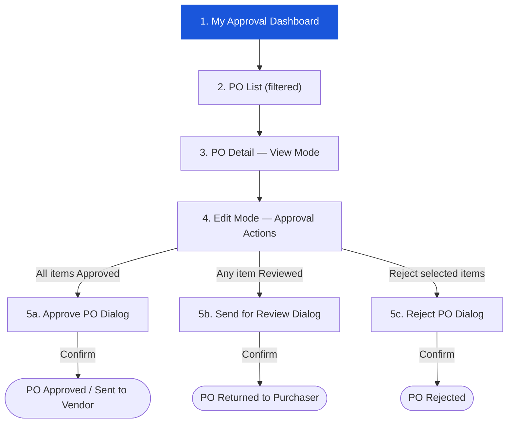

# Purchase Order — FC Approver Workflow

**Persona:** FC (Financial Controller)
**Module:** Procurement → Purchase Order
**App URL:** `https://carmen-inventory.vercel.app`
**Test User:** fc@zebra.com / 12345678

---

## Workflow Overview

---

## Document Index

| Step | File | Description |
|------|------|-------------|
| 1 | [step-01-my-approval.md](step-01-my-approval.md) | My Approval dashboard — PO filter tab |
| 2 | [step-02-po-detail.md](step-02-po-detail.md) | PO Detail in view mode (FC perspective) |
| 3 | [step-03-approval-actions.md](step-03-approval-actions.md) | Edit mode — item-level & document-level approval actions |

---

## Permissions Summary

| Action | DRAFT | IN PROGRESS | Notes |
|--------|-------|-------------|-------|
| View PO | ✅ | ✅ | FC can see both statuses in My Approval |
| Enter Edit Mode | ✅ | ✅ | Via Edit button |
| Edit header fields | ❌ | ❌ | All header fields are disabled for FC |
| Approve items | ❌ | ✅ | Only IN PROGRESS POs have item actions |
| Review items | ❌ | ✅ | |
| Reject items | ❌ | ✅ | |
| Document Approve | ❌ | ✅ | Requires all items to be Approved |
| Document Send Back | ❌ | ✅ | Requires at least one item in Review |
| Document Reject | ❌ | ✅ | Requires at least one item selected |
| Delete PO | ✅ | ✅ | Delete button visible in edit mode |
| Add Comment | ✅ | ✅ | Via Comment button (view and edit mode) |

> ⚠️ **Discrepancy:** The BRD (FR-PO-001 Overview) explicitly states "POs do not have approval workflows — they are created by authorized purchasing staff with proper authorization." The live UI, however, implements a full FC-based approval flow with item-level Approve/Review/Reject actions and document-level Approve/Send Back/Reject. This is a significant undocumented feature.

---

## Status Lifecycle — Live UI vs BRD Mapping

| Live UI Status | BRD Equivalent | Diff | Notes |
|---|---|---|---|
| DRAFT | Draft | ✅ Match | — |
| IN PROGRESS | _(not in BRD)_ | 🔴 New | PO submitted by Purchaser; pending FC approval |
| APPROVED | _(not in BRD)_ | 🔴 New | FC approved; PO auto-sent to vendor immediately |
| SENT | Sent | ✅ Match | Auto-set after FC approval — no manual Purchaser send step |
| PARTIAL | Partial Received | 🟡 Renamed | BRD uses "Partial Received" |
| COMPLETED | Fully Received | 🟡 Renamed | BRD uses "Fully Received" |
| CLOSED | Closed | ✅ Match | — |
| VOIDED | Cancelled | 🟡 Renamed | BRD uses "Cancelled"; VOIDED = Close with no items received |
| REJECTED | _(not in BRD)_ | 🔴 New | FC rejects PO outright; returned to Purchaser |
| _(ACKNOWLEDGED)_ | Acknowledged | 🔵 BRD only | BRD defines this status; not observed in live UI |

> ⚠️ **BRD Discrepancy:** The BRD (FR-PO-005) defines status flow as Draft → Sent → Acknowledged → Partial Received → Fully Received → Closed/Cancelled. The live UI adds IN PROGRESS, APPROVED, and REJECTED (FC approval workflow) and uses VOIDED instead of Cancelled. ACKNOWLEDGED is not observed in the live UI.

## Cross-Persona Links

| Persona | Folder | Role in PO Workflow |
|---------|--------|---------------------|
| Purchaser | `04-po-purchaser/` | Creates, submits, sends PO |
| FC Approver | `05-po-approver/` | Reviews items, approves/rejects/returns PO |

---

## Screenshots Index

All screenshots are embedded as base64 in their respective step documents.

### step-01-my-approval.md (2 screenshots)

| # | Screen |
|---|--------|
| 1 | My Approval — All Documents view (Total Pending 14) |
| 2 | My Approval — Purchase Order tab filtered (7 POs: 3 DRAFT, 4 IN PROGRESS) |

### step-02-po-detail.md (1 screenshot)

| # | Screen |
|---|--------|
| 3 | PO Detail — IN PROGRESS view mode (FC perspective, Edit/Comment buttons) |

### step-03-approval-actions.md (8 screenshots)

| # | Screen |
|---|--------|
| 4 | Edit mode — no item selected (Cancel/Save/Delete/Comment; no action toolbar) |
| 5 | Edit mode — item selected (Approve/Review/Reject toolbar appears) |
| 6 | Item 1 marked APPROVED — green badge; footer Approve button appears |
| 7 | Document Approve confirmation dialog ("Once approved, PO will be sent to vendor") |
| 8 | Item 1 marked REVIEW — amber badge; Send Back footer button appears |
| 9 | Send for Review dialog — stage selection + reason per item required |
| 10 | Reject Purchase Order dialog — reason field optional |
| 11 | Bulk action — Select Items dialog (Select All checkbox triggers this modal) |
