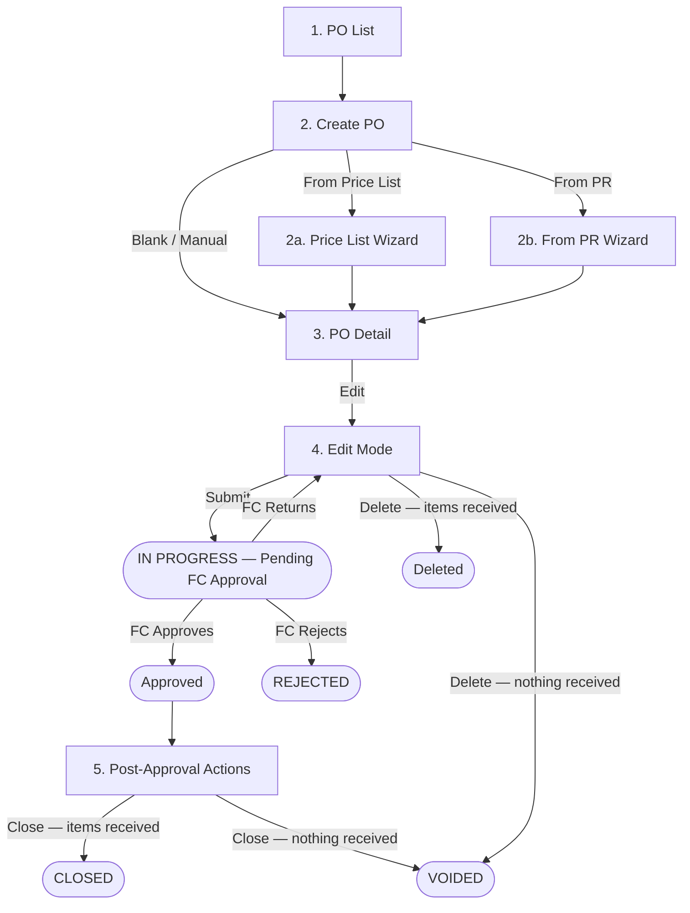

# Purchase Order — Purchaser Workflow

**Persona:** Purchaser (Purchasing Staff / Buyer)
**Module:** Procurement → Purchase Order
**App URL:** `https://carmen-inventory.vercel.app`
**Test User:** purchase@zebra.com / 12345678

---

## Workflow Overview

---

## Document Index

| Step | File | Description |
|------|------|-------------|
| 1 | [step-01-po-list.md](step-01-po-list.md) | PO List — filters, columns, navigation |
| 2 | [step-02-create-po.md](step-02-create-po.md) | Create PO — three creation methods |
| 3 | [step-03-po-detail.md](step-03-po-detail.md) | PO Detail — view mode |
| 4 | [step-04-edit-mode.md](step-04-edit-mode.md) | Edit mode — items, vendor, pricing, submit |
| 5 | [step-05-post-approval.md](step-05-post-approval.md) | Post-approval actions — Send to Vendor, Close (TBC — requires Approved PO) |

---

## Permissions Summary

| Action | DRAFT | IN PROGRESS | Approved | Rejected |
|--------|-------|-------------|----------|----------|
| View PO | ✅ | ✅ | ✅ | ✅ |
| Edit header fields | ✅ | ❌ | ❌ | ❌ |
| Add/Remove items | ✅ | ❌ | ❌ | ❌ |
| Submit for approval | ✅ | ❌ | ❌ | ❌ |
| Delete PO | ✅ | ✅ | ❌ | ❌ |
| Close PO | ❌ | ❌ | ✅ | ❌ |
| Send to Vendor | ❌ | ❌ | ✅ | ❌ |
| Add Comment | ✅ | ✅ | ✅ | ✅ |

> ⚠️ **Discrepancy:** The BRD (FR-PO-005) defines status lifecycle as Draft → Sent → Acknowledged → Partial Received → Fully Received → Closed/Cancelled. The live UI uses DRAFT and IN PROGRESS statuses. The mapping and post-approval workflow require live verification with the Purchaser persona.

---

## Creation Methods

| Method | Entry | Description |
|--------|-------|-------------|
| Blank / Manual | Add Purchase Order → Blank PO | Create from scratch with manual item entry |
| From Price List | Add Purchase Order → From Price List | 2-step wizard: Select Vendors → Review items from vendor's active price list |
| From PR | Add Purchase Order → From PR | Select approved PRs; system groups items by vendor |

---

## Status Lifecycle — Live UI vs BRD Mapping

| Live UI Status | BRD Equivalent | Diff | Notes |
|---|---|---|---|
| DRAFT | Draft | ✅ Match | — |
| IN PROGRESS | _(not in BRD)_ | 🔴 New | PO submitted by Purchaser; pending FC approval |
| APPROVED | _(not in BRD)_ | 🔴 New | FC approved; PO auto-sent to vendor immediately |
| SENT | Sent | ✅ Match | Auto-set after FC approval — no manual Purchaser send step |
| PARTIAL | Partial Received | 🟡 Renamed | BRD uses "Partial Received" |
| COMPLETED | Fully Received | 🟡 Renamed | BRD uses "Fully Received" |
| CLOSED | Closed | ✅ Match | — |
| VOIDED | Cancelled | 🟡 Renamed | BRD uses "Cancelled"; VOIDED = Close with no items received |
| REJECTED | _(not in BRD)_ | 🔴 New | FC rejects PO outright; returned to Purchaser |
| _(ACKNOWLEDGED)_ | Acknowledged | 🔵 BRD only | BRD defines this status; not observed in live UI |

> ⚠️ **BRD Discrepancy:** The BRD (FR-PO-005) defines status flow as Draft → Sent → Acknowledged → Partial Received → Fully Received → Closed/Cancelled. The live UI adds IN PROGRESS, APPROVED, and REJECTED (FC approval workflow) and uses VOIDED instead of Cancelled. ACKNOWLEDGED is not observed in the live UI.

## Cross-Persona Links

| Persona | Folder | Role in PO Workflow |
|---------|--------|---------------------|
| **Purchaser** | `04-po-purchaser/` | Creates, submits, sends PO |
| FC Approver | `05-po-approver/` | Reviews items, approves/rejects/returns PO |

---

## Screenshots Index

All screenshots are embedded as base64 in their respective step documents.

### step-01-po-list.md (7 screenshots)

| # | Screen |
|---|--------|
| 1 | PO List — default view |
| 2 | PO List — All Documents view (53 POs, all statuses) |
| 3 | Row actions menu — DRAFT |
| 4 | Row actions menu — IN PROGRESS |
| 5 | Row actions menu — SENT |
| 6 | Row actions menu — COMPLETED |
| 7 | Row actions menu — CLOSED |

### step-02-create-po.md (7 screenshots)

| # | Screen |
|---|--------|
| 8 | Creation method selection modal |
| 9 | Blank PO create form |
| 10 | Add Item dialog — product lookup and fields |
| 11 | From Price List wizard — Step 1 Select Vendors |
| 12 | From Price List wizard — Step 2 Review (expanded) |
| 13 | From PR wizard — Step 1 Select Purchase Requests |
| 14 | From PR wizard — Step 2 Review Grouped POs |

### step-03-po-detail.md (6 screenshots)

| # | Screen |
|---|--------|
| 15 | PO Detail — DRAFT view |
| 16 | PO Detail — IN PROGRESS view (returned by FC) |
| 17 | Item Details panel — Details tab (multi-location) |
| 18 | Item Details panel — Quantity tab |
| 19 | Item Details panel — Pricing tab |
| 20 | Submit PO confirmation dialog |

### step-04-edit-mode.md (9 screenshots)

| # | Screen |
|---|--------|
| 21 | Edit mode — DRAFT PO full view |
| 22 | Edit mode — IN PROGRESS PO (Delete button present) |
| 23 | Item Details panel — Details tab |
| 24 | Item Details panel — Quantity tab (edit mode) |
| 25 | Item Details panel — Pricing tab (edit mode) |
| 26 | Cancel with no unsaved changes — exits immediately, no dialog |
| 27 | Cancel after typing input — changes discarded silently with no dialog |
| 28 | Submit PO confirmation dialog |
| 29 | Delete PO confirmation dialog |
