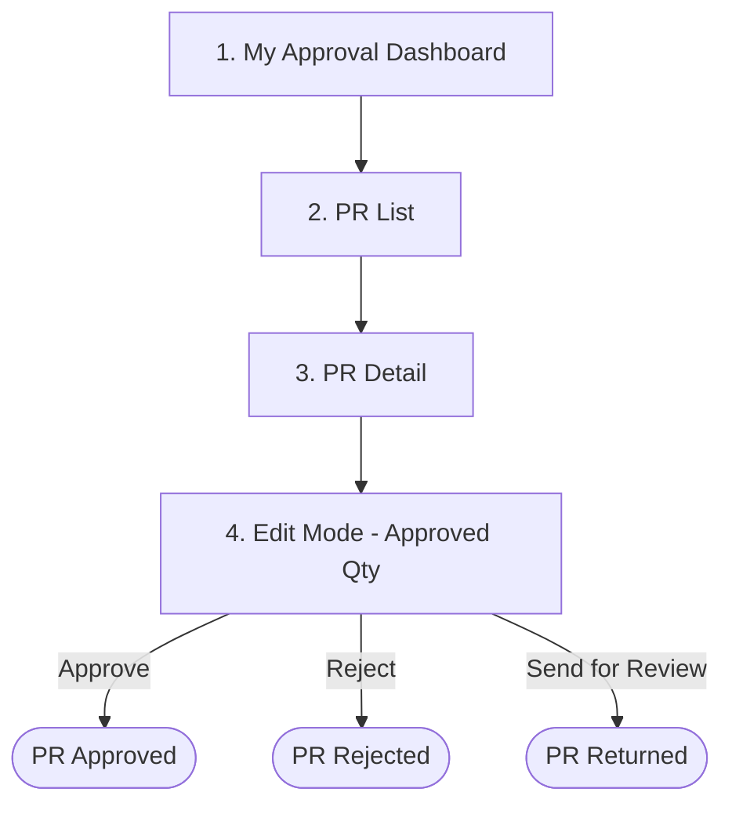

# Persona 3 — Approver (HOD / FC / GM / Owner)

**Module:** 3
**Stage:** Stage 3 — Review & Approve
**Section Prefix:** `3.x`
**Test User:** hod@zebra.com / 12345678
**App URL:** http://carmen-inventory.vercel.app
**Last Updated:** 2026-04-19 — Updated discrepancy callout and permissions table — Approve/Reject/Return are bulk toolbar actions, not standalone per-PR buttons

---

## Approver Roles & Scope

| Role | Scope | Test User | Password |
|------|-------|-----------|----------|
| HOD (Head of Department) | Own department PRs only | hod@zebra.com | 12345678 |
| FC (Financial Controller) | All departments | — | 12345678 |
| GM (General Manager) | All departments | — | 12345678 |
| Owner | All departments | — | 12345678 |

> **Note:** HOD is limited to PRs from their own department by the RBAC permission `procurement.purchase_request.view_department`. FC, GM, and Owner see all PRs across departments. The approval screens and workflow actions are identical — only the visibility scope differs.

---

## Workflow Overview

> ⚠️ **Discrepancy:** BRD FR-PR-005A specifies standalone Approve, Reject, and Return buttons for the Approver role. The live UI does **not** show these as individual per-PR header buttons. The approval actions are available as **bulk toolbar actions only** — accessible in Edit Mode via the Select All dropdown → bulk action toolbar. Individual bulk actions confirmed in UI: **Approve**, **Reject**, **Send for Review** (BRD: Return Selected), **Split**. Standalone row-level buttons remain absent.

---

## Document Inventory

| Step | File | Title | Section | Status |
|------|------|-------|---------|--------|
| 01 | [step-01-my-approval.md](step-01-my-approval.md) | My Approval Dashboard | 3.1 | ✅ Draft |
| 02 | [step-02-pr-list.md](step-02-pr-list.md) | PR List (Approver View) | 3.2 | ✅ Draft |
| 03 | [step-03-pr-detail.md](step-03-pr-detail.md) | PR Detail (Read-only) | 3.3 | ✅ Draft |
| 04 | [step-04-edit-mode.md](step-04-edit-mode.md) | Edit Mode (Approved Qty) | 3.4 | ✅ Draft |

---

## Permissions Summary

| Action | HOD | FC | GM | Owner |
|--------|-----|----|----|-------|
| View own dept PRs | ✅ | ✅ | ✅ | ✅ |
| View all dept PRs | ❌ | ✅ | ✅ | ✅ |
| Enter Edit Mode (adjust Approved Qty) | ✅ | ✅ | ✅ | ✅ |
| Add Comments | ✅ | ✅ | ✅ | ✅ |
| Approve (bulk toolbar only — no standalone button) | ✅ HOD confirmed · Assumed ✅ FC/GM/Owner | ✅ | ✅ | ✅ |
| Reject (bulk toolbar only — no standalone button) | ✅ HOD confirmed · Assumed ✅ FC/GM/Owner | ✅ | ✅ | ✅ |
| Send for Review / Return (bulk toolbar only) | ✅ HOD confirmed · Assumed ✅ FC/GM/Owner | ✅ | ✅ | ✅ |
| Edit vendor/pricing fields | ❌ | ❌ | ❌ | ❌ |
| Delete PR | ❌ | ❌ | ❌ | ❌ |

### Editable Fields by Role (in Edit Mode)

| Field | HOD | FC | GM | Owner | BRD Reference |
|-------|-----|----|----|-------|---------------|
| Approved Quantity | ✅ | ✅ | ✅ | ✅ | FR-PR-011A |
| Item Note | ✅ | ✅ | ✅ | ✅ | FR-PR-011A |
| Delivery Point | ✅ | ✅ | ✅ | ✅ | FR-PR-011A |
| Vendor | 👁️ read-only | 👁️ | 👁️ | 👁️ | FR-PR-011A |
| Unit Price | 👁️ read-only | 👁️ | 👁️ | 👁️ | FR-PR-011A |
| Discount Rate | 👁️ read-only | 👁️ | 👁️ | 👁️ | FR-PR-011A |
| Tax Profile | 👁️ read-only | 👁️ | 👁️ | 👁️ | FR-PR-011A |
| FOC Quantity | 👁️ read-only | 👁️ | 👁️ | 👁️ | FR-PR-024 |

---

## Cross-Persona Links

| Persona | Folder | Hands Off To / From |
|---------|--------|----------------------|
| Creator (Requestor) | [01-creator/](../01-creator/INDEX.md) | Creates & submits PR → routes to Purchaser |
| Purchaser | [02-purchaser/](../02-purchaser/INDEX.md) | Allocates vendors/pricing → advances to Approver |
| **Approver (this)** | `03-approver/` | Reviews & adjusts Approved Qty → final approval |

---

## Screenshots Index

| File | Screen | Step |
|------|--------|------|
| `step-01-my-approval.png` | My Approval dashboard — 39 pending | step-01 |
| `step-01-list-row-hovered.png` | My Approval list hover state | step-01 |
| `step-02-pr-list-my-pending.png` | PR List — My Pending (HOD view, 38 PRs) | step-02 |
| `step-02-pr-list-all-documents.png` | PR List — All Documents | step-02 |
| `step-02-pr-list-filter-open.png` | PR List — Filter panel open | step-02 |
| `step-02-pr-list-stage-dropdown.png` | PR List — All Stage dropdown | step-02 |
| `step-03-pr-detail-tab-items.png` | PR Detail — Items tab | step-03 |
| `step-03-pr-detail-tab-workflow-history.png` | PR Detail — Workflow History tab | step-03 |
| `step-04-edit-mode.png` | Edit Mode — Workflow History tab | step-04 |
