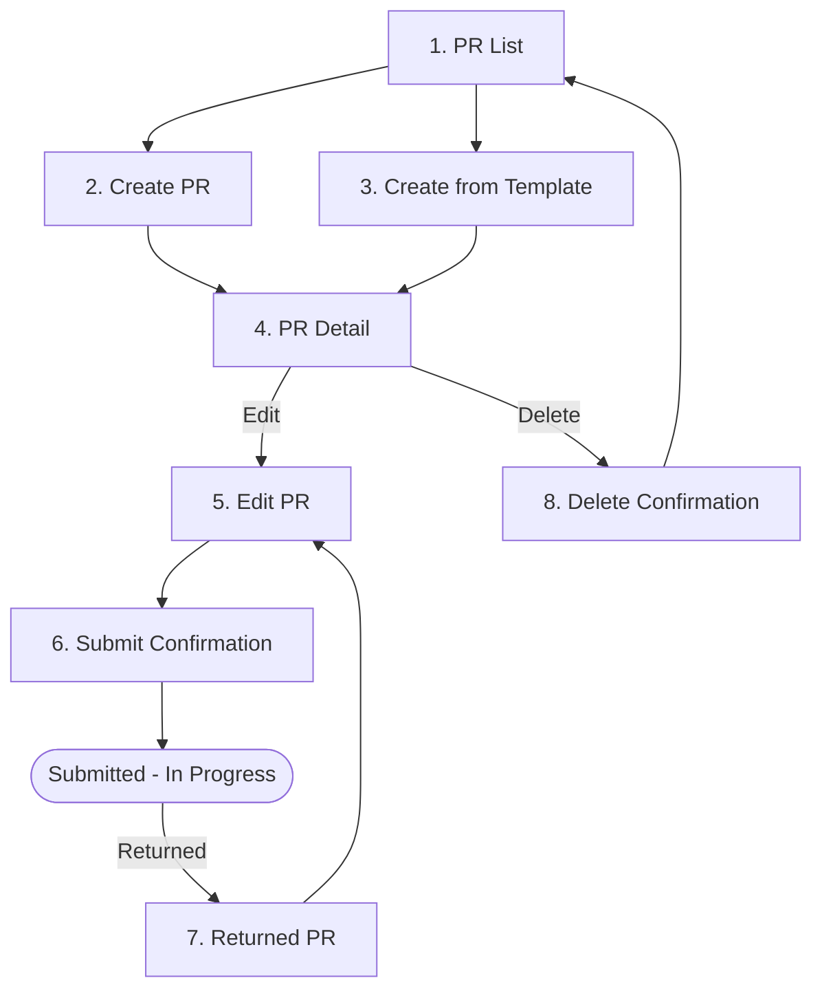

# Creator — Purchase Request Workflow

The **Creator** persona covers staff who originate purchase requests. In Carmen, this role maps to the user type _Requestor_ (Staff, Chef, Housekeeping Manager, Engineers, Counter Staff, etc.).

---

## Workflow Overview

---

## Document Index

| Step | Document | Screen | Route |
|------|----------|--------|-------|
| 1 | [step-01-pr-list.md](step-01-pr-list.md) | Purchase Request List | `/procurement/purchase-request` |
| 2 | [step-02-create-pr.md](step-02-create-pr.md) | Create PR Form (Blank) | `/procurement/purchase-request/new` |
| 3 | [step-03-pr-template.md](step-03-pr-template.md) | Create PR from Template | `/procurement/purchase-request/new?template_id=:uuid` |
| 4 | [step-04-pr-detail.md](step-04-pr-detail.md) | PR Detail View | `/procurement/purchase-request/:uuid` |
| 5 | [step-05-edit-pr.md](step-05-edit-pr.md) | Edit PR (Draft / Returned) | `/procurement/purchase-request/:uuid` |
| 6 | [step-06-submit-confirmation.md](step-06-submit-confirmation.md) | Submit Confirmation Dialog | overlay on `/:uuid` |
| 7 | [step-07-returned-pr.md](step-07-returned-pr.md) | Returned PR — Review & Resubmit | `/procurement/purchase-request/:uuid` (status=RETURNED) |
| 8 | [step-08-delete-confirmation.md](step-08-delete-confirmation.md) | Delete Confirmation Dialog | overlay on `/:uuid` |

---

## Access Path

**Dashboard → Procurement (sidebar) → Purchase Request**

Or direct: `https://carmen-inventory.vercel.app/procurement/purchase-request`

---

## Creator Permissions Summary

| Action | Draft | In Progress | Void | Approved | Completed |
|--------|-------|-------------|------|----------|-----------|
| View | ✅ | ✅ | ✅ | ✅ | ✅ |
| Edit | ✅ | ❌ | ✅ | ❌ | ❌ |
| Submit | ✅ (requires ≥1 item) | ❌ | ❌ | ❌ | ❌ |
| Delete | ✅ | ❌ | ❌ | ❌ | ❌ |

---

## Related Flow Documents

| Stage | Persona | Document |
|-------|---------|----------|
| 1 — Create & Submit | **Creator** ← you are here | This folder |
| 2 — Vendor Allocation | Purchaser | `02-purchaser/` |
| 3 — Approval | Approver | `03-approver/` |
