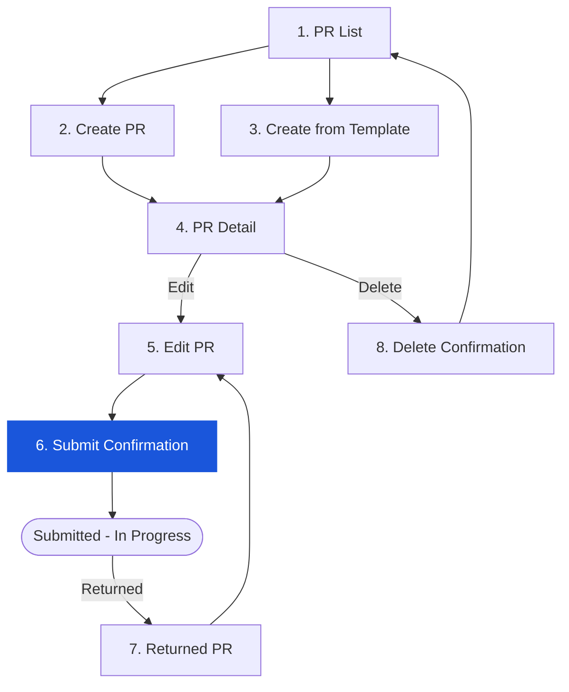

# Step 6 — Submit PR Confirmation Dialog

> A confirmation dialog that appears when the Creator clicks **Submit** on a Draft PR with at least one item and a Workflow type selected. Confirming this dialog transitions the PR status from `DRAFT` to `INPROGRESS` and routes it to the first approver.

---

## 6.1 Access Path

- PR Detail (Draft) or Edit PR form → **Submit** button (enabled when ≥ 1 item + Workflow selected)
- The Submit button is **disabled** (greyed out) until both conditions are met

---

## 6.2 Flow Position

---

## 6.3 Dialog Content

| Element | Content |
|---------|----------|
| Title | "Submit Purchase Request" |
| Message | "Are you sure you want to submit this purchase request? Once submitted, it will be routed for approval and cannot be edited." |
| **OK** button (Blue/Primary) | Confirms submission — PR status changes `DRAFT` → `INPROGRESS`; Creator redirected to PR Detail (read-only) |
| **Cancel** button (Outline/Grey) | Closes dialog — PR remains in DRAFT; no changes made |

---

## 6.4 Submit Button Pre-conditions

The Submit button is **only enabled** when ALL of the following are true:

| Condition | Source |
|-----------|--------|
| Workflow (PR Type) is selected | FR-PR-001 |
| At least 1 item row is present | FR-PR-002 |
| PR status is DRAFT or RETURNED | FR-PR-011 |

The button is **disabled** (pointer-events: none, opacity: 50%) in all other states. No tooltip explaining the disabled reason was observed — this is a known usability gap.

---

## 6.5 Validation on Submit (before dialog appears)

| # | Check | BR | Pass Behaviour | Fail Behaviour |
|---|-------|----|----------------|----------------|
| 1 | Workflow selected | BR-04 | Submit button enabled | Button disabled; dialog not shown |
| 2 | ≥ 1 item present | BR-05 | Submit button enabled | Button disabled |
| 3 | All mandatory item fields filled (Location + Product + Qty > 0) | FR-PR-002 | Dialog shown | TBC — may show row-level validation error |
| 4 | Budget available | FR-PR-004 | Dialog shown (budget check happens on confirm) | TBC — may block or warn at confirm time |
| 5 | PR not locked by another user | FR-PR-011 | Dialog shown | TBC — lock conflict error expected |

---

## 6.6 On Confirm — System Actions

When the Creator confirms submission:

| Action | Detail |
|--------|--------|
| Status transition | `DRAFT` → `INPROGRESS` |
| Soft budget commitment | Created at submission time (not at approval) |
| Workflow routing | PR routed to first approver based on PR Type (General / Asset / Market List) |
| Workflow History entry | New `RECEIVED` entry added with timestamp and Creator name |
| Email notification | First approver receives email within **5 minutes** (BRD SLA) |
| Page redirect | Creator redirected to PR Detail (INPROGRESS, read-only view) |

---

## 6.7 On Cancel — System Actions

| Action | Detail |
|--------|--------|
| Dialog closes | PR remains in `DRAFT` status |
| No state change | No budget commitment created |
| Returns to | Edit PR form or PR Detail (Draft) — unchanged |

---

## 6.8 Business Rules

| # | Rule | Source |
|---|------|--------|
| BR-01 | Minimum 1 item required before PR can be submitted. | FR-PR-002 |
| BR-02 | PR Type (Workflow) must be selected before Submit is enabled. | FR-PR-001 |
| BR-03 | Soft budget commitment is created the moment the PR is submitted (not on approval). Released if PR is rejected or cancelled within 1 hour. | FR-PR-004 |
| BR-04 | Status transition DRAFT → INPROGRESS is enforced server-side. Only valid transitions are permitted. | FR-PR-006 |
| BR-05 | Submitting a **Returned** PR also transitions it to INPROGRESS (re-submission). Workflow history records the resubmission event. | FR-PR-011 |
| BR-06 | The first approver in the routing chain receives an email notification within 5 minutes. | FR-PR-005 |
| BR-07 | All items included in the submission are locked from editing once status = INPROGRESS. Creator can only view. | FR-PR-011 |
| BR-08 | If a PR is submitted while another user is viewing it (race condition), the server validates status at submit time and rejects stale requests. | FR-PR-006 |
| BR-09 | Budget check is configurable per org policy — either warn (allow submit with warning) or block (prevent submit if over budget). | FR-PR-004 |

> ⚠️ **Discrepancy (BR-06):** Email notification SLA of 5 minutes is specified in BRD FR-PR-005. Not verified in test environment. Dependent on notification service availability.

> ⚠️ **Discrepancy (BR-09):** Budget check behaviour (warn vs. block) was not observable in the test account as items had no unit prices set, meaning budget commitment = 0.00.

---

## 6.9 Edge Cases & Error States

| # | Scenario | System Behaviour |
|---|----------|-----------------|
| 1 | Submit clicked — no Workflow selected | Submit button remains disabled; dialog not shown |
| 2 | Submit clicked — no items | Submit button remains disabled; dialog not shown |
| 3 | Submit clicked — budget exceeded | TBC: warn or block depending on org policy configuration |
| 4 | Confirm clicked — server error | TBC: error toast expected; PR status unchanged |
| 5 | Confirm clicked — PR already INPROGRESS (race) | Server rejects; error message shown |
| 6 | Confirm clicked — approval workflow not configured for PR Type | TBC: error or PR sits without approver |
| 7 | Network timeout during submit | TBC: client-side timeout; retry mechanism unknown |

---

## 6.10 Navigation

| Action | Destination |
|--------|-------------|
| **Cancel** (dialog) | Step 5 — Edit PR Form (Draft, unchanged) |
| **Confirm** (dialog) | Step 4 — PR Detail (INPROGRESS, read-only) |
