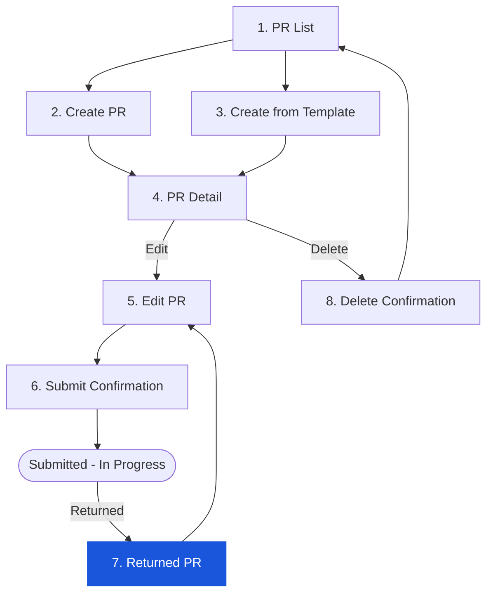

# Step 7 — Returned PR (Receive, Review & Resubmit)

> When an approver (HOD, Purchase Officer, FC, GM, or Owner) returns a PR to the Creator, its status changes from `INPROGRESS` to `RETURNED`. The Creator must review the return reason, make the requested changes, and resubmit. Resubmission transitions the PR back to `INPROGRESS`.

> ⚠️ **Capture status:** No RETURNED PR was available in the test account during screen capture. All screen references in this document are TBC. Content is based on BRD (FR-PR-011) and observed behaviour of adjacent statuses.

---

## 7.1 Access Path

1. Creator receives an email notification: "Your PR [number] has been returned by [approver name]"
2. Navigate to PR List → PR appears with `RETURNED` status badge
3. Click the RETURNED PR row → opens PR Detail in editable state (same form as step-04)

---

## 7.2 Flow Position

---

## 7.3 How the Creator Discovers a Returned PR

| Channel | Detail |
|---------|--------|
| **Email notification** | Creator receives email when PR is returned. Contains PR number and approver name. SLA: within 5 minutes of return action (BRD FR-PR-005). |
| **PR List** | PR appears with `RETURNED` status badge. Listed under both "My pending" and "All Documents" tabs. |
| **PR Detail** | Status badge shows `RETURNED`. Workflow History tab shows the return event with approver name, timestamp, and return reason. |

---

## 7.4 PR Detail — RETURNED Status View

The PR Detail page for a RETURNED PR appears **in edit mode** — the same form as step-04 (Edit PR), not a read-only view.

| Element | Value / Behaviour |
|---------|-----------------|
| Status badge | `RETURNED` (amber/orange — TBC exact colour) |
| Header fields | Workflow and Description editable; PR No./Date/Requestor/Department read-only |
| Items grid | Fully editable — Creator can modify, add, or delete rows |
| Workflow History tab | Shows the return event: approver name, timestamp, return reason (mandatory comment from approver) |
| Action buttons | **Cancel**, **Save**, **Submit** (Delete not available on Returned PRs — TBC) |

> ⚠️ **Discrepancy:** BRD FR-PR-011 lists `RETURNED` alongside `DRAFT` as editable by the Creator, but does not explicitly state whether a Returned PR can be **deleted** (vs only resubmitted). The Delete button availability on RETURNED status was not confirmed during capture. Needs verification.

---

## 7.5 Reading the Return Reason

The return reason is recorded by the approver when performing the Return action. It appears in the **Workflow History** tab of the PR Detail.

| Element | Content |
|---------|---------|
| Stage badge | `RETURNED` |
| Actor | Approver's name |
| Timestamp | Date and time of the return action |
| Return reason | Free-text comment from approver (minimum 10 characters per BRD FR-PR-005) |
| Stage name | Workflow stage where the return occurred (e.g. HOD, FC) |

---

## 7.6 Editing a Returned PR

Identical to step-04 (Edit PR — Draft). The Creator:

- Can change Workflow type and Description in the header
- Can edit, add, or delete item rows
- All item fields (Location, Product, Requested, Delivery Date, Comment) are editable
- Changes are not committed until **Save** is clicked

→ Full edit behaviour: **[step-05-edit-pr.md](step-05-edit-pr.md)**

---

## 7.7 Resubmitting a Returned PR

Clicking **Submit** on a RETURNED PR follows the same flow as submitting a Draft PR.

→ Full submission flow: **[step-06-submit-confirmation.md](step-06-submit-confirmation.md)**

On confirmation of resubmission:
- Status: `RETURNED` → `INPROGRESS`
- PR is re-routed to the approver who returned it (or from the beginning of the workflow — TBC per org config)
- Workflow History records a new `RECEIVED` entry with timestamp and Creator name
- The approver who returned it receives an email notification

> ⚠️ **Discrepancy:** BRD does not specify whether resubmission routes to the approver who returned it or restarts the full workflow chain. Needs clarification from business.

---

## 7.8 Validation on Action

### On Save

**Purpose / Use Case:** Save current edits on a Returned PR as a work-in-progress — use to preserve changes before you are ready to resubmit.

Same as step-04 §4.8 On Save. Key point: RETURNED status is treated identically to DRAFT for save validation.

### On Submit (Resubmission)

**Purpose / Use Case:** Resubmit the corrected PR back into the approval workflow — use once all changes requested by the approver have been addressed.

| # | Check | BR | Pass Behaviour | Fail Behaviour |
|---|-------|----|----------------|----------------|
| 1 | Workflow selected | BR-02 | Submit enabled | Button disabled |
| 2 | ≥ 1 item present | BR-05 | Submit enabled | Button disabled |
| 3 | PR status is RETURNED at submit time | FR-PR-006 | Status → INPROGRESS | Server rejects if status changed |
| 4 | Budget available (re-check on resubmit) | FR-PR-004 | Soft commitment re-created | TBC — budget may have changed since original submit |

**Confirmation Dialog:**

| Element | Content |
|---------|----------|
| Title | "Resubmit Purchase Request" |
| Message | "Are you sure you want to resubmit this purchase request? It will be sent back into the approval workflow." |
| **OK** button (Blue/Primary) | Confirms resubmission — PR status changes `RETURNED` → `INPROGRESS`; routed to first approver |
| **Cancel** button (Outline/Grey) | Closes dialog — PR remains in RETURNED; no changes made |

---

## 7.9 Business Rules

| # | Rule | Source |
|---|------|--------|
| BR-01 | `RETURNED` PRs are editable by the Creator. Edit capability is identical to `DRAFT`. | FR-PR-011 |
| BR-02 | Resubmitting a Returned PR transitions status: `RETURNED` → `INPROGRESS`. | FR-PR-011 |
| BR-03 | The approver's return reason is mandatory (minimum 10 characters) and is permanently recorded in Workflow History. | FR-PR-005 |
| BR-04 | Creator receives an email notification when their PR is returned. Notification includes PR number and approver name. | FR-PR-005 |
| BR-05 | All edits to a Returned PR are tracked in the audit trail: field, old value, new value, user, timestamp. | FR-PR-011 |
| BR-06 | A Returned PR can be resubmitted without making any changes (Creator may agree with original content). | FR-PR-011 |
| BR-07 | Budget soft commitment is re-created on resubmission. If the budget has changed since the original submission, the new commitment is checked against current available budget. | FR-PR-004 |

---

## 7.10 Edge Cases & Error States

| # | Scenario | System Behaviour |
|---|----------|-----------------|
| 1 | Creator resubmits without making any changes | Allowed — resubmission valid even with identical content |
| 2 | Creator adds new items to a Returned PR | New items included in resubmission; amount recalculated |
| 3 | Creator deletes all items from a Returned PR | Submit disabled; must have ≥ 1 item to resubmit |
| 4 | PR returned a second time by a different approver | Additional `RETURNED` entry in Workflow History; Creator edits and resubmits again |
| 5 | Creator receives return notification but PR was already voided by admin | PR Detail shows VOID status; Creator cannot edit |
| 6 | Network error during resubmission | TBC — error toast expected; PR status should remain RETURNED |

---

## 7.11 Navigation

| Action | Destination |
|--------|-------------|
| Email notification link | PR Detail (RETURNED status) |
| PR List → click RETURNED PR | PR Detail (RETURNED, edit mode) |
| **Save** | Stays on edit form |
| **Submit** → Confirm | Step 4 — PR Detail (INPROGRESS, read-only) |
| **Cancel** → Discard | Step 1 — PR List |
| **Cancel** → Keep editing | Stays on edit form |
| Breadcrumb **Purchase Request** | Step 1 — PR List |
