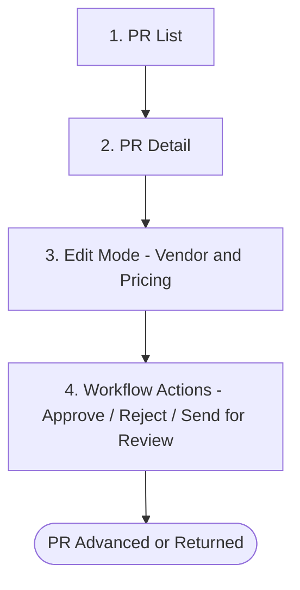

# Persona 2 — Purchase Officer

**Module:** 2 (per CLAUDE.md mapping; BL doc ID prefix: 3.x per persona-doc-pattern.md)
**Stage:** Stage 3 — Vendor Allocation & Submit
**Test User:** purchase@zebra.com / 12345678
**Section Prefix:** `2.x` (folder-level); step docs use their step number as section prefix
**Last Updated:** 2026-04-19 — Added discrepancy callout — Approve/Reject/Return are bulk toolbar actions, not standalone per-PR buttons; updated Permissions Summary

---

## Workflow Overview

> ⚠️ **Discrepancy:** BRD FR-PR-005A specifies standalone Approve, Reject, and Return buttons for the Purchasing Staff role. The live UI does **not** show these as individual per-PR header buttons. The approval actions are available as **bulk toolbar actions only** — accessible in Edit Mode via the Select All dropdown → bulk action toolbar. Actions confirmed in UI: **Approve**, **Reject**, **Send for Review** (BRD: Return Selected), **Split**. Standalone row-level buttons remain absent.

---

## Document Inventory

| Step | File | Title | Status |
|------|------|-------|--------|
| 1 | [step-01-pr-list.md](step-01-pr-list.md) | PR List — Purchaser View | Draft |
| 2 | [step-02-pr-detail.md](step-02-pr-detail.md) | PR Detail — Read-Only View | Draft |
| 3 | [step-03-edit-mode.md](step-03-edit-mode.md) | Edit Mode — Vendor & Pricing Allocation | Draft |
| 4 | [step-04-workflow-actions.md](step-04-workflow-actions.md) | Workflow Actions — Approve / Reject / Return | Draft |

---

## Key Responsibilities

| Responsibility | Where |
|---------------|-------|
| Review PRs routed to Purchase stage | step-01, step-02 |
| Allocate vendors per line item | step-03 |
| Enter unit prices, discounts, tax profiles | step-03 |
| Use Auto Allocate for vendor scoring | step-03 |
| Submit / Approve PR to next stage | step-04 |
| Reject or Return PR with comments | step-04 |

---

## Permissions Summary

| Status | Purchaser Can | Notes |
|--------|--------------|-------|
| In Progress (Purchase stage) | View, Edit (vendor/pricing), Approve / Reject / Send for Review (bulk toolbar only — no standalone per-PR buttons) | Primary workflow |
| In Progress (other stage) | View only | Cannot act on PRs at HOD/FC/GM stage |
| Draft | View only | Not editable by purchaser |
| Approved / Completed | View only | Read-only for all |
| Void | View only | |

**Field-level edit permissions in Edit Mode** — see step-03 §3.4 (FR-PR-011A).

---

## Cross-Persona Links

| Previous Persona | This Persona | Next Persona |
|-----------------|--------------|--------------|
| HOD — approves PR qty, routes to Purchase | **Purchase Officer** — allocates vendors, submits | FC / GM / Owner — financial approval |
| → `03-approver/` | ← you are here → | → `03-approver/` |

---

## Screenshots

| File | Description |
|------|-------------|
| screens/step-02-pr-list-my-pending.png | PR list — My Pending tab (default) |
| screens/step-02-pr-list-all-documents.png | PR list — All Documents tab |
| screens/step-02-pr-list-filter-open.png | Filter panel open |
| screens/step-02-pr-list-stage-dropdown.png | All Stage dropdown open |
| screens/step-03-pr-detail-overview.png | PR Detail — loading state |
| screens/step-03-pr-detail-tab-items.png | PR Detail — Items tab |
| screens/step-03-pr-detail-tab-workflow-history.png | PR Detail — Workflow History tab |
| screens/step-04-edit-mode-full.png | Edit Mode — collapsed rows |
| screens/step-04-edit-mode-expanded.png | Edit Mode — rows expanded |
| screens/step-05-auto-allocate.png | After Auto Allocate |
| screens/step-06-approve-dialog.png | Approve confirmation |
