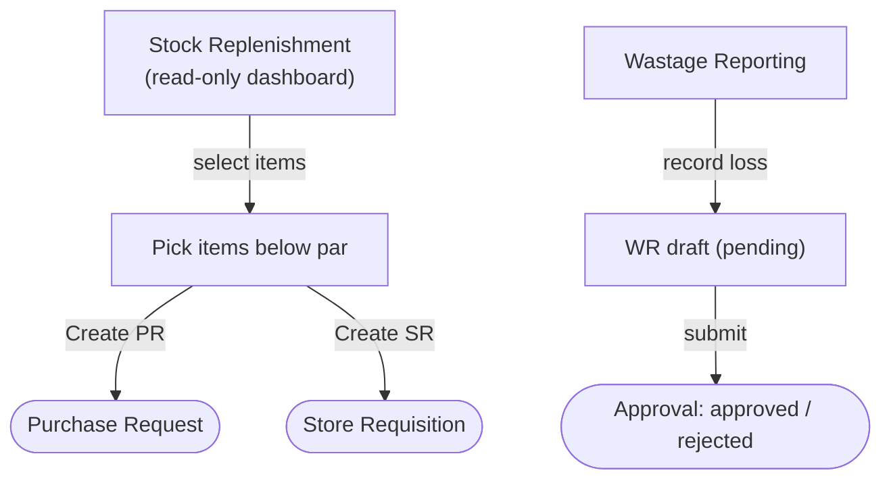

# Store Operation — Store Manager Workflows

The **Store Manager** persona owns day-to-day stock health at the store/outlet level: spotting items that have fallen below par, reporting spoilage and breakage, and turning both into actionable documents (Purchase Requests, Store Requisitions, and Wastage Reports). These journeys are scoped to the manager's active Business Unit — **BLAVG** in the test environment.

This index covers two read/light-write modules in the Store Operation area. The heavier, fully-workflowed flows (the Store Requisition lifecycle) live elsewhere and are cross-linked below.

---

## Workflow Overview

The two flows are complementary:

- **Stock Replenishment** is a *detection* surface. It summarises items that have dropped below par level and lets the manager fan a selection out into a Purchase Request (buy from a vendor) or a Store Requisition (pull from another internal location). It writes no document of its own — it seeds the create flow of PR or SR.
- **Wastage Reporting** is a *recording* surface. It captures spoilage, breakage, or expiry as a Wastage Report that carries a status (pending / approved / rejected) and a calculated loss value.

---

## Document Index

| Journey | Document | Screen | Route | URL |
|---------|----------|--------|-------|-----|
| Report wastage | [wastage-reporting.md](wastage-reporting.md) | Wastage Reporting (list + form) | `routes/store-operation/wastage-reporting` | `/store-operation/wastage-reporting` |
| Detect & route shortfalls | [stock-replenishment.md](stock-replenishment.md) | Stock Replenishment dashboard | `routes/store-operation/stock-replenishment` | `/store-operation/stock-replenishment` |

---

## Access Path

**Dashboard → Store Operation (sidebar) → Wastage Reporting / Stock Replenishment**

Or direct:
- `/store-operation/wastage-reporting`
- `/store-operation/stock-replenishment`

---

## Related Flow Documents

The main store flow — **Store Requisition** — is the destination of the "Create SR" action on the Stock Replenishment dashboard. It is the only Store Operation module with an automated spec today and has its own, fuller documentation:

| Flow | Where it lives |
|------|----------------|
| **Store Requisition** (create → submit → approve → issue lifecycle) | Automated spec `tests/701-sr.spec.ts` · user stories `docs/user-stories/701-sr.md` · persona journey `docs/persona-doc/System Process/tx-03-sr.md` |
| **Wastage Report** (transaction-level process view) | `docs/persona-doc/System Process/tx-11-wastage-report.md` — companion to the [wastage-reporting.md](wastage-reporting.md) journey in this folder |

> The wastage process appears in two places by design: this folder documents the **Store Manager's screen-level journey** through the Wastage Reporting UI, while `System Process/tx-11-wastage-report.md` documents the **end-to-end transaction process**. Keep them consistent when either changes.

---

## Scope Notes

- **Active BU = BLAVG.** All data on both screens is scoped to the manager's active Business Unit. Stock Replenishment binds the query key to `buCode` and does not fetch until the BU is ready; Wastage Reports are created and listed under the active BU.
- **Stock Replenishment is read-only.** It currently sources from mock data (`useStockReplenishment`, pending real backend) and has no create/edit/delete of its own — its only writes are the downstream PR/SR create flows.
