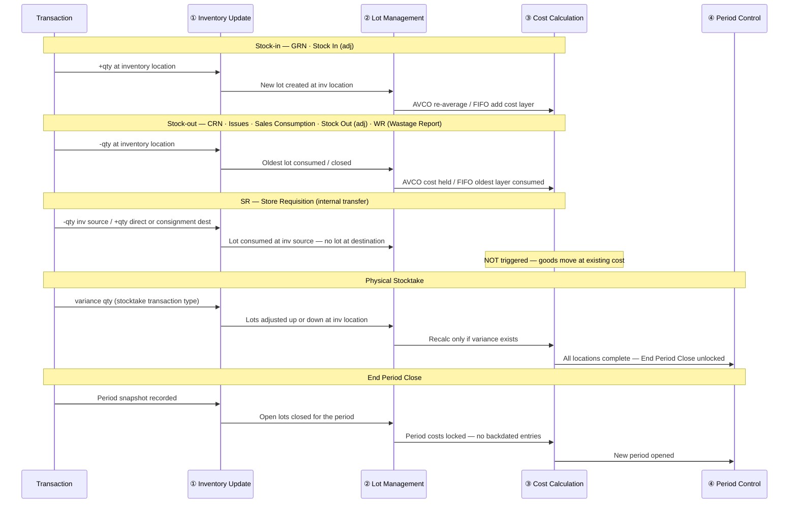

# System Processes — Carmen Inventory

This folder documents **what the system does** underneath each transaction, across three cross-cutting processes. It complements the persona workflow docs (01–05) which describe *what users do*.

**Output location:** `/Users/peak/Storage/1-Projects/Carmen/System-Processes/`

---

## How to Use This Folder

| If you want to know… | Read… |
|---|---|
| How inventory qty changes for a specific transaction | The transaction doc (tx-XX) → System Effects table |
| The rules that govern AVCO vs FIFO cost recalculation | `proc-03-cost-calculation.md` |
| Which transactions create or consume lots | `proc-02-lot-management.md` |
| Which location types are affected by a transaction | The transaction doc → System Effects table |
| How End Period Close relates to Physical Count and Spot Check | `tx-09-end-period-close.md` + `tx-08-physical-stocktake.md` + `tx-10-spot-check.md` |

---

## Scope and Constraints

| Constraint | Value |
|---|---|
| Costing method | AVCO or FIFO — set per Business Unit at implementation; **cannot be changed after go-live** |
| Lot tracking scope | **Inventory locations only** — Direct and Consignment locations are excluded |
| Lot granularity | 1 lot = 1 inventory location (a lot cannot span multiple locations) |
| Location types | Inventory · Direct · Consignment |
| End Period prerequisite | Stage 1: all transactions (GRN/ADJ/TRF/SR/WR) Posted · Stage 2: all Spot Checks Completed · Stage 3: all Physical Counts Finalized (GL posted) |
| Physical Count lock | Transactions at a location are locked while its Physical Count is IN PROGRESS |

---

## Process Execution Swim Lane

The diagram below shows the order in which processes execute for each transaction group. Columns are the four processes; rows are the transaction groups.

---

## Transaction × Process Matrix

✅ = process triggered · ❌ = not triggered · — = not applicable

| Transaction | Inventory Update | Lot Management | Cost Calculation | End Period Close |
|---|---|---|---|---|
| GRN (Goods Receipt Note) | ✅ +qty at inv | ✅ new lot (inv only) | ✅ AVCO/FIFO recalc | — |
| CRN (Credit Return Note) | ✅ −qty at inv | ✅ reverse lot | ✅ AVCO/FIFO recalc | — |
| SR (Store Requisition) | ✅ −qty inv source / +qty at dest | ✅ consume lot at inv source; new lot at inv dest (Variant A only) | ❌ transfer at existing FIFO cost | — |
| Issues | ✅ −qty at inv | ✅ consume lot | ✅ AVCO/FIFO recalc | — |
| Sales Consumption (SC) | ✅ −qty at inv | ✅ consume lot | ✅ AVCO/FIFO recalc | — |
| Stock In (adj) | ✅ +qty at inv | ✅ new lot (inv only) | ✅ AVCO/FIFO recalc | — |
| Stock Out (adj) | ✅ −qty at inv | ✅ consume lot (inv only) | ✅ AVCO/FIFO recalc | — |
| WR (Wastage Report) | ✅ −qty at inv (INV/CON); metrics only at DIR | ✅ consume lot (inv only) | ✅ AVCO/FIFO recalc (INV/CON only) | — |
| Spot Check | ⏳ PENDING — variance posting not yet implemented | ⏳ PENDING | ⏳ PENDING | — |
| Physical Count | ✅ ±qty (variance) | ✅ adjust lots | ✅ recalc if qty changes | — |
| End Period Close | ✅ period snapshot | ✅ close open lots | ✅ lock period costs | ✅ |

> **SR note:** SR has 3 destination variants: INV → INV (= Stock Transfer view, balance-sheet only), INV → DIR (Dr Expense / Cr Inventory Asset), INV → CONS (Dr Expense / Cr Vendor Liability). FIFO cost-layer consumption at source; Cost Calculation (proc-03) not triggered for any variant. See [tx-03-sr.md](tx-03-sr.md).

> **WR note:** Wastage Report is a separate transaction with its own document and approval workflow (see [tx-11-wastage-report.md](tx-11-wastage-report.md)). On approval, it generates a downstream Stock Out adjustment that appears in the inventory ledger under reference type `WR`. WR ≠ ADJ — WR is the operational/evidence layer (photos, tiered approval, supplier charge-back) that *produces* an ADJ.

> **TRF note:** There is no separate Transfer transaction entity. Stock Transfer is a read-only filtered view of SR records where both source and destination are INVENTORY locations. In period-close Stage 1, SR with INV → INV destinations satisfies both the SR and TRF buckets. Source: BR-stock-transfers.md.

> **Spot Check note:** Variance posting to inventory is PENDING (not yet implemented per BR-spot-check.md v2.2.0). Spot Checks currently reach `completed` status and satisfy End Period Close Stage 2, but do not post QOH / lot / cost changes.

> **Physical Count note:** Variance is posted as its own transaction type (not a Stock In/Out adjustment). Physical Count must reach **Finalized** status (GL posted) to satisfy End Period Close Stage 3 — Completed alone is insufficient.

---

## Document Index

### Process Reference Docs

| Doc | File | What it explains |
|-----|------|-----------------|
| proc-01 | [proc-01-inventory-update.md](proc-01-inventory-update.md) | How qty on hand changes — rules, triggers, location scope |
| proc-02 | [proc-02-lot-management.md](proc-02-lot-management.md) | Lot creation, consumption, adjustment — inventory-only scope |
| proc-03 | [proc-03-cost-calculation.md](proc-03-cost-calculation.md) | AVCO vs FIFO rules, BU-level lock, recalculation triggers |

### Transaction Effect Docs

| Doc | File | Transaction |
|-----|------|-------------|
| tx-01 | [tx-01-grn.md](tx-01-grn.md) | Goods Receipt Note |
| tx-02 | [tx-02-crn.md](tx-02-crn.md) | Credit Return Note |
| tx-03 | [tx-03-sr.md](tx-03-sr.md) | Store Requisition |
| tx-04 | [tx-04-issues.md](tx-04-issues.md) | Issues |
| tx-05 | [tx-05-sales.md](tx-05-sales.md) | Sales Consumption (SC) |
| tx-06 | [tx-06-stock-in-adj.md](tx-06-stock-in-adj.md) | Stock In (Adjustment) |
| tx-07 | [tx-07-stock-out-adj.md](tx-07-stock-out-adj.md) | Stock Out (Adjustment) |
| tx-08 | [tx-08-physical-stocktake.md](tx-08-physical-stocktake.md) | Physical Count |
| tx-09 | [tx-09-end-period-close.md](tx-09-end-period-close.md) | End Period Close |
| tx-10 | [tx-10-spot-check.md](tx-10-spot-check.md) | Spot Check |
| tx-11 | [tx-11-wastage-report.md](tx-11-wastage-report.md) | Wastage Report (WR) |

---

## Audience Guide

| Section | Developer | BA / QA | End User / Trainer |
|---|---|---|---|
| P1 Overview | skim | read | read |
| P2 Rules | read | read | skim |
| P3 System Behaviour | read | reference | skip |
| P4 Open Questions | read | read | skip |
| tx System Effects table | read | read | reference |
| tx Before / After example | reference | read | read |

---

## Cross-Links to Persona Docs

| Transaction | Persona who creates it | Persona workflow doc |
|---|---|---|
| GRN | Purchaser / Warehouse | TBD |
| CRN | Purchaser | TBD |
| SR | Requestor | `01-creator/` |
| Issues | TBD | TBD |
| Sales Consumption (SC) | System (POS) — Reviewers: Store Manager / Finance Manager | TBD |
| Wastage Report (WR) | Kitchen Staff / Store Manager / Chef → tiered approval | TBD |
| Stock In/Out (adj) | TBD | TBD |
| Physical Count | Warehouse | TBD |
| Spot Check | Storekeeper / Inventory Coordinator | TBD |
| End Period Close | Finance Controller | TBD |
| Purchase Order | Purchaser + FC Approver | `04-po-purchaser/`, `05-po-approver/` |
