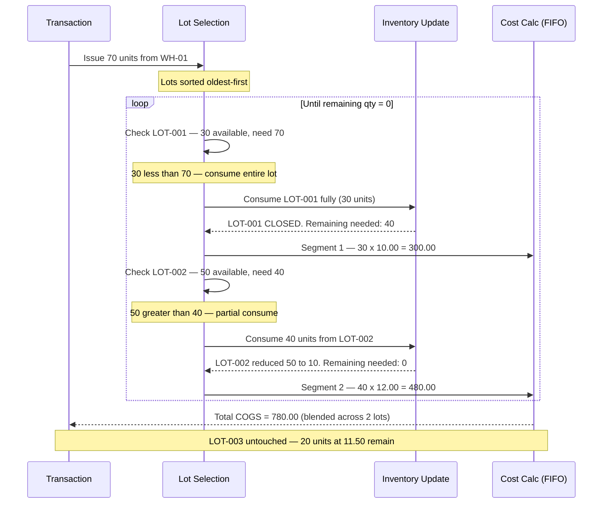

# Process 03 — Cost Calculation

**What this process does:** Recalculates the unit cost of a product at a location whenever a transaction adds or removes stock. The costing method (AVCO or FIFO) is set per Business Unit at implementation and cannot be changed after go-live.

---

## P1 Overview (Business Layer)

The system needs to know the cost of goods on hand — both for balance sheet valuation and for calculating the cost of goods consumed (COGS). Every time a transaction changes qty, the system recalculates the unit cost using either the Average Cost (AVCO) or First-In-First-Out (FIFO) method, depending on which method the Business Unit was configured with at implementation.

**Critical constraint:** The costing method is locked at implementation. A hotel group with multiple BUs can have some BUs on AVCO and others on FIFO, but each individual BU's method is permanent.

**Exception — Store Requisition (SR):** SR moves goods from an inventory location to a Direct or Consignment location at the existing unit cost. No recalculation occurs — the cost is preserved from the source.

---

## P2 Rules (Business Analyst Layer)

### When Cost Calculation Runs

| Transaction | Triggers Cost Calc? | Notes |
|---|---|---|
| GRN | ✅ Yes | New stock in — recalculate unit cost |
| CRN | ✅ Yes | Return reduces stock — recalculate |
| SR | ❌ No | Transfer at existing cost; no recalc |
| Issues | ✅ Yes | Stock leaves — recalculate |
| Sales | ✅ Yes | Stock leaves — recalculate |
| Stock In (adj) | ✅ Yes | Positive qty change — recalculate |
| Stock Out (adj) | ✅ Yes | Negative qty change — recalculate |
| Physical Stocktake (variance) | ✅ Yes (if qty changes) | Variance posted → qty changed → recalculate |
| Physical Stocktake (no variance) | ❌ No | No qty change → no recalc |
| End Period Close | ✅ Lock | Locks cost for the period; no new recalc after lock |

### AVCO (Average Cost) Method

**Formula:**
```
New Unit Cost = (Existing QOH × Current Unit Cost + Incoming Qty × Incoming Unit Cost)
                ──────────────────────────────────────────────────────────────────────
                            (Existing QOH + Incoming Qty)
```

Applied on every stock-in transaction (GRN, Stock In adj). Stock-out transactions (Issues, Sales, Stock Out adj) use the current average cost at time of issue — they do not change the unit cost.

**Example:**

| Step | Event | QOH | Unit Cost | Total Value |
|---|---|---|---|---|
| Start | Opening balance | 100 | 10.00 | 1,000.00 |
| GRN | Receive 50 units @ 12.00 | 150 | 10.67 | 1,600.00 |
| Issues | Issue 30 units | 120 | 10.67 | 1,280.00 |
| GRN | Receive 80 units @ 11.00 | 200 | 10.84 | 2,168.00 |

*AVCO re-averages on every stock-in. Issues use the running average — unit cost does not change on stock-out under AVCO.*

### FIFO (First-In, First-Out) Method

Under FIFO, the system maintains a cost layer for each inbound transaction. When goods are issued or sold, the oldest cost layer is consumed first.

**Example:**

| Layer | Source | Qty | Unit Cost | Remaining |
|---|---|---|---|---|
| Layer 1 | GRN-001 | 100 units | 10.00 | 100 |
| Layer 2 | GRN-002 | 50 units | 12.00 | 50 |

When 80 units are issued:
- 80 units from Layer 1 @ 10.00 = 800.00 COGS
- Layer 1 remaining: 20 units

*Under FIFO, the issued cost is the oldest layer's cost. The remaining inventory cost is the weighted value of surviving layers.*

### FIFO Multi-Lot Spanning — When One Lot Is Not Enough

Applies to: **Issues · Sales · Stock Out adj · CRN**

When the transaction qty exceeds the oldest lot's available qty, the system rolls into the next lot automatically, consuming each in chronological order until the full qty is satisfied. Each lot segment posts its own cost at that lot's unit cost.

**Scenario:** Issue 70 units from WH-01. Three lots on hand:

| Lot | Created | Qty Available | Unit Cost |
|---|---|---|---|
| LOT-001 | GRN-2026-01 (oldest) | 30 | 10.00 |
| LOT-002 | GRN-2026-02 | 50 | 12.00 |
| LOT-003 | GRN-2026-03 (newest) | 20 | 11.50 |



**Result:**

| Lot | Before | After | COGS Segment |
|---|---|---|---|
| LOT-001 | 30 units @ 10.00 | **CLOSED** | 30 × 10.00 = 300.00 |
| LOT-002 | 50 units @ 12.00 | 10 units @ 12.00 | 40 × 12.00 = 480.00 |
| LOT-003 | 20 units @ 11.50 | 20 units @ 11.50 (unchanged) | — |
| **Total COGS** | | | **780.00** |

**AVCO equivalent:** 70 × 11.20 (current avg) = 784.00 — one calculation, no lot iteration needed.

### End Period Close — Cost Lock

At End Period Close:
1. All pending Physical Stocktakes for all inventory locations must be completed first
2. The period's inventory costs are locked — no backdated cost entries are permitted after close
3. A cost snapshot is recorded for the period (used for reporting and reconciliation)
4. Subsequent transactions are assigned to the next open period

---

## P3 System Behaviour (Developer Layer)

### Input Contract

| Input | Source |
|---|---|
| Product ID | Transaction line item |
| Location ID | Transaction line item |
| Quantity delta | Transaction line item qty |
| Transaction unit cost | GRN/Stock In adj: from PO unit price or manual entry; Issues/Sales/Stock Out: derived from current cost layer |
| BU costing method | BU configuration (AVCO or FIFO — read-only at transaction time) |

### Output Contract

| Output | AVCO | FIFO |
|---|---|---|
| Updated unit cost | Single weighted average | New cost layer added (stock-in) or oldest layer reduced (stock-out) |
| COGS amount | QOH × new avg cost — previous value | Oldest layer qty × oldest layer cost |
| Period cost lock | `period_costs.status = LOCKED` | Same |

### Sequencing with Other Processes

1. **Inventory Update** (Process 01) — posts qty change
2. **Lot Management** (Process 02) — updates lot records
3. **Cost Calculation** (this process) — recalculates unit cost using updated qty

Cost Calculation always runs last. It reads the new QOH (post inventory update) to compute the revised cost.

### SR Exception — Why No Recalc

SR is a location transfer, not a consumption. The goods move from an inventory location to a Direct or Consignment location at the same unit cost they carried in inventory. AVCO and FIFO are not affected because no value is gained or lost — it is an internal movement at book value.

### What This Process Does NOT Do

- Does not select the costing method (fixed at BU implementation)
- Does not validate PO pricing (separate procurement validation)
- Does not handle multi-currency conversion (separate FX process — TBC)
- Does not generate GL journal entries (separate accounting integration — TBC)

---

## P4 Open Questions / Confirmed Answers

| # | Question | Answer | Source |
|---|---|---|---|
| 1 | Costing method locked at implementation | ✓ Cannot be changed after go-live; set per BU | User confirmed 2026-04-26 |
| 2 | SR does not trigger cost recalculation | ✓ Transfer at existing cost | User confirmed 2026-04-26 |
| 3 | End Period Close locks costs (not just snapshot) | ✓ Locks period — no backdated entries after close; requires all-location stocktakes complete | User confirmed 2026-04-26 |
| 4 | Physical Stocktake variance triggers cost recalc | ✓ If qty changes, AVCO/FIFO recalculates | Inferred from process rules |
| 5 | Does CRN reverse the original GRN cost or use current cost? | TBC | — |
| 6 | Multi-currency: are costs stored in base currency only? | TBC | — |
| 7 | Are cost layers (FIFO) tracked per lot or per GRN? | TBC | — |

---

## Related Documents

→ [INDEX.md](INDEX.md) — transaction × process matrix  
→ [proc-01-inventory-update.md](proc-01-inventory-update.md) — qty change that precedes cost recalculation  
→ [proc-02-lot-management.md](proc-02-lot-management.md) — FIFO lot order determines which cost layer is consumed  
→ [tx-09-end-period-close.md](tx-09-end-period-close.md) — period lock that freezes costs  
→ [tx-03-sr.md](tx-03-sr.md) — SR: the exception where cost calculation does not run
