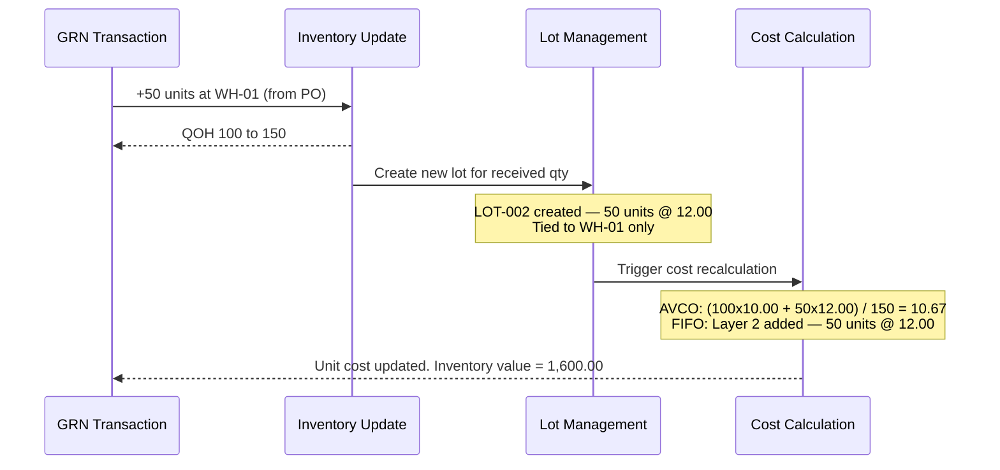

# Transaction 01 — GRN (Goods Receipt Note)

**What it is:** Records the physical receipt of goods against a Purchase Order. Stock enters an inventory location.

**Who creates it:** Receiver (Warehouse staff — role may be labelled Receiver, Store Keeper, or Warehouse Staff per property configuration)  
**Creation paths:** From an approved Purchase Order, or independently by the Receiver without a PO reference  
**Status flow:** Received → Committed  
**Committed:** Transaction locked — cannot be edited or reversed

---

## System Effects (in order)

| Step | Process | Location Types Affected | Lot Impact | Cost Impact |
|---|---|---|---|---|
| 1 | Inventory Update | Inventory (receiving) | — | — |
| 2 | Lot Management | Inventory (receiving) | New lot created | — |
| 3 | Cost Calculation | Inventory (receiving) | — | AVCO: re-average unit cost; FIFO: add new cost layer |

### Step Detail

**Step 1 — Inventory Update:**  
QOH at the receiving inventory location increases by the received quantity for each line item.

**Step 2 — Lot Management:**  
A new lot record is created at the receiving inventory location with:
- Lot number (system-generated or supplier-provided — TBC)
- Product ID
- Location ID
- Qty received
- Supplier reference, expiry date, manufacture date (if captured on GRN)

**Step 3 — Cost Calculation:**  
- **AVCO:** New unit cost = weighted average of existing stock value + new receipt value, divided by new total QOH
- **FIFO:** A new cost layer is added with qty = received qty and unit cost = GRN unit price

---

## Process Swim Lane

Stock-in transaction — linear flow, no lot spanning (GRN adds stock, it does not consume existing lots).

---

## Before / After Example

**Scenario:** 50 units of Product A received at WH-01 @ unit cost 12.00. Opening balance: 100 units @ 10.00.

| Field | Before GRN | After GRN |
|---|---|---|
| Product A · WH-01 QOH | 100 | 150 |
| Open lots at WH-01 | LOT-001 (100 units) | LOT-001 (100 units) + LOT-002 (50 units) |
| Unit cost (AVCO) | 10.00 | 10.67 |
| Total inventory value (AVCO) | 1,000.00 | 1,600.00 |
| Cost layers (FIFO) | Layer 1: 100 @ 10.00 | Layer 1: 100 @ 10.00 · Layer 2: 50 @ 12.00 |

---

## Business Rules

| # | Rule |
|---|---|
| BR-01 | GRN can be created from an approved Purchase Order (PO-linked) or independently by the Receiver without a PO reference (standalone) |
| BR-02 | Received qty cannot exceed PO qty without an over-receipt allowance (TBC — tolerance setting) |
| BR-03 | Receiving location must be an Inventory location — GRN cannot post directly to Direct or Consignment |
| BR-04 | New lot is created at the receiving inventory location on every GRN line |
| BR-05 | Cost Calculation runs after inventory update — unit cost reflects new QOH |

---

## Edge Cases

| Scenario | System Behaviour |
|---|---|
| GRN qty = 0 on a line | TBC — whether system permits or blocks zero-qty lines |
| Received qty > PO qty | TBC — over-receipt tolerance setting |
| Product has no prior stock at location | QOH goes from 0 to received qty; first lot created; unit cost = GRN unit price |
| GRN references a PO that was already fully received | TBC |
| Multiple GRNs against same PO | Each GRN creates its own lot; cumulative qty tracks against PO total |
| GRN posted to a location currently in Physical Stocktake | Transaction blocked — location is locked during stocktake |

---

## Related Documents

→ [INDEX.md](INDEX.md) — transaction × process matrix  
→ [proc-01-inventory-update.md](proc-01-inventory-update.md)  
→ [proc-02-lot-management.md](proc-02-lot-management.md)  
→ [proc-03-cost-calculation.md](proc-03-cost-calculation.md)  
→ `04-po-purchaser/` — Purchase Order workflow that precedes GRN
