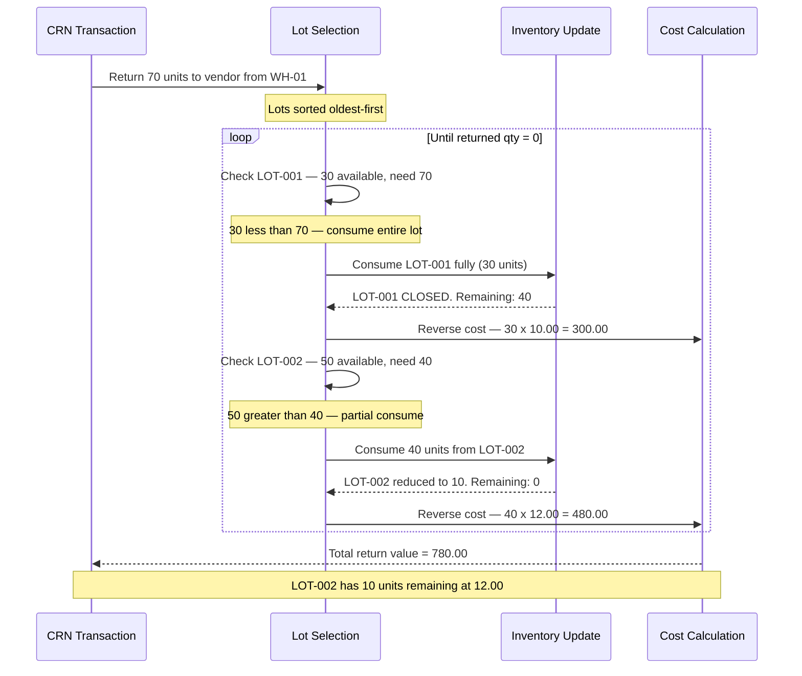

# Transaction 02 — CRN (Credit Return Note)

**What it is:** Records the return of goods to a vendor. Stock leaves an inventory location and goes back to the supplier.

**Who creates it:** Purchaser / Warehouse staff  
**Status before posting:** DRAFT  
**Status after posting:** TBC — verify live UI status name

---

## System Effects (in order)

| Step | Process | Location Types Affected | Lot Impact | Cost Impact |
|---|---|---|---|---|
| 1 | Inventory Update | Inventory (source) | — | — |
| 2 | Lot Management | Inventory (source) | Lot reversed / qty reduced or lot closed | — |
| 3 | Cost Calculation | Inventory (source) | — | AVCO: re-average; FIFO: remove from cost layer |

### Step Detail

**Step 1 — Inventory Update:**  
QOH at the source inventory location decreases by the returned quantity.

**Step 2 — Lot Management:**  
The lot associated with the returned goods has its qty reduced. If the entire lot is returned, the lot is closed. The lot to consume is typically identified by the original GRN lot number.

**Step 3 — Cost Calculation:**  
- **AVCO:** Returning goods reduces QOH. The unit cost is recalculated (or held — TBC: whether AVCO recalculates on stock-out or only on stock-in)
- **FIFO:** The returned goods are removed from the relevant cost layer (oldest first, or from the specific lot's layer — TBC)

---

## Process Swim Lane

Return qty may span multiple lots when the oldest lot does not hold enough qty to cover the full return.

**Scenario:** Return 70 units to vendor from WH-01. Lots on hand: LOT-001 (30 units @ 10.00), LOT-002 (50 units @ 12.00).

---

## Before / After Example

**Scenario:** 20 units of Product A returned from WH-01 to vendor. Current balance: 150 units in two lots.

| Field | Before CRN | After CRN |
|---|---|---|
| Product A · WH-01 QOH | 150 | 130 |
| LOT-001 qty | 100 | 80 |
| LOT-002 qty | 50 | 50 |
| Unit cost (AVCO) | 10.67 | 10.67 (TBC — re-averages?) |
| Cost layers (FIFO) | Layer 1: 100 @ 10.00 · Layer 2: 50 @ 12.00 | Layer 1: 80 @ 10.00 · Layer 2: 50 @ 12.00 |

---

## Business Rules

| # | Rule |
|---|---|
| BR-01 | CRN must reference a valid GRN or PO (TBC — whether CRN can be standalone) |
| BR-02 | Returned qty cannot exceed the qty originally received on the referenced GRN |
| BR-03 | Source location must be an Inventory location |
| BR-04 | The lot from the original GRN is identified and its qty reduced |
| BR-05 | Cost Calculation runs after inventory update |

---

## Edge Cases

| Scenario | System Behaviour |
|---|---|
| Return qty > original GRN qty | TBC — whether system blocks or requires override |
| Lot from original GRN no longer exists (fully consumed) | TBC — whether CRN is blocked or creates a negative lot |
| CRN at a location currently in Physical Stocktake | Transaction blocked — location locked during stocktake |
| Partial return (only some items from original GRN returned) | Allowed — lot qty reduced proportionally |
| Return of goods received at a different unit cost than current avg (AVCO) | AVCO recalculates based on remaining qty and value |
| CRN with no GRN reference | TBC |

---

## Related Documents

→ [INDEX.md](INDEX.md) — transaction × process matrix  
→ [proc-01-inventory-update.md](proc-01-inventory-update.md)  
→ [proc-02-lot-management.md](proc-02-lot-management.md)  
→ [proc-03-cost-calculation.md](proc-03-cost-calculation.md)  
→ [tx-01-grn.md](tx-01-grn.md) — GRN that CRN typically references
