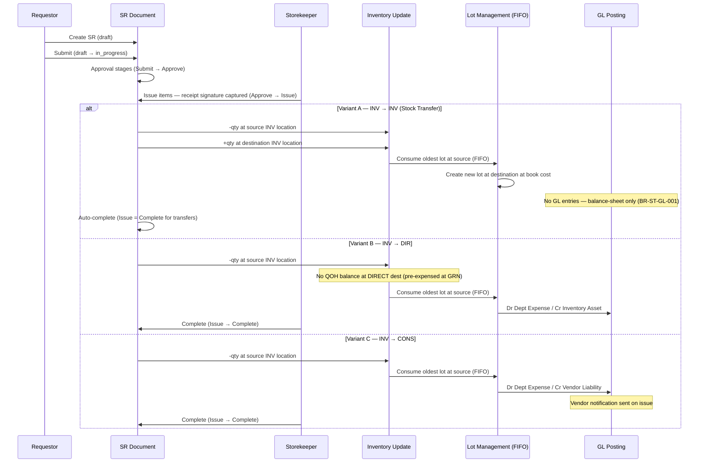

# Transaction 03 — SR (Store Requisition)

**What it is:** An internal request to move goods from an inventory source location to a destination for operational use. SR covers three destination variants — INVENTORY (= Stock Transfer), DIRECT (expense), and CONSIGNMENT (vendor-owned) — each with different system and GL effects. There is no separate "Transfer" transaction: the **Stock Transfer view** is a read-only filtered view of SR records where both source and destination are INVENTORY locations.

**Reference format:** `SR-YYMM-NNNN` (auto-generated)  
**Who creates it:** Requestor (Chef, F&B, Housekeeping, Engineering — own department only)  
**Who issues it:** Storekeeper  
**Status flow:** `draft → in_progress → completed` (terminal: `cancelled`, `voided`)  
**Stage flow (BR-SR-014):** `Draft → Submit → Approve → Issue → Complete`

---

## SR Destination Variants

SR behaviour is determined by the **destination location type**. The source must always be an INVENTORY location.

| Variant | Source | Destination | Lot at Source | Lot at Destination | GL / Cost Impact |
|---|---|---|---|---|---|
| **A. INV → INV** (= Stock Transfer view) | INV | INV | FIFO consumed | New lot created at dest (book cost) | Balance-sheet only — no GL, no COGS, no expense |
| **B. INV → DIR** | INV | DIR | FIFO consumed | None — not tracked at Direct | Dr Dept Expense / Cr Inventory Asset |
| **C. INV → CONS** | INV | CONS | FIFO consumed | None — not tracked at Consignment | Dr Dept Expense / Cr Vendor Liability |

> **Cost Calculation (proc-03) is NOT triggered** for any variant. FIFO is used only for cost-layer consumption at the source (determining which cost per unit moves with the goods); no AVCO re-average or FIFO re-layer occurs at either location.

---

## Stock Transfer View (Variant A)

When both source and destination are INVENTORY locations, the SR appears in the **Stock Transfer** page as a read-only audit view using the same SR-YYMM-NNNN reference — no separate document or reference number is generated.

From the Stock Transfer view, users can **view and print only**. All stage changes (Issue → Complete) are performed in the Store Requisitions module. For Variant A, Issue and Complete are treated as the same stage (auto-complete) — no separate receipt confirmation step.

> ⚠️ **Discrepancy:** BR-period-end v2.0.0 lists `TRF` as a peer transaction code alongside `GRN`, `ADJ`, `SR`, and `WR` in Stage 1 of the period-close validation gate. The implementation (BR-stock-transfers.md) confirms that Stock Transfers are not a separate entity — they are SRs with INVENTORY destinations. For period-close Stage 1 validation, SR records with INV → INV destinations satisfy both the `SR` and `TRF` buckets. *Source: BR-ST-REF-001, BR-ST-REF-002.*

---

## System Effects by Variant

### Variant A — INV → INV (Stock Transfer)

| Step | Process | Location Affected | Lot Impact | Cost / GL Impact |
|---|---|---|---|---|
| 1 | Inventory Update — decrease | INV (source) | — | — |
| 2 | Inventory Update — increase | INV (destination) | — | — |
| 3 | Lot Management | INV (source) | FIFO consumed oldest-first | — |
| 4 | Lot Management | INV (destination) | New lot created at book cost | — |
| 5 | Cost Calculation | ❌ Not triggered | — | No GL entries — balance-sheet movement only (BR-ST-GL-001) |

### Variant B — INV → DIR (Store Issue / Expense)

| Step | Process | Location Affected | Lot Impact | Cost / GL Impact |
|---|---|---|---|---|
| 1 | Inventory Update — decrease | INV (source) | — | — |
| 2 | Lot Management | INV (source) | FIFO consumed oldest-first | — |
| 3 | Cost Calculation | ❌ Not triggered | — | GL: Dr Dept Expense / Cr Inventory Asset |
| — | No QOH balance at destination | DIR | No lot created | Items already expensed at GRN — no second posting |

### Variant C — INV → CONS (Consignment Issue)

| Step | Process | Location Affected | Lot Impact | Cost / GL Impact |
|---|---|---|---|---|
| 1 | Inventory Update — decrease | INV (source) | — | — |
| 2 | Lot Management | INV (source) | FIFO consumed oldest-first | — |
| 3 | Cost Calculation | ❌ Not triggered | — | GL: Dr Dept Expense / Cr Vendor Liability |
| — | Vendor notification required | CONS | No lot created | Consignment vendor liability reduced |

---

## Process Swim Lane

Three destination variants shown. Variant A is balance-sheet only. Variants B and C post GL expense entries.

> **Multi-lot spanning:** If the SR qty exceeds the oldest lot at source, the system consumes lots in FIFO order (oldest-first) until the full qty is satisfied — same pattern as Issues / Sales / Stock Out adj.

---

## Before / After Example

**Scenario:** 10 units of Product A transferred from WH-01 (inventory, unit cost 10.67) to three different destination types.

### Variant A — INV → INV (transfer to COLD-STORE-01)

| Field | Before SR | After SR |
|---|---|---|
| Product A · WH-01 QOH | 150 | 140 |
| Product A · COLD-STORE-01 QOH | 0 | 10 |
| LOT-001 at WH-01 | 100 units | 90 units (10 consumed by FIFO) |
| Lot at COLD-STORE-01 | — | New lot: 10 units at cost 10.67 |
| GL entries | — | None — balance-sheet movement only |

### Variant B — INV → DIR (issue to KITCHEN-DIRECT)

| Field | Before SR | After SR |
|---|---|---|
| Product A · WH-01 QOH | 150 | 140 |
| Product A · KITCHEN-DIRECT balance | — | — (no QOH tracked at Direct) |
| LOT-001 at WH-01 | 100 units | 90 units (10 consumed by FIFO) |
| GL entries | — | Dr Dept Expense 106.70 / Cr Inventory Asset 106.70 |

### Variant C — INV → CONS (issue from consignment stock)

| Field | Before SR | After SR |
|---|---|---|
| Product A · WH-01 QOH | 150 | 140 |
| LOT-001 at WH-01 | 100 units | 90 units (10 consumed by FIFO) |
| GL entries | — | Dr Dept Expense 106.70 / Cr Vendor Liability 106.70 |

---

## Business Rules

| # | Rule | Source |
|---|---|---|
| BR-01 | SR source must always be an INVENTORY location | BR-SR-013 |
| BR-02 | Destination can be INVENTORY, DIRECT, or CONSIGNMENT — each has different system effects | BR-SR-011 |
| BR-03 | Cost Calculation (proc-03) is NOT triggered for any SR variant — goods move at existing FIFO cost | — |
| BR-04 | FIFO cost-layer consumption applied at source INVENTORY location on issue | BR-SR-011 |
| BR-05 | SR qty cannot exceed available QOH at source location | BR-SR-004, BR-SR-013 |
| BR-06 | Lot at source consumed (FIFO, oldest-first); new lot created at destination only for INV → INV | BR-SR-011 |
| BR-07 | INV → INV (Transfer): balance-sheet movement only — no GL, no COGS, no expense posting | BR-ST-GL-001–003 |
| BR-08 | INV → DIR: GL posts Dr Dept Expense / Cr Inventory Asset at FIFO cost | BR-SR-011 |
| BR-09 | INV → CONS: GL posts Dr Dept Expense / Cr Vendor Liability; vendor notification required | BR-SR-011 |
| BR-10 | Stock Transfer page is a read-only filtered view of SRs at Issue/Complete stage with INVENTORY destination | BR-ST-REF-001–002 |
| BR-11 | Cannot transfer TO a DIRECT location via SR — items at DIRECT are pre-expensed at GRN | BR-SR-013 |
| BR-12 | Stage flow: Draft → Submit → Approve → Issue → Complete | BR-SR-014 |
| BR-13 | Receipt signature from requestor required before issue completion | BR-SR-015 |

---

## Edge Cases

| Scenario | System Behaviour |
|---|---|
| SR qty > available QOH at source | Blocked — system validates available stock before Issue (BR-SR-004); alert shown |
| Source location in active Physical Count | Transaction blocked — location locked while count is IN PROGRESS |
| INV → INV: source and destination are same location | Blocked — source and destination must differ (BR-ST-LOC-006) |
| Partial issuance (less qty available than approved) | Partial issue supported — SR stays open; further batches allowed until fully issued |
| SR cancelled before Issue stage | Status → `cancelled`; no inventory or GL changes |
| SR voided after partial issue | TBC — whether partial movements are reversed or retained |
| Multiple source lots needed to satisfy SR qty | FIFO: oldest lot consumed first, then next, until full qty satisfied |
| INV → INV: Variant A destination type auto-detected or user-selected? | Determined by destination location type on the SR — no separate user selection needed |

---

## Related Documents

→ [INDEX.md](INDEX.md) — transaction × process matrix  
→ [proc-01-inventory-update.md](proc-01-inventory-update.md) — qty changes at source and destination  
→ [proc-02-lot-management.md](proc-02-lot-management.md) — FIFO lot consumption at source; lot creation at INV destination  
→ [proc-03-cost-calculation.md](proc-03-cost-calculation.md) — SR exception: cost calc not triggered  
→ [tx-09-end-period-close.md](tx-09-end-period-close.md) — Stage 1: SR (covers TRF view) must be Posted before period close  
→ BR-store-requisitions.md (v1.5.0) — primary BRD source  
→ BR-stock-transfers.md — Stock Transfer view architecture (TRF = filtered view of SR)
