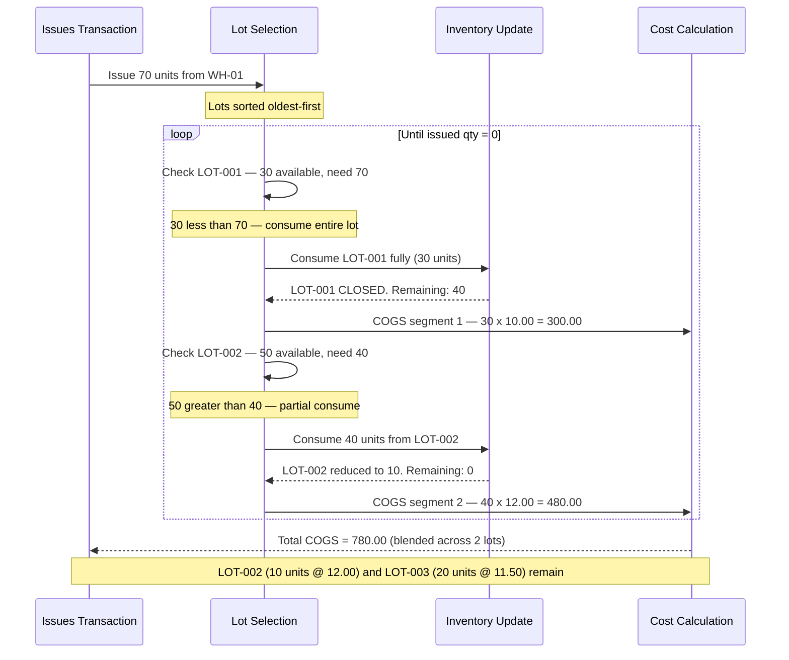

# Transaction 04 — Issues

**What it is:** Records the internal issue of goods from inventory — typically to a department, cost centre, or production process. Unlike SR, Issues records consumption (stock leaves inventory entirely — no destination location increase is tracked in inventory).

**Who creates it:** TBD — verify persona  
**Status flow:** TBC — verify live UI statuses

> ⚠️ **BRD Discrepancy:** The exact scope of "Issues" vs "SR" needs clarification — in some systems these are the same transaction; in others, Issues records consumption without a destination (expensed immediately) while SR is a location transfer. Verify in live UI.

---

## System Effects (in order)

| Step | Process | Location Types Affected | Lot Impact | Cost Impact |
|---|---|---|---|---|
| 1 | Inventory Update | Inventory (source) | — | — |
| 2 | Lot Management | Inventory (source) | Lot qty consumed | — |
| 3 | Cost Calculation | Inventory (source) | — | AVCO: unit cost may adjust; FIFO: oldest layer consumed |

### Step Detail

**Step 1 — Inventory Update:**  
QOH at the source inventory location decreases by the issued quantity. There is no destination — goods are issued out of inventory for use.

**Step 2 — Lot Management:**  
The lot at the source inventory location is consumed (oldest first). If fully consumed, the lot is closed.

**Step 3 — Cost Calculation:**  
- **AVCO:** Issuing goods reduces QOH. Unit cost is typically held constant on stock-out under AVCO (cost is expensed at current average — TBC whether AVCO recalculates on out-movement)
- **FIFO:** The oldest cost layer is consumed. The issued cost = oldest layer's unit cost × qty issued. If the issue qty exceeds the oldest layer, it rolls into the next layer.

---

## Process Swim Lane

Issues may span multiple lots when the issued qty exceeds the oldest lot. Each lot contributes a separate COGS segment at its own unit cost.

**Scenario:** Issue 70 units from WH-01. Lots: LOT-001 (30 units @ 10.00), LOT-002 (50 units @ 12.00), LOT-003 (20 units @ 11.50).

| Lot | Before | After | COGS Segment |
|---|---|---|---|
| LOT-001 | 30 units @ 10.00 | **CLOSED** | 30 x 10.00 = 300.00 |
| LOT-002 | 50 units @ 12.00 | 10 units @ 12.00 | 40 x 12.00 = 480.00 |
| LOT-003 | 20 units @ 11.50 | 20 units @ 11.50 | — |
| **Total COGS** | | | **780.00** |

> **AVCO equivalent:** 70 x current avg cost — one flat calculation, no lot iteration.

---

## Before / After Example

**Scenario:** 15 units of Product A issued from WH-01 to Kitchen department. Current balance: 140 units.

| Field | Before Issues | After Issues |
|---|---|---|
| Product A · WH-01 QOH | 140 | 125 |
| LOT-001 at WH-01 qty | 90 | 75 |
| Unit cost at WH-01 (AVCO) | 10.67 | 10.67 (held constant on stock-out) |
| COGS (AVCO) | — | 15 × 10.67 = 160.05 |
| COGS (FIFO) | — | 15 × 10.00 = 150.00 (from oldest layer) |

---

## Business Rules

| # | Rule |
|---|---|
| BR-01 | Issues source must be an Inventory location |
| BR-02 | Issues qty cannot exceed available QOH at source location |
| BR-03 | Lot at source is consumed (oldest first) |
| BR-04 | Cost Calculation runs — cost of issued goods posted to COGS |
| BR-05 | No inventory destination — goods are consumed, not transferred |

---

## Edge Cases

| Scenario | System Behaviour |
|---|---|
| Issues qty > QOH | TBC — blocked pre-confirmation or allowed with warning |
| Source in Physical Stocktake | Transaction blocked — location locked |
| Zero-qty issue line | TBC |
| Issue from a location with mixed FIFO layers | Oldest layer consumed first; rolls into next if needed |
| Issue reversal (un-issue) | TBC — whether a reversal transaction exists |
| Issues to a cost centre with no inventory record | Issues records the outbound only; no inventory impact at cost centre |

---

## Related Documents

→ [INDEX.md](INDEX.md) — transaction × process matrix  
→ [proc-01-inventory-update.md](proc-01-inventory-update.md)  
→ [proc-02-lot-management.md](proc-02-lot-management.md)  
→ [proc-03-cost-calculation.md](proc-03-cost-calculation.md)  
→ [tx-03-sr.md](tx-03-sr.md) — SR vs Issues distinction (verify in live UI)
