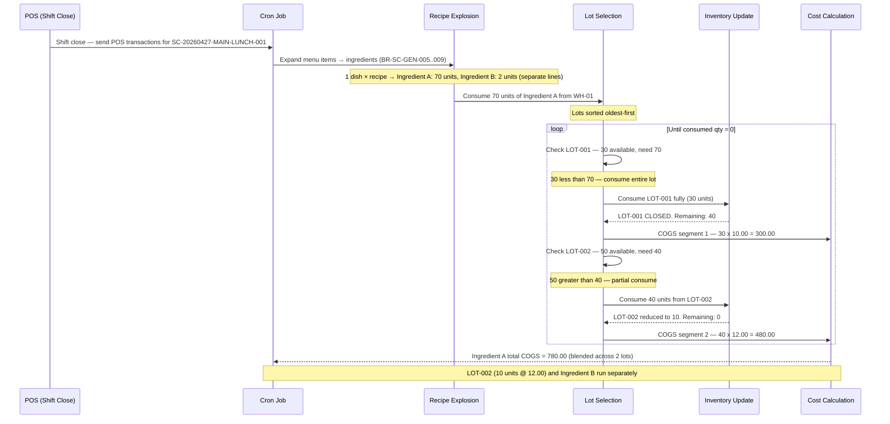

# Transaction 05 — Sales Consumption (SC)

**Document prefix:** `SC-YYYYMMDD-{locationCode}-{shift}-{seq}` (BR-SC-REF-001)  
**Transaction type written to ledger:** `SALES_CONSUMPTION`  
**What it is:** Records the consumption of inventory items driven by POS sales. One SC document covers all sales for a single (location, shift, business date) tuple. Recipe BOM explosion converts sold menu items into ingredient-level inventory deductions — one menu item sold may produce multiple SC lines, one per ingredient.

**Who creates it:** System only (POS pipeline + scheduled cron job). There is no user-facing "Create Sales Consumption" action — manual stock-out uses Stock Issue (tx-04) instead (BR-SC-SCOPE-004, BR-SC-ACC-004).  
**Reviewers:** Store Manager / Finance Manager (void); POS Admin (exception resolution)  
**Status flow:** `draft` → `posted` | `posted_with_exceptions` | `blocked` | `voided`

> ⚠️ **Discrepancy:** BRD uses the term "Periodic Average" for the cost method alongside FIFO (BR-SC-COST-001). System-Processes documents use "AVCO" throughout. These are treated as equivalent here. Confirm with Finance team if BU-level costing method terminology differs between modules.

---

## Status Values

| Status | Description | Terminal? |
|---|---|---|
| `draft` | SC created by the cron job; ingredient-level validation in progress | No |
| `posted` | All lines posted to inventory ledger | Yes |
| `posted_with_exceptions` | At least one line posted; at least one line is in the POS Exception Queue | No — resolves to `posted` when queue is cleared |
| `blocked` | All lines are exceptions; zero lines post (e.g. entire shift unmapped) | No — resolves when exceptions cleared |
| `voided` | Manager voided the SC; all inventory deductions reversed | Yes |

---

## System Effects (in order)

| Step | Process | Location Types Affected | Lot Impact | Cost Impact |
|---|---|---|---|---|
| 1 | Inventory Update | Inventory | — | — |
| 2 | Lot Management | Inventory | Lot qty consumed (oldest first) | — |
| 3 | Cost Calculation | Inventory | — | AVCO: cost at avg; FIFO: oldest layer consumed |

### Step Detail

**Step 1 — Inventory Update:**  
QOH at the mapped inventory location decreases by the ingredient quantity consumed. Each SC line corresponds to one ingredient deduction for one recipe component.

**Step 2 — Lot Management:**  
The oldest lot at the source inventory location is consumed first. If the consumed qty spans multiple lots, each is reduced in chronological order until the ingredient qty is satisfied. Lot closed if fully consumed.

> ⚠️ **Discrepancy:** BRD (BR-SC-COST-001) specifies FIFO or Periodic Average as valuation method but does not explicitly state an oldest-first lot selection rule. The oldest-first assumption here is inherited from `proc-02-lot-management.md`. Verify whether FIFO valuation always implies oldest-lot selection in the Carmen implementation.

**Step 3 — Cost Calculation:**  
- **AVCO / Periodic Average:** COGS = ingredient qty × current average unit cost at the location. Cost captured at **time of SC posting**, not time of POS sale (BR-SC-COST-002).
- **FIFO:** COGS = oldest lot qty × oldest unit cost, rolling across layers if ingredient qty spans multiple lots.
- Revenue from the POS sale (totalRevenue) is stored on the SC header for analytics **but does not post to any revenue ledger** (BR-SC-COST-003). Revenue posting is the responsibility of the POS / Finance module, not Carmen inventory.

---

## Process Swim Lane

A single SC may span multiple lots per ingredient when the consumed qty exceeds the oldest lot. Recipe explosion means each POS menu item generates separate ingredient consumption lines first; then each ingredient runs through lot selection independently.

**Scenario (simplified):** SC for the LUNCH shift at MAIN covers 1 dish sold. Recipe = 2 ingredients. Ingredient A: consume 70 units from WH-01. Lots: LOT-001 (30 units @ 10.00), LOT-002 (50 units @ 12.00).

| Lot | Before | After | COGS Segment |
|---|---|---|---|
| LOT-001 | 30 units @ 10.00 | **CLOSED** | 30 x 10.00 = 300.00 |
| LOT-002 | 50 units @ 12.00 | 10 units @ 12.00 | 40 x 12.00 = 480.00 |
| **Ingredient A COGS** | | | **780.00** |

> **AVCO equivalent:** 70 × current average unit cost — one flat calculation, no lot iteration.

---

## Before / After Example

**Scenario:** LUNCH shift SC posts consumption of 25 units of Ingredient A at WH-01. Current balance: 125 units.

| Field | Before SC | After SC |
|---|---|---|
| Ingredient A · WH-01 QOH | 125 | 100 |
| LOT-001 at WH-01 qty | 75 | 50 |
| Unit cost at WH-01 (AVCO / Periodic Avg) | 10.67 | 10.67 |
| COGS recorded (AVCO) | — | 25 × 10.67 = 266.75 |
| COGS recorded (FIFO) | — | 25 × 10.00 = 250.00 (oldest layer) |
| Revenue (POS totalRevenue) | — | Stored informational only — not posted to revenue ledger |

---

## Business Rules

| # | Rule | BRD Source |
|---|---|---|
| BR-01 | Exactly one SC per (location, shift, business date) — deduplication enforced before generation | BR-SC-SCOPE-001 |
| BR-02 | SC is system-generated only; no user-facing create or edit action | BR-SC-SCOPE-004, BR-SC-ACC-004 |
| BR-03 | Generation triggered by scheduled cron at configurable shift-close time | BR-SC-GEN-001 |
| BR-04 | Each POS item line is exploded via recipe mapping → ingredient-level SC lines | BR-SC-GEN-005..009 |
| BR-05 | SC status cannot be manually changed — only system posting or manager void | BR-SC-STAT-007 |
| BR-06 | Lines where validation passes are auto-posted; failures are queued in POS Exception Queue | BR-SC-POST-001, BR-SC-POST-006 |
| BR-07 | Once a line is posted, it cannot be edited — corrections via reversing line or Supplemental SC | BR-SC-POST-004 |
| BR-08 | VOID_AFTER_POST (POS void arrives after SC posted) is auto-reversed in the next shift SC | BR-SC-EXC-003 |
| BR-09 | Supplemental SC (suffix -SUP1, -SUP2, …) links to parent SC; posted immediately on resolution | BR-SC-SUP-001..005 |
| BR-10 | Manager void requires a reason (≥10 chars); reverses all inventory transactions; cascades to Supplemental SCs | BR-SC-VOID-001..005 |
| BR-11 | Unit cost captured at time of SC posting, not time of POS sale | BR-SC-COST-002 |
| BR-12 | POS sale revenue is informational only — does not post to the Carmen revenue ledger | BR-SC-COST-003 |

---

## Exception Reason Codes (selected)

| Code | Cause | Auto-resolved? | Resolution path |
|---|---|---|---|
| `UNMAPPED_ITEM` | POS item has no recipe mapping | No | Add mapping in POS Setup → Mappings |
| `ZERO_COST_INGREDIENT` | Ingredient has no cost on file | No | Update product cost |
| `VOID_AFTER_POST` | POS void arrived after SC was already posted | Yes (auto-reverse in next SC) | Informational only |
| `REFUND_PARTIAL` | Refund from prior shift/day | No | Manager confirms; reversing line created |
| `STALE_TRANSACTION` | Sale timestamp >7 days old | No | Manager: post to current shift or discard |
| `CURRENCY_MISMATCH` | POS currency has no active exchange rate for businessDate | No | Add FX rate in Finance → Exchange Rates |

---

## Edge Cases

| Scenario | System Behaviour |
|---|---|
| All lines in shift are unmapped | SC status = `blocked`; no inventory impact; exception queue populated |
| POS void arrives after SC posted | `VOID_AFTER_POST` — system auto-generates reversing line in next open SC |
| Refund from prior shift or day | `REFUND_PARTIAL` — manager confirms; reversing line linked to original SC |
| Sale timestamp >7 days old | `STALE_TRANSACTION` — manager decides: post or discard |
| POS currency ≠ Carmen location currency | SC blocked (`CURRENCY_MISMATCH`) until FX rate added |
| Manager voids entire SC | All posted inventory transactions reversed; Supplemental SCs also voided (BR-SC-VOID-005) |
| Ingredient has no stock (zero QOH) | TBC — whether SC posts to negative QOH or routes to exception |
| Expired lot reached during FIFO consumption | TBC — whether expiry is enforced or oldest lot consumed regardless |

---

## SC vs Stock Issue (tx-04)

| Aspect | Sales Consumption (SC) | Stock Issue (tx-04) |
|---|---|---|
| Initiated by | System (POS pipeline) | User |
| Source document | POS transaction | Store Requisition |
| Creation | Automatic at shift close | Manual |
| Mapping basis | Recipe BOM (POS item → ingredients) | SR line items |
| Partial posting | Allowed (`posted_with_exceptions`) | N/A |
| Exception handling | POS Exception Queue | N/A |
| Revenue data | Stored informational | Not stored |

---

## Related Documents

→ [INDEX.md](INDEX.md) — transaction × process matrix  
→ [proc-01-inventory-update.md](proc-01-inventory-update.md)  
→ [proc-02-lot-management.md](proc-02-lot-management.md)  
→ [proc-03-cost-calculation.md](proc-03-cost-calculation.md)  
→ [tx-04-issues.md](tx-04-issues.md) — Stock Issue (manual stock-out alternative to SC)  
→ Source BRD: `/Users/peak/Documents/GitHub/carmen/docs/app/store-operations/sales-consumption/BR-sales-consumption.md`
