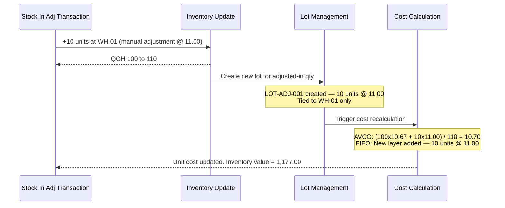

# Transaction 06 — Stock In (Adjustment)

**Transaction Code:** ADJ | **Direction:** IN (green badge)  
**What it is:** A manual positive adjustment to increase inventory at a location — used to correct discrepancies, record found stock, or add opening balances. Not linked to a PO or vendor.

**Who creates it:** Warehouse / Stock Controller  
**Status flow:** TBC — verify live UI statuses

## ADJ Classification System

Inventory Adjustments use a two-level classification system configured by the Finance Controller per property:

| Level | Scope | Maps to | IN direction notes |
|---|---|---|---|
| Direction | Transaction-level | Badge colour (IN = green, OUT = red) | Fixed — IN for Stock In adj |
| Category | Header-level | GL account code | 1xxx = inventory asset accounts for IN |
| Reason | Item-level | Sub-classification within Category | e.g. Found Stock, Count Correction, Opening Balance |

**Category** is selected at the adjustment header and determines which GL asset account is debited.  
**Reason** is selected per item row and provides a specific sub-classification within that Category.  
Both values are preserved after posting — visible in the Inventory Adjustments list and detail views.

---

## System Effects (in order)

| Step | Process | Location Types Affected | Lot Impact | Cost Impact |
|---|---|---|---|---|
| 1 | Inventory Update | Inventory | — | — |
| 2 | Lot Management | Inventory | New lot created | — |
| 3 | Cost Calculation | Inventory | — | AVCO: re-average; FIFO: add new cost layer |

### Step Detail

**Step 1 — Inventory Update:**  
QOH at the target inventory location increases by the adjustment quantity.

**Step 2 — Lot Management:**  
A new lot is created at the inventory location for the adjusted-in quantity. The lot number and metadata (expiry, etc.) may be entered manually or system-generated (TBC).

**Step 3 — Cost Calculation:**  
- **AVCO:** New unit cost = re-weighted average of existing stock + adjustment value
- **FIFO:** New cost layer added with adjustment qty and the manually entered unit cost

---

## Process Swim Lane

Stock-in adjustment adds qty — linear flow, no lot spanning (new lot created for the adjusted qty).

---

## Before / After Example

**Scenario:** 10 units of Product A found in back store, added to WH-01 @ unit cost 11.00. Current balance: 100 units @ 10.67.

| Field | Before Stock In adj | After Stock In adj |
|---|---|---|
| Product A · WH-01 QOH | 100 | 110 |
| Open lots at WH-01 | LOT-001 (50 units) + LOT-002 (50 units) | + LOT-ADJ-001 (10 units) |
| Unit cost (AVCO) | 10.67 | 10.70 |
| Total inventory value (AVCO) | 1,067.00 | 1,177.00 |
| Cost layers (FIFO) | Layer 1–2 existing | + Layer 3: 10 @ 11.00 |

---

## Business Rules

| # | Rule |
|---|---|
| BR-01 | Adjustment target must be an Inventory location |
| BR-02 | Unit cost for the adjustment must be provided — cannot be zero (TBC) |
| BR-03 | New lot is created for the adjusted-in qty |
| BR-04 | Cost Calculation runs after inventory update |
| BR-05 | Category must be selected at the adjustment header — determines GL debit account (1xxx inventory asset) |
| BR-06 | Reason is selected per item row — sub-classification within Category (TBC — verify if mandatory in live UI) |

---

## Edge Cases

| Scenario | System Behaviour |
|---|---|
| Stock In adj at a location in Physical Stocktake | Transaction blocked — location locked |
| Adjustment qty = 0 | TBC — blocked or ignored |
| No unit cost provided | TBC — blocked or defaults to current average |
| Adjustment after period lock | TBC — blocked (period closed) |
| Stock In adj to a Direct or Consignment location | TBC — whether permitted |
| Adjustment to a product with no prior QOH at the location | QOH goes from 0 to adj qty; first lot created; unit cost = adj cost |

---

## UI Access Path

Stock In Adjustments (ADJ / IN) appear in two list views — both are filtered views of the master Inventory Transactions ledger at `/inventory-management/transactions`:

| List View | Route | Filter Applied |
|---|---|---|
| **Stock In list** | `/inventory-management/stock-in` | direction = IN (all IN-direction sources: GRN, Transfer, Credit Note, Issue Return, Adjustment) |
| **Inventory Adjustments** | `/inventory-management/inventory-adjustments` | type = ADJ (both IN and OUT directions) |

**Stock In list** columns include a color-coded direction badge per row; each row links to its source document (ADJ-XXXX). Print format shows both Stock In Qty and Stock Out Qty columns (one is always 0).

**Inventory Adjustments list** shows per row: Direction badge · Category · Reason · Status badge.  
Search includes: adjustment ID, date, type, status, location, reason.  
Category and Reason are **preserved after posting** — not cleared on completion.

## Related Documents

→ [INDEX.md](INDEX.md) — transaction × process matrix  
→ [proc-01-inventory-update.md](proc-01-inventory-update.md)  
→ [proc-02-lot-management.md](proc-02-lot-management.md)  
→ [proc-03-cost-calculation.md](proc-03-cost-calculation.md)  
→ [tx-07-stock-out-adj.md](tx-07-stock-out-adj.md) — the mirror transaction (negative adjustment)
