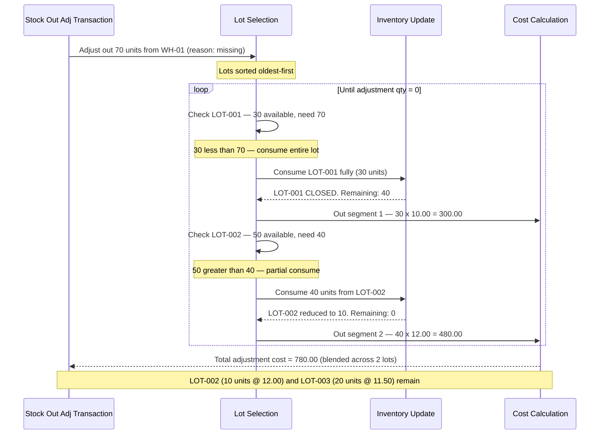

# Transaction 07 — Stock Out (Adjustment)

**Transaction Code:** ADJ | **Direction:** OUT (red badge)  
**What it is:** A manual negative adjustment to decrease inventory at a location — used to correct stock for missing items, stocktake discrepancies, or other operational reasons not covered by Wastage Report ([tx-11](tx-11-wastage-report.md)) or Issues (tx-04). Not linked to a sales order or issue.

> 📌 **See also:** Waste, damage, spoilage, expired, and obsolescence are recorded via **Wastage Report** ([tx-11-wastage-report.md](tx-11-wastage-report.md)). When a WR is approved, it auto-generates a Stock Out inventory adjustment — those ADJ records appear in the Stock Out ledger view under reference type `WR`, but are *originated* in the WR module.

**Who creates it:** Warehouse / Stock Controller  
**Status flow:** TBC — verify live UI statuses

## ADJ Classification System

Inventory Adjustments use a two-level classification system configured by the Finance Controller per property:

| Level | Scope | Maps to | OUT direction notes |
|---|---|---|---|
| Direction | Transaction-level | Badge colour (IN = green, OUT = red) | Fixed — OUT for Stock Out adj |
| Category | Header-level | GL account code | 5xxx = expense/loss accounts for OUT |
| Reason | Item-level | Sub-classification within Category | Missing · Stocktake correction · Other |

**Category** is selected at the adjustment header and determines which GL expense/loss account is debited.  
**Reason** is selected per item row and provides the specific classification of loss (e.g. Spoilage under a Perishable Loss category, Damage under a Stock Damage category).  
Both values are preserved after posting — visible in the Inventory Adjustments list and detail views.

> **Note:** Reason codes (Missing, Stocktake correction, Other) are ADJ-specific defaults for non-waste manual corrections. Finance Controllers may add or rename reasons per property configuration. Waste / Damage / Expired / Spoilage / Obsolescence reasons belong to the Wastage Report module (tx-11).

---

## System Effects (in order)

| Step | Process | Location Types Affected | Lot Impact | Cost Impact |
|---|---|---|---|---|
| 1 | Inventory Update | Inventory | — | — |
| 2 | Lot Management | Inventory | Lot qty consumed (oldest first) | — |
| 3 | Cost Calculation | Inventory | — | AVCO: cost held or recalc; FIFO: oldest layer consumed |

### Step Detail

**Step 1 — Inventory Update:**  
QOH at the source inventory location decreases by the adjustment quantity.

**Step 2 — Lot Management:**  
Oldest lot is consumed first. If the adjustment qty spans multiple lots, each is reduced in chronological order until the adjustment qty is satisfied.

**Step 3 — Cost Calculation:**  
- **AVCO:** Cost of adjusted-out goods = qty × current average unit cost. Unit cost at location may be held constant (TBC)
- **FIFO:** Oldest cost layer is consumed. Cost of adjusted-out goods = oldest layer cost × qty

---

## Process Swim Lane

Stock-out adjustment may span multiple lots when the adjustment qty exceeds the oldest lot. Each lot contributes a separate out-segment at its own unit cost.

**Scenario:** Missing-stock adjustment of 70 units from WH-01. Lots: LOT-001 (30 units @ 10.00), LOT-002 (50 units @ 12.00), LOT-003 (20 units @ 11.50).

| Lot | Before | After | Out Segment |
|---|---|---|---|
| LOT-001 | 30 units @ 10.00 | **CLOSED** | 30 x 10.00 = 300.00 |
| LOT-002 | 50 units @ 12.00 | 10 units @ 12.00 | 40 x 12.00 = 480.00 |
| LOT-003 | 20 units @ 11.50 | 20 units @ 11.50 | — |
| **Total** | | | **780.00** |

---

## Before / After Example

**Scenario:** 8 units of Product A corrected out at WH-01 — reason: missing. Current balance: 110 units.

| Field | Before Stock Out adj | After Stock Out adj |
|---|---|---|
| Product A · WH-01 QOH | 110 | 102 |
| LOT-001 at WH-01 qty | 50 | 42 |
| Unit cost at WH-01 (AVCO) | 10.70 | 10.70 |
| Adj cost (AVCO) | — | 8 × 10.70 = 85.60 |
| Adj cost (FIFO) | — | 8 × 10.00 = 80.00 (oldest layer) |

---

## Business Rules

| # | Rule |
|---|---|
| BR-01 | Adjustment source must be an Inventory location |
| BR-02 | Adjustment qty cannot exceed QOH at source location |
| BR-03 | Oldest lot consumed first; if lot fully consumed, it is closed |
| BR-04 | Cost Calculation runs — write-off value posted to expense or loss account |
| BR-05 | Category must be selected at the adjustment header — determines GL debit account (5xxx expense/loss) |
| BR-06 | Reason is selected per item row (e.g. Missing, Stocktake correction, Other) — sub-classification within Category (TBC — verify if mandatory in live UI) |

---

## Edge Cases

| Scenario | System Behaviour |
|---|---|
| Adj qty > QOH | TBC — blocked or allowed with warning |
| Source in Physical Stocktake | Transaction blocked — location locked |
| All lots at the location are older than the adj period | Oldest consumed first regardless |
| Adj after period lock | TBC — blocked (period closed) |
| Zero-qty adjustment | TBC — blocked or ignored |
| Adjustment spans multiple FIFO layers | System rolls through layers oldest-first until qty satisfied |

---

## UI Access Path

Stock Out Adjustments (ADJ / OUT) appear in two list views — both are filtered views of the master Inventory Transactions ledger at `/inventory-management/transactions`:

| List View | Route | Filter Applied |
|---|---|---|
| **Stock Out list** | TBC — likely `/inventory-management/stock-out` | direction = OUT (all OUT-direction sources: Issue, Transfer, Adjustment) |
| **Inventory Adjustments** | `/inventory-management/inventory-adjustments` | type = ADJ (both IN and OUT directions) |

**Inventory Adjustments list** shows per row: Direction badge · Category · Reason · Status badge.  
Search includes: adjustment ID, date, type, status, location, reason.  
Category and Reason (Missing / Stocktake correction / Other) are **preserved after posting** — not cleared on completion. WR-originated Stock Out records that appear in this view carry WR-module reasons (SPOIL, EXP, DMG, etc.) — those are read-only here and managed in tx-11.

## Related Documents

→ [INDEX.md](INDEX.md) — transaction × process matrix  
→ [proc-01-inventory-update.md](proc-01-inventory-update.md)  
→ [proc-02-lot-management.md](proc-02-lot-management.md)  
→ [proc-03-cost-calculation.md](proc-03-cost-calculation.md)  
→ [tx-06-stock-in-adj.md](tx-06-stock-in-adj.md) — the mirror transaction (positive adjustment)  
→ [tx-11-wastage-report.md](tx-11-wastage-report.md) — Wastage Report (WR), which generates Stock Out ADJ records via the WR approval flow
