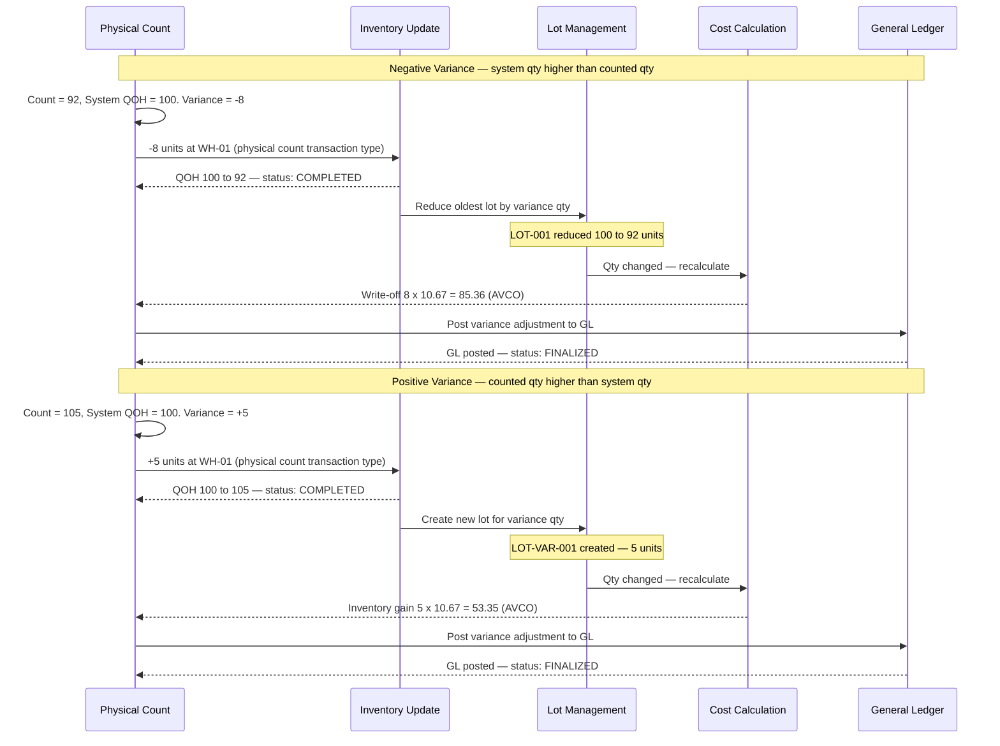

# Transaction 08 — Physical Count

**What it is:** A count of physical inventory at a location. When the count is confirmed, the system posts a variance adjustment (its own transaction type — **not** a Stock In/Out adjustment) to bring system QOH in line with the counted qty. The count must then be **Finalized** (variance adjustments posted to GL) before End Period Close Stage 3 is satisfied.

**Who creates it:** Warehouse / Stock Controller  
**Status flow:** IN PROGRESS → COMPLETED → FINALIZED  
- **COMPLETED** — count submitted; variance recorded  
- **FINALIZED** — variance adjustments posted to General Ledger (required for period close)

**Critical prerequisite:** All inventory locations must have their Physical Count reach **FINALIZED** status before End Period Close Stage 3 can pass. Transactions at a location are **locked** while the location's count is IN PROGRESS.

---

## System Effects (in order)

### If counted qty = system qty (no variance)

| Step | Process | Location Types Affected | Lot Impact | Cost Impact |
|---|---|---|---|---|
| 1 | Stocktake confirmed — no change | Inventory | No lot change | No cost change |

### If counted qty ≠ system qty (variance exists)

| Step | Process | Location Types Affected | Lot Impact | Cost Impact |
|---|---|---|---|---|
| 1 | Inventory Update (±qty variance) | Inventory | — | — |
| 2 | Lot Management (adjust lots) | Inventory | Lots adjusted up or down | — |
| 3 | Cost Calculation | Inventory | — | AVCO: re-average; FIFO: adjust layers |

### Step Detail (variance case)

**Step 1 — Inventory Update:**  
QOH at the stocktake location changes by the variance amount:
- Positive variance (counted > system): QOH increases
- Negative variance (counted < system): QOH decreases

The variance is posted as a **Physical Stocktake transaction type**, not a Stock In/Out adjustment — the two are distinguishable in the transaction log.

**Step 2 — Lot Management:**  
- Positive variance: new lot created (or existing lot adjusted up — TBC)
- Negative variance: oldest lot consumed/reduced first

**Step 3 — Cost Calculation:**  
Triggered only when QOH changes:
- **AVCO:** Re-averages using the post-variance QOH
- **FIFO:** Adds or removes cost layers based on variance direction

---

## Transaction Lock During Count

When a Physical Count is IN PROGRESS at a location:
- **GRN, CRN, SR, Issues, Sales, Stock In/Out adj** for that location are all **blocked**
- The location is effectively frozen until the count is COMPLETED

This ensures the count is not invalidated by concurrent transactions.

---

## Spot Check vs Physical Count

Spot Check is a separate, lighter verification type — sampling selected items only, not a full location count. It is a distinct module and document type with its own reference format (`SC-YYMMDD-XXXX`) and status flow.

For full details see [tx-10-spot-check.md](tx-10-spot-check.md).

Key difference for End Period Close: Physical Count must reach **FINALIZED** (GL posted) to satisfy Stage 3; Spot Check must reach **COMPLETED** to satisfy Stage 2. These are independent gates.

---

## Process Swim Lane

Two scenarios depending on whether the physical count is higher or lower than the system qty. Both paths end with GL posting (Finalized) before the count satisfies the End Period Close prerequisite. Negative variance (system over-counts) consumes lots oldest-first and may span multiple.

> **Multi-lot spanning on negative variance:** If the variance qty exceeds the oldest lot, the system consumes lots in chronological order (same pattern as Issues / Sales / Stock Out adj) until the full variance is absorbed.

> **Finalized is required for period close:** A Physical Count that is COMPLETED but not yet FINALIZED will block End Period Close Stage 3. The GL posting step must complete before the count contributes to the period close prerequisite.

---

## Before / After Example

**Scenario A — Positive variance:** System shows 100 units at WH-01; physical count finds 105 units.

| Field | Before Stocktake | After Stocktake |
|---|---|---|
| Product A · WH-01 QOH | 100 | 105 |
| Variance lot created | — | LOT-STKT-001 (5 units) |
| Unit cost (AVCO) | 10.67 | 10.67 (TBC — re-averages if new cost added) |

**Scenario B — Negative variance:** System shows 100 units; physical count finds 92 units.

| Field | Before Stocktake | After Stocktake |
|---|---|---|
| Product A · WH-01 QOH | 100 | 92 |
| LOT-001 qty | 100 | 92 (oldest lot reduced) |
| Variance write-off (AVCO) | — | 8 × 10.67 = 85.36 |
| Variance write-off (FIFO) | — | 8 × 10.00 = 80.00 (oldest layer) |

---

## Business Rules

| # | Rule | Source |
|---|---|---|
| BR-01 | Transactions at a count location are locked while the Physical Count is IN PROGRESS | — |
| BR-02 | End Period Close Stage 3 cannot pass until all Physical Counts are FINALIZED (GL posted) | BR-PE-005 |
| BR-03 | Physical Count variance is posted as its own transaction type (not Stock In/Out adj) | — |
| BR-04 | Positive variance creates a new lot (or adjusts an existing lot — TBC) | — |
| BR-05 | Negative variance consumes lots oldest-first | — |
| BR-06 | Cost Calculation runs if and only if a variance exists (QOH changed) | — |
| BR-07 | Spot Checks are a separate document type; they must reach COMPLETED to satisfy Stage 2 of End Period Close | BR-PE-006 |
| BR-08 | COMPLETED status alone does not satisfy the period close prerequisite — FINALIZED (GL posted) is required | BR-PE-005 |

---

## Edge Cases

| Scenario | System Behaviour |
|---|---|
| No variance found | Count confirmed; no inventory, lot, or cost changes; count still must be Finalized for period close |
| Count COMPLETED but GL posting fails | Status stays COMPLETED — will block End Period Close Stage 3 until Finalized |
| Count started but not submitted before period end | Period close Stage 3 blocked until count is FINALIZED |
| New transaction attempted while count in progress | Blocked — error message referencing the active Physical Count |
| Multiple variance lines (some + some −) on one count | Each line processed individually; net effect applied to QOH |
| Counted qty is zero (full write-off) | QOH goes to 0; all lots at location closed |
| Count cancelled mid-count | TBC — whether partial counts are retained or discarded |
| Spot Check incomplete while Physical Count is Finalized | Stage 2 (Spot Checks) still blocks End Period Close — both stages must pass independently |

---

## Related Documents

→ [INDEX.md](INDEX.md) — transaction × process matrix  
→ [proc-01-inventory-update.md](proc-01-inventory-update.md)  
→ [proc-02-lot-management.md](proc-02-lot-management.md)  
→ [proc-03-cost-calculation.md](proc-03-cost-calculation.md)  
→ [tx-09-end-period-close.md](tx-09-end-period-close.md) — End Period Close that requires Physical Counts (Stage 3: Finalized) and Spot Checks (Stage 2: Completed)
