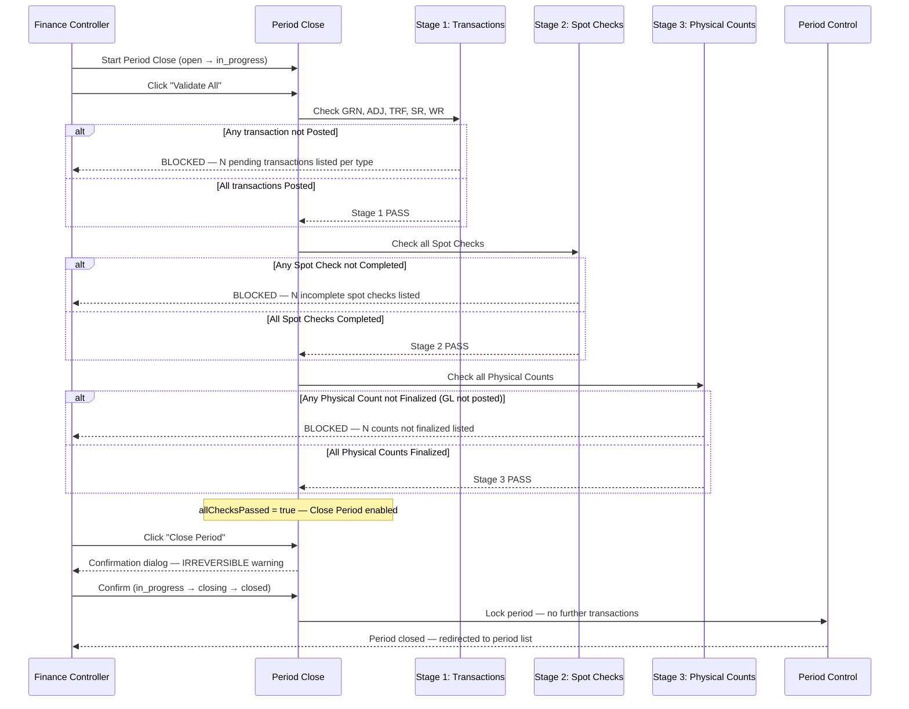

# Transaction 09 — End Period Close

**What it is:** Closes the current inventory period, locks all transactions and costs within that period, and prepares the system for the next period. The close is **irreversible** — once confirmed, the period cannot be reopened.

**Who creates it:** Finance Controller  
**Status flow:** `open` → `in_progress` → `closing` → `closed`  
**Cancel allowed:** `in_progress` → `open` (abort the close process before confirming)

---

## Period Status Values

| Status | Badge Colour | Meaning |
|---|---|---|
| `open` | Blue | Current active period — transactions can be posted |
| `in_progress` | Yellow | Close process initiated — validation in progress |
| `closing` | Orange | All validations passed — close confirmed, system processing |
| `closed` | Green | Period locked — no further transactions permitted |

Only one period can be `open` at a time (BR-01 / BR-PE-001).

---

## 3-Stage Validation Gate

End Period Close requires all three stages to pass before the Close Period button is enabled (BR-03 / BR-PE-003). Stages must be satisfied in order.

### Stage 1 — Transactions

All transactions for the period must be **Posted** before close can proceed.

| Transaction Type | Code | Required Status |
|---|---|---|
| Goods Receipt Note | GRN | Posted |
| Adjustment (Stock In / Stock Out) | ADJ | Posted |
| Transfer | TRF | Posted |
| Store Requisition | SR | Posted |
| Wastage Report | WR | Posted or Approved |

> **Note (TRF):** TRF is not a separate transaction entity — it is a read-only filtered view of SR records where both source and destination are INVENTORY locations. SR records with INV → INV destinations satisfy both the SR and TRF buckets in Stage 1. See [tx-03-sr.md](tx-03-sr.md).


A per-document-type breakdown is shown in the validation panel — each type lists total count and pending count.

### Stage 2 — Spot Checks

All Spot Checks for the period must reach **Completed** status (BR-06 / BR-PE-006).

> **Spot Check** is a lighter verification type — a sample count of selected items, not a full Physical Count of an entire location. It is a distinct module with its own reference format (`SC-YYMMDD-XXXX`) and status flow. See [tx-10-spot-check.md](tx-10-spot-check.md) for full detail.

### Stage 3 — Physical Counts

All Physical Counts for the period must reach **Finalized** status — meaning variance adjustments have been posted to the General Ledger (BR-05 / BR-PE-005). A Physical Count that is **Completed** (counted) but **not yet Finalized** (GL not posted) does **not** satisfy this gate.

---

## Period Close UI Controls

| Control | Behaviour |
|---|---|
| **Validate All** button | Refreshes validation status across all three stages — re-queries current state |
| **Close Period** button | Disabled until `allChecksPassed = true`; enabled only when all 3 stages pass |
| **Confirmation dialog** | Warns that the action is irreversible before proceeding |
| **Cancel close** | Returns period from `in_progress` → `open`; available before close is confirmed |

**Confirmation Dialog:**

| Element | Content |
|---|---|
| Title | "Close Period" |
| Message | "Are you sure you want to close this period? This action is irreversible — the period cannot be reopened once closed." |
| **Confirm** button (Blue/Primary) | Period transitions `in_progress` → `closing` → `closed`; user redirected to period list |
| **Cancel** button (Outline/Grey) | Dialog dismissed; period remains `in_progress` |

---

## System Effects (in order)

| Step | Process | Location Types Affected | Lot Impact | Cost Impact |
|---|---|---|---|---|
| 1 | Inventory Update — period snapshot | All | — | — |
| 2 | Lot Management — close open lots | Inventory | Open lots for the period closed | — |
| 3 | Cost Calculation — lock period costs | All | — | Period costs locked; no backdated entries permitted |
| 4 | Period Control — open next period | System-wide | — | New period opened for transactions |

### Step Detail

**Step 1 — Inventory Update (period snapshot):**  
A read-only snapshot of QOH for each product × location is recorded as of the period end date. This does not change current QOH — it creates a historical record for reporting.

**Step 2 — Lot Management (close open lots):**  
All lots that remain open at the end of the period are marked as closed. Open lot balances carry forward into the next period as opening balances (TBC — verify whether lots roll over or are re-opened).

**Step 3 — Cost Calculation (lock period costs):**  
- Period costs are locked — no transactions can be backdated into the closed period
- The closing unit cost for each product × location is recorded as the opening cost for the next period
- Under AVCO: closing average cost becomes the opening average for the next period
- Under FIFO: closing cost layers carry forward into the next period

**Step 4 — Open next period:**  
A new period is created. Transactions from this point forward are assigned to the new open period.

---

## Period Lock Effect

After End Period Close (period status = `closed`):

| Action attempted | Result |
|---|---|
| Post a GRN dated in the closed period | Blocked — period locked (BR-04 / BR-PE-004) |
| Post a Stock adjustment dated in the closed period | Blocked |
| View historical QOH for the closed period | Permitted — read-only snapshot available |
| Create new transactions in the new period | Permitted — new period is open |

---

## Process Swim Lane

The close workflow has two phases: (1) validation, repeatable via "Validate All"; (2) irreversible close, triggered once all validations pass.



---

## Before / After Example

**Scenario:** Closing April 2026 period. All 3 validation stages passed and close confirmed.

| Field | Before End Period Close | After End Period Close |
|---|---|---|
| April 2026 period status | `in_progress` | `closed` |
| May 2026 period status | — | `open` |
| Product A · WH-01 QOH snapshot | 102 | Recorded as April closing balance (read-only) |
| Product B · WH-02 QOH snapshot | 55 | Recorded as April closing balance (read-only) |
| Open lots | LOT-001 (active) | LOT-001 marked closed for April; rolls into May (TBC) |
| Unit cost lock | Current avg / FIFO layers | Locked for April; May starts from closing cost |

---

## Business Rules

| # | Rule | Source |
|---|---|---|
| BR-01 | Only one period can be `open` at a time | BR-PE-001 |
| BR-02 | Periods close in chronological order | BR-PE-002 |
| BR-03 | All three validation stages must pass before Close Period is enabled | BR-PE-003 |
| BR-04 | Closed periods reject new transactions — no backdating permitted | BR-PE-004 |
| BR-05 | Physical Counts must reach Finalized status (GL posted) — Completed alone does not satisfy Stage 3 | BR-PE-005 |
| BR-06 | Spot Checks must reach Completed status to satisfy Stage 2 | BR-PE-006 |
| BR-07 | All transactions (GRN, ADJ, TRF, SR, WR) must be Posted to satisfy Stage 1 | BR-PE-007 |
| BR-08 | Period close is irreversible — the period cannot be reopened after `closed` status | FR-PE-003 |
| BR-09 | Costing method (AVCO/FIFO) does not change at period close — locked at BU level | — |

---

## Edge Cases

| Scenario | System Behaviour |
|---|---|
| One transaction still in draft | Stage 1 fails; Close Period button remains disabled |
| One Spot Check not Completed | Stage 2 fails; Close Period button remains disabled |
| Physical Count completed but GL not yet posted | Stage 3 fails — Finalized status required, Completed is insufficient |
| Finance Controller clicks "Cancel close" | Period reverts from `in_progress` to `open`; close process must restart from beginning |
| Close confirmed but system processing fails mid-way | TBC — period may remain in `closing` status; manual intervention may be required |
| Attempt to post a transaction to a closed period | Blocked — period lock error returned to user |
| End Period Close attempted when period already `closed` | Blocked — no action taken |
| No transactions in a period for a product | Snapshot still recorded with zero activity; opening balance = closing balance |
| Period close with FIFO and multiple open layers | All open layers recorded in snapshot; carry forward into next period |

---

## Relationship to Physical Count and Spot Check

```
Stage 1: All transactions → Posted (GRN / ADJ / TRF / SR / WR)
Stage 2: All Spot Checks → Completed
Stage 3: All Physical Counts → Finalized (variance adjustments GL-posted)
         ↓  all 3 stages pass
Close Period → confirmed (IRREVERSIBLE)
         ↓
Period closed → costs frozen → snapshot recorded → new period opened
```

---

## Related Documents

→ [INDEX.md](INDEX.md) — transaction × process matrix  
→ [proc-01-inventory-update.md](proc-01-inventory-update.md) — period snapshot step  
→ [proc-02-lot-management.md](proc-02-lot-management.md) — lot close step  
→ [proc-03-cost-calculation.md](proc-03-cost-calculation.md) — cost lock step  
→ [tx-08-physical-stocktake.md](tx-08-physical-stocktake.md) — Physical Count (Stage 3 prerequisite) and Spot Check (Stage 2 prerequisite)
