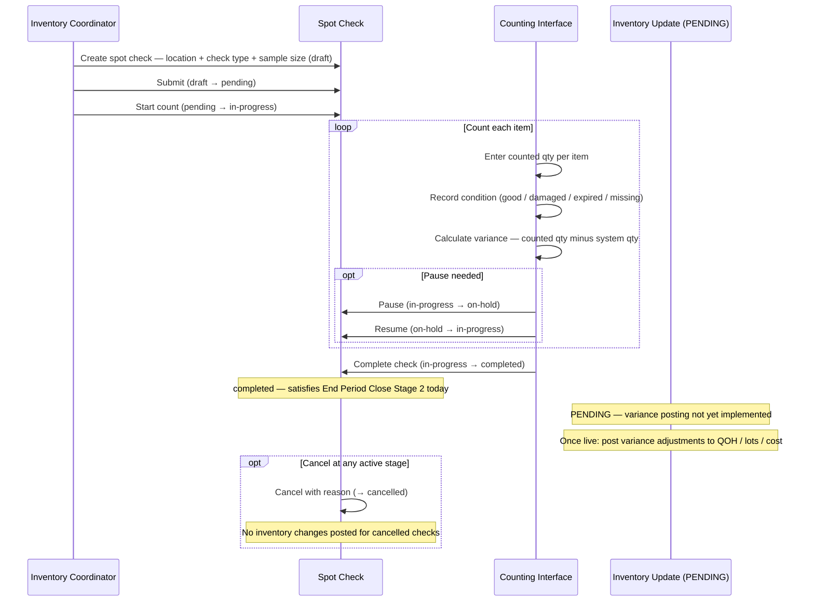

# Transaction 10 — Spot Check

**What it is:** A targeted, partial verification of inventory quantities for selected items at a location. Unlike Physical Count (which counts all items at a location), Spot Check samples a subset — focusing on high-risk, high-value, or problem items. Spot Check is a distinct module from Physical Count and has its own reference format and status flow.

> ⚠️ **Implementation Status — Inventory Effects:** Per BR-spot-check.md v2.2.0, real-time variance posting to inventory is listed as **Pending** — not yet implemented. Current behaviour: Spot Check records variances and reaches `completed` status (satisfying End Period Close Stage 2), but does **not** post variance adjustments to inventory, lots, or cost.

**Reference format:** `SC-YYMMDD-XXXX`  
**Who creates it:** Storekeepers / Inventory Coordinators (primary); Department Supervisors initiate  
**Who approves significant variances:** Inventory Managers  
**Status flow:** `draft → pending → in-progress → completed` (terminal); `on-hold` (pause/resume); `cancelled`  
**Period-end role:** Stage 2 prerequisite — all Spot Checks must be `completed` before End Period Close

---

## Spot Check vs Physical Count

| Attribute | Physical Count | Spot Check |
|---|---|---|
| Module | `/inventory-management/physical-count` | `/inventory-management/spot-check` |
| Reference format | (per Physical Count BRD) | `SC-YYMMDD-XXXX` |
| Scope | All items at a location | Sample items (10 / 20 / 50) |
| Selection methods | Full count | Random · High-Value · Manual |
| Check types | N/A | random · targeted · high-value · variance-based · cycle-count |
| End Period Close stage | Stage 3: **Finalized** (GL posted) | Stage 2: **Completed** |
| Variance posting | Yes — own transaction type | **PENDING** — not yet implemented |
| Transaction lock at location | Full location locked | TBC |
| Lot impact | Yes (if variance) | TBC — pending implementation |
| Cost impact | Yes (if variance, via proc-03) | TBC — pending implementation |

---

## Check Types (BR-SC-001)

| Type | Purpose |
|---|---|
| `random` | System-generated random sample from all items at location |
| `targeted` | Specific items selected by supervisor or coordinator |
| `high-value` | System selects highest-value items at location |
| `variance-based` | Items with recent discrepancy history |
| `cycle-count` | Systematic rotation through all items over time |

Check type is set at creation and **cannot be changed** after (BR-SC-003).

---

## Status Flow

| Status | Meaning | Transitions allowed |
|---|---|---|
| `draft` | Created, not yet submitted | → `pending` |
| `pending` | Submitted, awaiting start | → `in-progress`, `cancelled` |
| `in-progress` | Actively being counted | → `on-hold`, `completed`, `cancelled` |
| `on-hold` | Paused (staff/items unavailable) | → `in-progress`, `cancelled` |
| `completed` | All items counted; check finalised | Terminal — no further changes (BR-SC-006) |
| `cancelled` | Cancelled with reason | Preserves all entered data; no inventory changes (BR-SC-007) |

States cannot be skipped (BR-SC-005).

---

## System Effects

> **All rows marked TBC — variance posting to inventory is PENDING per BR-spot-check.md v2.2.0.**  
> Once implemented, effects are expected to mirror Physical Count variance behaviour.

| Step | Process | Location Affected | Lot Impact | Cost Impact |
|---|---|---|---|---|
| 1 | Variance calculation (always runs) | Spot Check record | — | — |
| 2 | Inventory Update **(PENDING)** | INV (counted location) | — | — |
| 3 | Lot Management **(PENDING)** | INV (counted location) | TBC — adjust lots per variance direction | — |
| 4 | Cost Calculation **(PENDING)** | INV (counted location) | — | TBC — proc-03 if QOH changes |

**Current behaviour (pending implementation):**
- Counted quantities and variances are recorded in the Spot Check record
- No QOH changes posted to inventory
- No lot adjustments made
- No cost recalculation triggered
- `completed` status is reached and satisfies End Period Close Stage 2

---

## Process Swim Lane

Status lifecycle and counting interface shown. Inventory posting branch is marked PENDING.

---

## Before / After Example

**Scenario:** Spot Check of 10 items at WH-01. 2 items have variances. Variance posting is PENDING.

| Field | Before Spot Check | After Spot Check (current) | After Spot Check (once PENDING implemented) |
|---|---|---|---|
| Spot Check status | — | `completed` | `completed` |
| Item A system qty / counted | 100 / 100 | Variance = 0 recorded | No inventory change |
| Item B system qty / counted | 50 / 47 | Variance = −3 recorded | QOH → 47; lot adjusted; cost recalculated |
| QOH changes posted | — | None | Yes — per variance direction |
| End Period Close Stage 2 | Blocked | ✅ Satisfied | ✅ Satisfied |

---

## Business Rules

| # | Rule | Source |
|---|---|---|
| BR-01 | Five check types: random, targeted, high-value, variance-based, cycle-count | BR-SC-001 |
| BR-02 | Each check type has specific selection criteria and purpose | BR-SC-002 |
| BR-03 | Check type cannot be changed after creation | BR-SC-003 |
| BR-04 | Valid statuses: draft, pending, in-progress, completed, cancelled, on-hold | BR-SC-004 |
| BR-05 | Status transitions must follow defined flow — no state skipping | BR-SC-005 |
| BR-06 | Completed is terminal — no further modifications | BR-SC-006 |
| BR-07 | Cancelled preserves all data; no inventory adjustments posted | BR-SC-007 |
| BR-08 | Item conditions: good, damaged, expired, missing | BR-SC-008 |
| BR-09 | Item with `missing` condition: variance = full system quantity | BR-SC-014 |
| BR-10 | Variance qty = counted qty − system qty | BR-SC-011 |
| BR-11 | Variance % = (variance qty / system qty) × 100 | BR-SC-012 |
| BR-12 | Accuracy = (matched items / total items) × 100 | BR-SC-013 |
| BR-13 | All Spot Checks must be `completed` before End Period Close Stage 2 passes | BR-PE-006 |
| BR-14 | Cancelled Spot Checks do not satisfy End Period Close Stage 2 | BR-PE-006 |
| BR-15 | Skipped items require a reason / note | BR-SC-010 |

---

## Edge Cases

| Scenario | System Behaviour |
|---|---|
| Check cancelled mid-count | Status → `cancelled`; all entered counts retained; no inventory changes posted |
| Staff unavailable during count | Pause (in-progress → on-hold); resume when available; no timeout |
| Item counted as zero qty | Variance = full system qty; condition should be set to `missing` (BR-SC-014) |
| Variance found but inventory posting is PENDING | Variance recorded; no QOH / lot / cost changes until feature is implemented |
| Spot Check `completed` but inventory posting fails (once PENDING implemented) | TBC — whether status reverts or posting is retried |
| Multiple Spot Checks active at same location simultaneously | TBC — whether concurrent checks on same location are permitted |
| Second Spot Check run after first `completed` for same period | New SC-YYMMDD-XXXX created; completed record is immutable (BR-SC-006) |
| Item skipped during count | Reason/note mandatory (BR-SC-010); item status stays `pending`; does not block completion |

---

## Related Documents

→ [INDEX.md](INDEX.md) — transaction × process matrix  
→ [tx-08-physical-stocktake.md](tx-08-physical-stocktake.md) — Physical Count (Stage 3 of End Period Close); full scope vs Spot Check sample  
→ [tx-09-end-period-close.md](tx-09-end-period-close.md) — End Period Close Stage 2: all Spot Checks must be Completed  
→ [proc-01-inventory-update.md](proc-01-inventory-update.md) — inventory effects (TBC once variance posting implemented)  
→ [proc-02-lot-management.md](proc-02-lot-management.md) — lot effects (TBC once variance posting implemented)  
→ [proc-03-cost-calculation.md](proc-03-cost-calculation.md) — cost effects (TBC once variance posting implemented)  
→ BR-spot-check.md (v2.2.0) — primary BRD source
