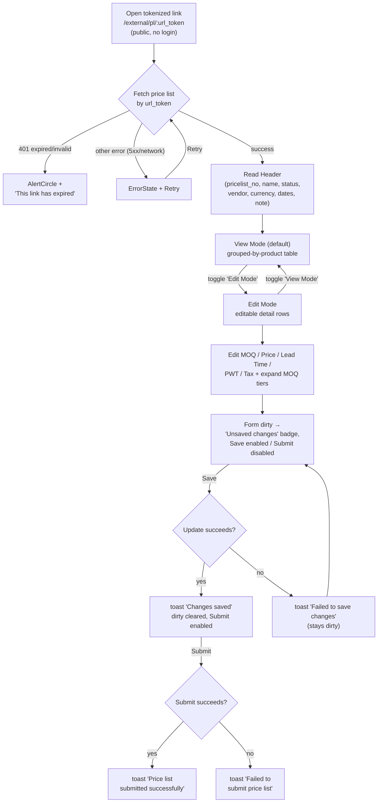

# External Vendor — Price List Submission

The **External Vendor** persona is a supplier **outside** the company. They never sign in to
Carmen. Instead, as part of a Request-for-Pricing / Campaign (see `docs/test-cases/1001-campaign.md`),
Carmen e-mails them a **tokenized link** of the shape `/external/pl/:url_token`. Opening that link
loads exactly one price list, scoped entirely by the token — the vendor sees their own pricing and
nothing else.

A few traits set this journey apart from every other persona in this repo:

- **This page is PUBLIC.** There is **no role gate and no login**. The route resolves the price list
  purely from the `url_token` path param — `routes/external/pl/page.tsx` reads `useParams().url_token`
  and renders `PriceListExternalComponent` directly, with no auth wrapper, no session, and no redirect
  to `/login`. ผู้ใช้ภายนอกเปิดลิงก์ได้ทันทีโดยไม่ต้องมี account.
- **The token is the only credential.** Authorisation lives entirely in the token. An expired or
  invalid token is rejected by the backend with **HTTP 401**, and the page shows
  *"This link has expired"* rather than any login prompt.
- **Save-then-Submit, gated by a dirty flag.** The form tracks `react-hook-form`'s `formState.isDirty`.
  **Save** persists edits and clears the dirty flag; **Submit** is only allowed once everything is
  saved (no pending changes). The two buttons are mutually exclusive by design — Save is disabled when
  clean, Submit is disabled when dirty.

The full vendor experience is three components rendered inside a centred `max-w-5xl` container:
`PriceListExternalHeader` (read-only summary), the **View Mode ↔ Edit Mode** toggle button, and
`PriceListExternalProductTable` (the grouped read view, the editable detail view, and the Save / Submit
footer).

---

## Workflow Overview

---

## Step 1 — Open the tokenized link (no auth)

The vendor clicks the link from their e-mail. The route `/external/pl/:url_token` resolves the token
and immediately fetches the price list (`usePriceListExternal(urlToken)`). While the request is in
flight a plain *"Loading..."* line is shown. There is no login screen and no redirect — a clean browser
context with no session reaches the price list directly.

- A valid, unexpired token loads the page (Header + table) without a 404 and without redirecting to
  `/login` — *covered by TC-EPL-010001*.
- The public, login-free nature of the route is asserted explicitly — *covered by TC-EPL-100003*.
- Missing `:url_token` does not crash; `page.tsx` returns `null` rather than rendering content —
  *covered by TC-EPL-900002*.

## Step 2 — Read the price-list Header

`PriceListExternalHeader` renders a read-only summary of the price list the vendor is being asked to
quote on. It shows:

- **`pricelist_no`** as the page heading, with the price-list **name** beneath it.
- A **status badge** in upper-case (`data.status.toLocaleUpperCase()`).
- A four-up grid of **Vendor Name** (falls back to `-`), **Currency** (`currency_code`), and the
  effective **Date** range rendered as `effective_from_date – effective_to_date` (formatted `yyyy-MM-dd`).
- Optional full-width **Description** and **Note** rows that appear *only* when those fields have a value.

Coverage: the core Header fields (no / name / status / vendor / currency / date range) are
*covered by TC-EPL-010002*; the conditional Description / Note rows are *covered by TC-EPL-010003*.

## Step 3 — Browse the products in View Mode (default)

The table opens in **View Mode** (`isViewMode` starts `true`). In this mode rows are **grouped by
product**: every detail line for the same `product_id` is folded into one row, so a product with several
MOQ tiers / units appears once. Columns are **#, Product, MOQ, PWT, Tax, Tax Profile**. The MOQ column
stacks one line per tier in the shape `moq+ unit→price (Nd)` (e.g. `10+ KG→125(3d)`), while PWT, Tax,
and Tax Profile stack their per-tier values in parallel. The grid supports pagination (page size 10)
and column sorting. The toggle button reads **"Edit Mode"** while in this state.

- Default View Mode with the grouped columns and the *"Edit Mode"* toggle label — *covered by TC-EPL-010004*.
- Multiple tiers of one product collapsing into a single row — *covered by TC-EPL-010005*.
- Pagination + sorting on the grouped grid — *covered by TC-EPL-010006*.
- A price list with no `tb_pricelist_detail` shows an empty grid (record count 0) without crashing —
  *covered by TC-EPL-900001*.

## Step 4 — Switch to Edit Mode

Clicking the toggle (**"Edit Mode"**) flips `isViewMode` to `false` and swaps the grouped read table
for the **editable detail table** — one row per `tb_pricelist_detail` line, no grouping. Columns become
**#, Product, Unit, MOQ, Price, Lead Time, PWT, Tax, Tax Profile**, plus an **expand** control per row
and a **Save / Submit** footer beneath the grid. The toggle button now reads **"View Mode"**.

Coverage: entering Edit Mode and the new column set / footer — *covered by TC-EPL-040001*.

## Step 5 — Update the pricing fields

In Edit Mode the vendor edits values inline. **MOQ**, **Price**, **PWT**, and **Tax** are free-text
inputs; **Lead Time** is a numeric input (days, min 0). Each keystroke calls `handleItemFieldChange`,
which writes back through `useFieldArray.update` and marks the form **dirty**. Product, Unit, and Tax
Profile are display-only in this view (Unit is a secondary badge).

When the form goes dirty an **"Unsaved changes"** warning badge appears in the footer, the **Save**
button becomes enabled, and **Submit** becomes disabled.

- Editing Price / MOQ / Lead Time / PWT / Tax and reflecting the values immediately — *covered by TC-EPL-040002*.
- The dirty state producing the *"Unsaved changes"* badge and enabling Save — *covered by TC-EPL-040003*.
- The enable/disable pairing (Save disabled when clean, Submit disabled when dirty) — *covered by TC-EPL-200003*.

## Step 6 — Expand and edit MOQ tiers

Every row carries an **expand** control (`SquarePlus` / `SquareMinus`). Expanding a row reveals the
**MOQ tiers sub-table** (`MoqTiersSubTable`) for that detail line. Editing a tier flows back via
`handleTiersUpdate` → `update`, which marks the form dirty just like the row-level fields.

Coverage: expanding a row and editing tiers (with the dirty side-effect) — *covered by TC-EPL-040006*.

## Step 7 — Save (the "no changes" / dirty rules)

**Save** calls `handleSave`. The rules, straight from the component:

- If `formState.isDirty` is **false**, the handler short-circuits with the error toast
  **"No changes to save"** and never calls the backend. In practice the Save button is also `disabled`
  when clean, so this is the guard behind a disabled control — *covered by TC-EPL-200001* (and the
  disabled-state assertion in TC-EPL-200003).
- On a **successful** update the page shows the success toast **"Changes saved successfully"**, then
  `form.reset(formData)` clears the dirty flag — the badge disappears, Save returns to disabled, and
  Submit becomes enabled — *covered by TC-EPL-040004*.
- On **failure** it shows the error toast **"Failed to save changes"** and the form stays dirty (Save
  remains usable so the vendor can retry) — *covered by TC-EPL-040005*.

While the update is in flight the button label reads **"Saving..."**.

## Step 8 — Submit (must save first)

**Submit** calls `handleSubmit`, which enforces the save-first rule:

- If the form is still **dirty**, it refuses to submit and shows the error toast
  **"Please save all changes before submitting"** — and the Submit button is `disabled` while dirty
  anyway — *covered by TC-EPL-200002* (and TC-EPL-200003 for the disabled state).
- With **no pending changes** a successful submit shows the success toast
  **"Price list submitted successfully"** — *covered by TC-EPL-300001*.
- A **failed** submit shows the error toast **"Failed to submit price list"** without crashing the page —
  *covered by TC-EPL-300002*.

While the submit is in flight the button label reads **"Submitting..."**.

## Step 9 — Failure & expiry states

Before any of the above is reachable, the fetch must succeed. The component handles two distinct
failure shapes:

- **Expired / invalid token (HTTP 401).** When the error is an `HttpError` with `status === 401`, the
  page renders an `AlertCircle` icon and the backend message (default **"This link has expired"**) — no
  price-list data, no Retry. นี่คือเส้นทางหลักเมื่อ token หมดอายุ — *covered by TC-EPL-100001*.
- **Any other error (5xx / network).** The page renders the shared **`ErrorState`** with the error
  message and a **Retry** button that calls `refetch()` to re-attempt the load — *covered by TC-EPL-100002*.

---

## Related Test-Case Catalog

| Area | Catalog | Prefix | Total |
|------|---------|--------|-------|
| External Price List (Vendor Portal) | `docs/test-cases/1002-external-price-list.md` | `EPL` | 22 |

> No automated Playwright spec exists for this module yet; the journey above is grounded in the React
> source under `../carmen-inventory-frontend-react/routes/external/pl/` and cross-referenced to the
> hand-authored `TC-EPL-XXXXXX` catalog.
